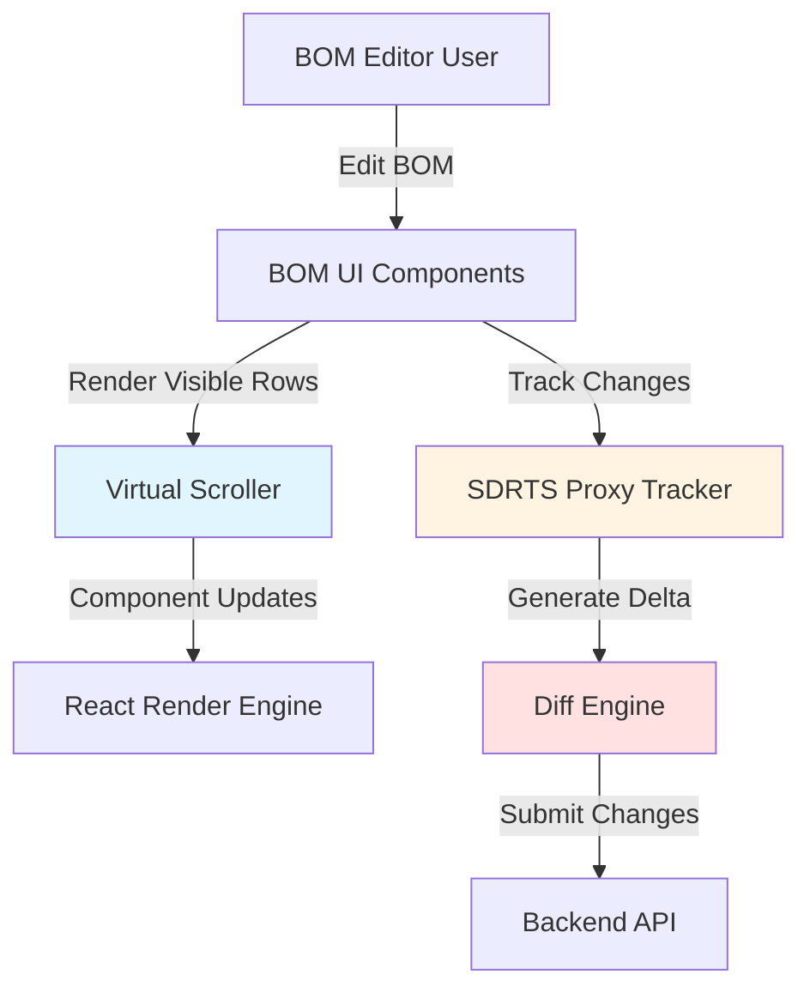
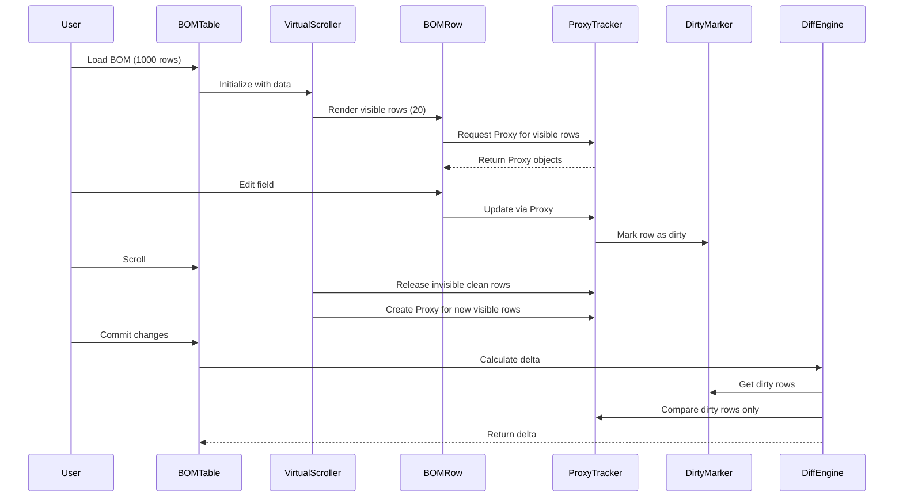
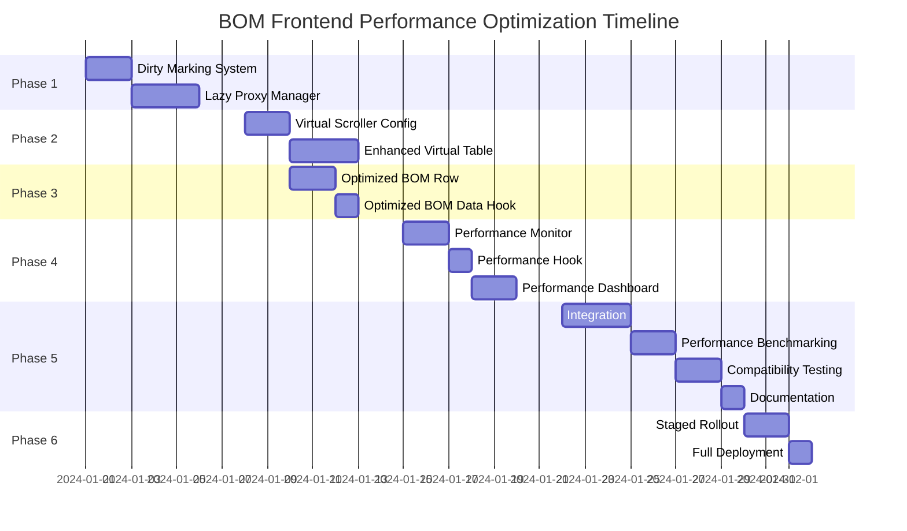

# Design Document: BOM Frontend Performance Optimization

## Overview

This document provides the technical design for optimizing the frontend performance of the BOM (Bill of Materials) module in the 纤镀 ERP system. The optimization targets an 8-10x performance improvement for large-scale BOM datasets (500-2000+ rows) through five key technical strategies:

1. **Incremental Diff Optimization**: Replace expensive JSON.stringify-based change detection with dirty marking and shallow comparison
2. **Virtual Scrolling Enhancement**: Optimize TanStack Virtual configuration and implement lazy Proxy creation
3. **React Rendering Optimization**: Implement React.memo, useMemo, and useCallback to minimize unnecessary re-renders
4. **SDRTS Proxy Memory Management**: Implement lifecycle-aware Proxy creation and garbage collection
5. **Performance Monitoring Infrastructure**: Build comprehensive measurement and reporting system

### Current Performance Baseline

- **Initial Render (1000 rows)**: ~800ms
- **Single Field Edit**: ~150ms
- **Commit Operation (1000 rows, 10% dirty)**: ~500ms
- **Memory Usage**: ~20,000 active Proxy objects for 1000-row BOM

### Target Performance Goals

- **Initial Render (1000 rows)**: ≤100ms (8x improvement)
- **Single Field Edit**: ≤50ms (3x improvement)
- **Commit Operation (1000 rows, 10% dirty)**: ≤50ms (10x improvement)
- **Memory Usage**: ≤4,000 active Proxy objects (80% reduction)

### Design Principles

1. **Backward Compatibility**: All existing BOM functionality must continue working without modification
2. **Type Safety**: Maintain 100% TypeScript type coverage with strict compiler options
3. **Incremental Adoption**: Optimizations can be enabled/disabled via feature flags
4. **Measurability**: All performance improvements must be quantifiable through automated metrics
5. **Maintainability**: Code quality metrics must be maintained or improved


## Architecture

### System Context



### Component Architecture

The BOM performance optimization involves five interconnected subsystems:

#### 1. Dirty Marking System
- **Purpose**: Track which BOM rows have been modified without expensive deep comparison
- **Location**: `src/lib/delta/dirty-marker.ts`
- **Integration Point**: ProxyTracker

#### 2. Enhanced Virtual Scroller
- **Purpose**: Render only visible rows with optimized overscan configuration
- **Location**: `src/features/product-structure/components/bom-virtual-table.tsx`
- **Integration Point**: BOM Table Component

#### 3. React Optimization Layer
- **Purpose**: Prevent unnecessary component re-renders through memoization
- **Location**: `src/features/product-structure/components/bom-row.tsx`
- **Integration Point**: BOM Row Components

#### 4. Lazy Proxy Manager
- **Purpose**: Create and destroy Proxy objects based on visibility and modification state
- **Location**: `src/lib/delta/lazy-proxy-manager.ts`
- **Integration Point**: ProxyTracker

#### 5. Performance Monitor
- **Purpose**: Measure and report performance metrics
- **Location**: `src/lib/performance/bom-performance-monitor.ts`
- **Integration Point**: All BOM components

### Data Flow




## Components and Interfaces

### 1. Dirty Marking System

#### DirtyMarker Interface

```typescript
/**
 * Tracks which BOM rows have been modified
 */
export interface DirtyMarker {
  /**
   * Mark a row as dirty (modified)
   */
  markDirty(rowId: string): void;
  
  /**
   * Check if a row is dirty
   */
  isDirty(rowId: string): boolean;
  
  /**
   * Get all dirty row IDs
   */
  getDirtyRows(): Set<string>;
  
  /**
   * Clear dirty status for a row
   */
  clearDirty(rowId: string): void;
  
  /**
   * Clear all dirty markers
   */
  clearAll(): void;
  
  /**
   * Get dirty row count
   */
  getDirtyCount(): number;
}

/**
 * Implementation using Set for O(1) operations
 */
export class BOMDirtyMarker implements DirtyMarker {
  private dirtyRows: Set<string> = new Set();
  
  markDirty(rowId: string): void {
    this.dirtyRows.add(rowId);
  }
  
  isDirty(rowId: string): boolean {
    return this.dirtyRows.has(rowId);
  }
  
  getDirtyRows(): Set<string> {
    return new Set(this.dirtyRows);
  }
  
  clearDirty(rowId: string): void {
    this.dirtyRows.delete(rowId);
  }
  
  clearAll(): void {
    this.dirtyRows.clear();
  }
  
  getDirtyCount(): number {
    return this.dirtyRows.size;
  }
}
```

#### Integration with ProxyTracker

```typescript
/**
 * Enhanced ProxyTracker with dirty marking
 */
export class OptimizedProxyTracker<T extends TrackableObject> extends ProxyTracker<T> {
  private dirtyMarker: DirtyMarker;
  private rowIdExtractor: (data: T) => string;
  
  constructor(
    initialData: T,
    dirtyMarker: DirtyMarker,
    rowIdExtractor: (data: T) => string,
    onMutation?: () => void
  ) {
    super(initialData, onMutation);
    this.dirtyMarker = dirtyMarker;
    this.rowIdExtractor = rowIdExtractor;
  }
  
  /**
   * Override set trap to mark row as dirty
   */
  protected createProxy(target: unknown, path: string): unknown {
    // ... existing proxy logic ...
    
    const proxy = new Proxy(proxyTarget, {
      set: (obj, key, value) => {
        const currentPath = path ? `${path}.${String(key)}` : String(key);
        const oldValue = Reflect.get(obj, key);
        
        if (oldValue === value) return true;
        
        Reflect.set(obj, key, value);
        this.mutations.set(currentPath, value);
        
        // Mark row as dirty
        const rowId = this.rowIdExtractor(this.data);
        this.dirtyMarker.markDirty(rowId);
        
        this.onMutation?.();
        return true;
      },
      // ... other traps ...
    });
    
    return proxy;
  }
  
  /**
   * Optimized commit that only compares dirty rows
   */
  public commit(): DeltaSet {
    const delta: DeltaSet = {};
    const rowId = this.rowIdExtractor(this.data);
    
    // Only process if row is dirty
    if (!this.dirtyMarker.isDirty(rowId)) {
      return delta;
    }
    
    // Shallow comparison for dirty row
    this.mutations.forEach((newValue, path) => {
      const oldValue = this.getValueByPath(this.baseline, path);
      
      // Use shallow comparison instead of deep comparison
      if (oldValue !== newValue) {
        delta[path] = {
          o: oldValue,
          n: newValue
        };
      }
    });
    
    return delta;
  }
}
```

### 2. Lazy Proxy Manager

#### LazyProxyManager Interface

```typescript
/**
 * Manages Proxy lifecycle based on visibility and modification state
 */
export interface LazyProxyManager<T> {
  /**
   * Get or create Proxy for a row
   */
  getProxy(rowId: string, data: T): T;
  
  /**
   * Release Proxy for a row (if not dirty)
   */
  releaseProxy(rowId: string): void;
  
  /**
   * Check if Proxy exists for a row
   */
  hasProxy(rowId: string): boolean;
  
  /**
   * Get active Proxy count
   */
  getActiveProxyCount(): number;
  
  /**
   * Force release all clean Proxies
   */
  releaseCleanProxies(): void;
}

/**
 * Implementation with WeakMap for automatic garbage collection
 */
export class BOMProxyManager<T extends BOMRow> implements LazyProxyManager<T> {
  private proxyCache = new Map<string, OptimizedProxyTracker<T>>();
  private dirtyMarker: DirtyMarker;
  
  constructor(dirtyMarker: DirtyMarker) {
    this.dirtyMarker = dirtyMarker;
  }
  
  getProxy(rowId: string, data: T): T {
    let tracker = this.proxyCache.get(rowId);
    
    if (!tracker) {
      tracker = new OptimizedProxyTracker<T>(
        data,
        this.dirtyMarker,
        (row) => row.id,
        () => {
          // Mutation callback
        }
      );
      this.proxyCache.set(rowId, tracker);
    }
    
    return tracker.data;
  }
  
  releaseProxy(rowId: string): void {
    // Only release if not dirty
    if (!this.dirtyMarker.isDirty(rowId)) {
      this.proxyCache.delete(rowId);
    }
  }
  
  hasProxy(rowId: string): boolean {
    return this.proxyCache.has(rowId);
  }
  
  getActiveProxyCount(): number {
    return this.proxyCache.size;
  }
  
  releaseCleanProxies(): void {
    const dirtyRows = this.dirtyMarker.getDirtyRows();
    
    for (const [rowId] of this.proxyCache) {
      if (!dirtyRows.has(rowId)) {
        this.proxyCache.delete(rowId);
      }
    }
  }
}
```

### 3. Enhanced Virtual Scroller

#### Virtual Scroller Configuration

```typescript
/**
 * Optimized virtual scroller configuration for BOM table
 */
export interface BOMVirtualScrollerConfig {
  /**
   * Number of rows to render above/below viewport
   * Recommended: 5-10 for smooth scrolling
   */
  overscan: number;
  
  /**
   * Estimated row height (px)
   * Used for initial render before measurement
   */
  estimateSize: number;
  
  /**
   * Enable dynamic row heights
   */
  enableDynamicSize: boolean;
  
  /**
   * Scroll throttle delay (ms)
   */
  scrollThrottle: number;
}

/**
 * Default configuration optimized for BOM performance
 */
export const DEFAULT_BOM_VIRTUAL_CONFIG: BOMVirtualScrollerConfig = {
  overscan: 5,
  estimateSize: 48,
  enableDynamicSize: true,
  scrollThrottle: 16, // ~60 FPS
};
```

#### BOM Virtual Table Component

```typescript
/**
 * Optimized BOM table with virtual scrolling and lazy Proxy creation
 */
export function BOMVirtualTable({
  rows,
  columns,
  onRowChange,
  config = DEFAULT_BOM_VIRTUAL_CONFIG,
}: BOMVirtualTableProps) {
  const parentRef = useRef<HTMLDivElement>(null);
  const dirtyMarker = useRef(new BOMDirtyMarker());
  const proxyManager = useRef(new BOMProxyManager(dirtyMarker.current));
  
  // Virtual scroller setup
  const rowVirtualizer = useVirtualizer({
    count: rows.length,
    getScrollElement: () => parentRef.current,
    estimateSize: () => config.estimateSize,
    overscan: config.overscan,
  });
  
  const virtualRows = rowVirtualizer.getVirtualItems();
  
  // Release Proxies for rows that scrolled out of view
  useEffect(() => {
    const visibleRowIds = new Set(
      virtualRows.map(vRow => rows[vRow.index].id)
    );
    
    // Release Proxies for invisible clean rows
    rows.forEach(row => {
      if (!visibleRowIds.has(row.id)) {
        proxyManager.current.releaseProxy(row.id);
      }
    });
  }, [virtualRows, rows]);
  
  return (
    <div ref={parentRef} className="bom-table-container">
      <div
        style={{
          height: `${rowVirtualizer.getTotalSize()}px`,
          position: 'relative',
        }}
      >
        {virtualRows.map(virtualRow => {
          const row = rows[virtualRow.index];
          const proxiedRow = proxyManager.current.getProxy(row.id, row);
          
          return (
            <BOMRow
              key={row.id}
              row={proxiedRow}
              columns={columns}
              style={{
                position: 'absolute',
                top: 0,
                left: 0,
                width: '100%',
                transform: `translateY(${virtualRow.start}px)`,
              }}
              onRowChange={onRowChange}
            />
          );
        })}
      </div>
    </div>
  );
}
```


### 4. React Rendering Optimization

#### Optimized BOM Row Component

```typescript
/**
 * Memoized BOM row component that only re-renders when its data changes
 */
export const BOMRow = memo(function BOMRow({
  row,
  columns,
  style,
  onRowChange,
}: BOMRowProps) {
  // Memoize computed values
  const rowClassName = useMemo(
    () => cn('bom-row', row.isDirty && 'bom-row--dirty'),
    [row.isDirty]
  );
  
  // Memoize event handlers
  const handleFieldChange = useCallback(
    (fieldName: string, value: unknown) => {
      row[fieldName] = value;
      onRowChange?.(row);
    },
    [row, onRowChange]
  );
  
  return (
    <div className={rowClassName} style={style}>
      {columns.map(column => (
        <BOMCell
          key={column.id}
          column={column}
          value={row[column.field]}
          onChange={handleFieldChange}
        />
      ))}
    </div>
  );
}, (prevProps, nextProps) => {
  // Custom comparison function for memo
  // Only re-render if row data actually changed
  return (
    prevProps.row === nextProps.row &&
    prevProps.columns === nextProps.columns &&
    prevProps.style === nextProps.style
  );
});

/**
 * Memoized BOM cell component
 */
export const BOMCell = memo(function BOMCell({
  column,
  value,
  onChange,
}: BOMCellProps) {
  const handleChange = useCallback(
    (newValue: unknown) => {
      onChange(column.field, newValue);
    },
    [column.field, onChange]
  );
  
  // Memoize cell renderer
  const cellContent = useMemo(() => {
    if (column.render) {
      return column.render(value, handleChange);
    }
    return <span>{String(value)}</span>;
  }, [column, value, handleChange]);
  
  return (
    <div className="bom-cell">
      {cellContent}
    </div>
  );
}, (prevProps, nextProps) => {
  return (
    prevProps.value === nextProps.value &&
    prevProps.column === nextProps.column
  );
});
```

#### Performance Optimization Hooks

```typescript
/**
 * Hook for optimized BOM data management
 */
export function useBOMData(initialRows: BOMRow[]) {
  const [rows, setRows] = useState(initialRows);
  const dirtyMarker = useRef(new BOMDirtyMarker());
  const proxyManager = useRef(new BOMProxyManager(dirtyMarker.current));
  
  // Memoize row update handler
  const handleRowUpdate = useCallback((updatedRow: BOMRow) => {
    setRows(prevRows => 
      prevRows.map(row => 
        row.id === updatedRow.id ? updatedRow : row
      )
    );
  }, []);
  
  // Memoize commit handler
  const handleCommit = useCallback(async () => {
    const dirtyRowIds = dirtyMarker.current.getDirtyRows();
    const delta: DeltaSet = {};
    
    // Only process dirty rows
    for (const rowId of dirtyRowIds) {
      const tracker = proxyManager.current.getProxy(rowId, rows.find(r => r.id === rowId)!);
      const rowDelta = tracker.commit();
      Object.assign(delta, rowDelta);
    }
    
    // Submit delta to backend
    await submitBOMDelta(delta);
    
    // Clear dirty markers after successful commit
    dirtyMarker.current.clearAll();
  }, [rows]);
  
  return {
    rows,
    handleRowUpdate,
    handleCommit,
    dirtyCount: dirtyMarker.current.getDirtyCount(),
  };
}
```

### 5. Performance Monitor

#### Performance Metrics Interface

```typescript
/**
 * Performance metrics for BOM operations
 */
export interface BOMPerformanceMetrics {
  /**
   * Initial render time (ms)
   */
  initialRenderTime: number;
  
  /**
   * Single field edit time (ms)
   */
  editTime: number;
  
  /**
   * Commit operation time (ms)
   */
  commitTime: number;
  
  /**
   * Active Proxy count
   */
  activeProxyCount: number;
  
  /**
   * Dirty row count
   */
  dirtyRowCount: number;
  
  /**
   * Total row count
   */
  totalRowCount: number;
  
  /**
   * Timestamp
   */
  timestamp: number;
}

/**
 * Performance monitor for BOM operations
 */
export class BOMPerformanceMonitor {
  private metrics: BOMPerformanceMetrics[] = [];
  private startTimes = new Map<string, number>();
  
  /**
   * Start timing an operation
   */
  startTiming(operation: string): void {
    this.startTimes.set(operation, performance.now());
  }
  
  /**
   * End timing an operation and record metric
   */
  endTiming(operation: string): number {
    const startTime = this.startTimes.get(operation);
    if (!startTime) {
      console.warn(`No start time found for operation: ${operation}`);
      return 0;
    }
    
    const duration = performance.now() - startTime;
    this.startTimes.delete(operation);
    return duration;
  }
  
  /**
   * Record a complete metric snapshot
   */
  recordMetrics(metrics: Partial<BOMPerformanceMetrics>): void {
    this.metrics.push({
      initialRenderTime: 0,
      editTime: 0,
      commitTime: 0,
      activeProxyCount: 0,
      dirtyRowCount: 0,
      totalRowCount: 0,
      timestamp: Date.now(),
      ...metrics,
    });
  }
  
  /**
   * Get all recorded metrics
   */
  getMetrics(): BOMPerformanceMetrics[] {
    return [...this.metrics];
  }
  
  /**
   * Export metrics as JSON
   */
  exportMetrics(): string {
    return JSON.stringify(this.metrics, null, 2);
  }
  
  /**
   * Get average metrics
   */
  getAverageMetrics(): Partial<BOMPerformanceMetrics> {
    if (this.metrics.length === 0) return {};
    
    const sum = this.metrics.reduce((acc, metric) => ({
      initialRenderTime: acc.initialRenderTime + metric.initialRenderTime,
      editTime: acc.editTime + metric.editTime,
      commitTime: acc.commitTime + metric.commitTime,
      activeProxyCount: acc.activeProxyCount + metric.activeProxyCount,
      dirtyRowCount: acc.dirtyRowCount + metric.dirtyRowCount,
      totalRowCount: acc.totalRowCount + metric.totalRowCount,
    }), {
      initialRenderTime: 0,
      editTime: 0,
      commitTime: 0,
      activeProxyCount: 0,
      dirtyRowCount: 0,
      totalRowCount: 0,
    });
    
    const count = this.metrics.length;
    return {
      initialRenderTime: sum.initialRenderTime / count,
      editTime: sum.editTime / count,
      commitTime: sum.commitTime / count,
      activeProxyCount: sum.activeProxyCount / count,
      dirtyRowCount: sum.dirtyRowCount / count,
      totalRowCount: sum.totalRowCount / count,
    };
  }
  
  /**
   * Clear all metrics
   */
  clearMetrics(): void {
    this.metrics = [];
  }
}
```

#### Performance Monitoring Hook

```typescript
/**
 * Hook for monitoring BOM performance
 */
export function useBOMPerformanceMonitor() {
  const monitor = useRef(new BOMPerformanceMonitor());
  
  // Monitor initial render
  useEffect(() => {
    monitor.current.startTiming('initialRender');
    
    return () => {
      const renderTime = monitor.current.endTiming('initialRender');
      monitor.current.recordMetrics({
        initialRenderTime: renderTime,
      });
    };
  }, []);
  
  // Provide monitoring utilities
  const monitorEdit = useCallback(() => {
    monitor.current.startTiming('edit');
    
    return () => {
      const editTime = monitor.current.endTiming('edit');
      monitor.current.recordMetrics({
        editTime,
      });
    };
  }, []);
  
  const monitorCommit = useCallback(async (commitFn: () => Promise<void>) => {
    monitor.current.startTiming('commit');
    
    try {
      await commitFn();
    } finally {
      const commitTime = monitor.current.endTiming('commit');
      monitor.current.recordMetrics({
        commitTime,
      });
    }
  }, []);
  
  return {
    monitor: monitor.current,
    monitorEdit,
    monitorCommit,
  };
}
```


## Data Models

### BOM Row Data Structure

```typescript
/**
 * BOM row data structure (approximately 20 fields)
 */
export interface BOMRow {
  // Identity
  id: string;
  bomId: string;
  
  // Material Information
  materialId: string;
  materialCode: string;
  materialName: string;
  materialSpec: string;
  materialUnit: string;
  
  // Quantity and Calculation
  quantity: number;
  unitPrice: number;
  totalPrice: number;
  lossRate: number;
  actualQuantity: number;
  
  // Structure
  parentId: string | null;
  level: number;
  sortOrder: number;
  
  // Metadata
  remark: string;
  status: 'Active' | 'Inactive';
  version: number;
  createdAt: string;
  updatedAt: string;
  
  // Computed (not persisted)
  isDirty?: boolean;
  isVisible?: boolean;
}

/**
 * BOM column definition
 */
export interface BOMColumn {
  id: string;
  field: keyof BOMRow;
  label: string;
  width: number;
  editable: boolean;
  render?: (value: unknown, onChange: (value: unknown) => void) => React.ReactNode;
}

/**
 * BOM table configuration
 */
export interface BOMTableConfig {
  columns: BOMColumn[];
  virtualScrollConfig: BOMVirtualScrollerConfig;
  enableDirtyMarking: boolean;
  enableLazyProxy: boolean;
  enablePerformanceMonitoring: boolean;
}
```

### Delta Data Structure

```typescript
/**
 * Delta set for BOM changes
 */
export interface BOMDeltaSet extends DeltaSet {
  // Inherits from base DeltaSet
  // Key format: "rows.{rowId}.{fieldName}"
  // Example: "rows.row-123.quantity"
}

/**
 * Delta payload for backend submission
 */
export interface BOMDeltaPayload {
  bomId: string;
  version: number;
  delta: BOMDeltaSet;
  dirtyRowIds: string[];
  timestamp: number;
}
```

### Performance Data Structure

```typescript
/**
 * Performance benchmark result
 */
export interface BOMPerformanceBenchmark {
  testName: string;
  rowCount: number;
  dirtyRowCount: number;
  metrics: BOMPerformanceMetrics;
  passed: boolean;
  threshold: number;
  actualValue: number;
}

/**
 * Performance report
 */
export interface BOMPerformanceReport {
  timestamp: number;
  environment: {
    browser: string;
    browserVersion: string;
    os: string;
    cpuCores: number;
    memory: number;
  };
  benchmarks: BOMPerformanceBenchmark[];
  summary: {
    totalTests: number;
    passedTests: number;
    failedTests: number;
    averageImprovement: number;
  };
}
```


## Correctness Properties

*A property is a characteristic or behavior that should hold true across all valid executions of a system—essentially, a formal statement about what the system should do. Properties serve as the bridge between human-readable specifications and machine-verifiable correctness guarantees.*

### Property Reflection

After analyzing all acceptance criteria, the following properties were identified as suitable for property-based testing. Some properties were combined to eliminate redundancy:

**Combined Properties:**
- Properties 1.2 and 1.3 (dirty marking and selective comparison) are combined into Property 1: Dirty Marking Isolation
- Properties 2.1 and 2.3 (virtual scrolling rendering) are combined into Property 2: Virtual Scroll Rendering Correctness
- Properties 3.2 and 2.4 (render isolation) are combined into Property 3: Render Isolation
- Properties 4.1 and 4.2 (Proxy lifecycle) are combined into Property 4: Lazy Proxy Lifecycle

**Excluded from PBT:**
- Performance thresholds (Requirements 1.4, 2.2, 2.5, 3.5, 6.1-6.5) → Integration/benchmark tests
- Implementation details (Requirements 3.1, 3.3, 3.4) → Code review/unit tests
- Monitoring functionality (Requirements 5.1-5.5) → Unit tests
- Backward compatibility (Requirements 7.1-7.5) → Integration tests
- Type safety (Requirements 8.1-8.5) → TypeScript compiler
- Error handling (Requirements 9.1-9.5) → Example-based unit tests
- Test infrastructure (Requirements 10.1-10.5) → Meta-tests

### Property 1: Dirty Marking Isolation

*For any* BOM dataset and any single row modification, the dirty marker SHALL flag only the modified row as dirty, and the DiffEngine SHALL compare only dirty-marked rows during commit operations.

**Validates: Requirements 1.2, 1.3**

**Test Strategy:**
- Generate random BOM datasets with varying sizes (10-2000 rows)
- Select random row and modify random field
- Verify dirty marker contains exactly one row ID (the modified row)
- Initiate commit and verify DiffEngine only compares the dirty row
- Verify non-dirty rows are not compared (track comparison calls)

### Property 2: Diff Accuracy Equivalence

*For any* BOM dataset and any set of modifications, the optimized DiffEngine using dirty marking SHALL detect exactly the same changes as the baseline JSON.stringify approach, with no false positives and no false negatives.

**Validates: Requirements 1.5**

**Test Strategy:**
- Generate random BOM datasets
- Apply random modifications (add, update, delete fields)
- Calculate delta using both old (JSON.stringify) and new (dirty marking) approaches
- Verify both deltas contain identical change sets
- This is a critical equivalence property ensuring optimization correctness

### Property 3: Virtual Scroll Rendering Correctness

*For any* BOM dataset, scroll position, and overscan configuration, the VirtualScroller SHALL render exactly the visible rows plus overscan buffer rows, and SHALL correctly position rows with dynamic heights.

**Validates: Requirements 2.1, 2.3**

**Test Strategy:**
- Generate random BOM datasets with varying row counts
- Generate random scroll positions (top, middle, bottom, random)
- Generate random overscan values (0-20)
- Generate random row heights for each row
- Verify rendered row count = visible rows + (2 × overscan)
- Verify each rendered row's position matches expected offset based on cumulative heights

### Property 4: Render Isolation

*For any* BOM dataset and any single row field edit, the React rendering system SHALL re-render only the edited row component, and SHALL not re-render any other row components.

**Validates: Requirements 2.4, 3.2**

**Test Strategy:**
- Generate random BOM datasets
- Instrument all BOM row components with render counters
- Select random row and random field to edit
- Modify the field value
- Verify only the edited row's render counter incremented
- Verify all other rows' render counters remained unchanged

### Property 5: Lazy Proxy Lifecycle

*For any* BOM dataset and scroll sequence, the ProxyTracker SHALL maintain Proxy objects only for rows that are currently visible OR have pending changes, and SHALL release Proxy objects for clean rows that scroll out of view.

**Validates: Requirements 4.1, 4.2**

**Test Strategy:**
- Generate random BOM datasets
- Generate random scroll sequences (scroll up, down, jump to position)
- Track active Proxy count at each scroll position
- Verify Proxy count ≤ (visible rows + dirty rows)
- Scroll clean rows out of view, verify their Proxies are released
- Verify dirty rows maintain Proxies regardless of visibility

### Property 6: Change Persistence Across Visibility

*For any* BOM row with modifications, scrolling the row out of view and back into view SHALL preserve all changes without data loss.

**Validates: Requirements 4.4, 4.5**

**Test Strategy:**
- Generate random BOM datasets
- Select random rows and apply random modifications
- Record the modified values
- Scroll modified rows out of viewport
- Scroll modified rows back into viewport
- Verify all modifications are preserved (round-trip property)
- Verify commit operation includes all modifications


## Error Handling

### Error Categories

#### 1. Diff Engine Errors

**Scenario**: Unexpected data structure during diff calculation

```typescript
export class DiffEngineError extends Error {
  constructor(
    message: string,
    public readonly rowId: string,
    public readonly fieldName: string,
    public readonly originalError: Error
  ) {
    super(message);
    this.name = 'DiffEngineError';
  }
}

// Error handling in DiffEngine
public commit(): DeltaSet {
  try {
    // Normal diff calculation
    return this.calculateDelta();
  } catch (error) {
    // Log detailed diagnostic information
    console.error('DiffEngine error:', {
      rowId: this.rowIdExtractor(this.data),
      error: error instanceof Error ? error.message : String(error),
      stack: error instanceof Error ? error.stack : undefined,
    });
    
    // Fall back to full diff calculation
    console.warn('Falling back to full diff calculation');
    return this.calculateFullDiff();
  }
}
```

#### 2. Virtual Scroller Errors

**Scenario**: Rendering error in virtual scroller

```typescript
export class VirtualScrollerErrorBoundary extends React.Component<
  { children: React.ReactNode },
  { hasError: boolean; error: Error | null }
> {
  constructor(props: { children: React.ReactNode }) {
    super(props);
    this.state = { hasError: false, error: null };
  }
  
  static getDerivedStateFromError(error: Error) {
    return { hasError: true, error };
  }
  
  componentDidCatch(error: Error, errorInfo: React.ErrorInfo) {
    console.error('VirtualScroller error:', {
      error: error.message,
      componentStack: errorInfo.componentStack,
    });
  }
  
  handleReset = () => {
    this.setState({ hasError: false, error: null });
  };
  
  render() {
    if (this.state.hasError) {
      return (
        <div className="bom-error-boundary">
          <h3>渲染错误</h3>
          <p>BOM 表格渲染时发生错误，但您的数据已保存。</p>
          <p className="error-message">{this.state.error?.message}</p>
          <button onClick={this.handleReset}>
            重试
          </button>
        </div>
      );
    }
    
    return this.props.children;
  }
}
```

#### 3. Commit Operation Errors

**Scenario**: Commit operation fails

```typescript
export async function handleBOMCommit(
  delta: BOMDeltaSet,
  onSuccess: () => void,
  onError: (error: Error) => void
): Promise<void> {
  // Preserve pending changes in local state
  const pendingChanges = { ...delta };
  
  try {
    await submitBOMDelta(delta);
    onSuccess();
  } catch (error) {
    // Log error with context
    console.error('Commit operation failed:', {
      error: error instanceof Error ? error.message : String(error),
      dirtyRowCount: Object.keys(delta).length,
      timestamp: new Date().toISOString(),
    });
    
    // Preserve pending changes
    localStorage.setItem('bom-pending-changes', JSON.stringify(pendingChanges));
    
    // User-visible error message
    const errorMessage = error instanceof Error 
      ? `保存失败: ${error.message}。您的更改已保存在本地，请稍后重试。`
      : '保存失败，请稍后重试。您的更改已保存在本地。';
    
    onError(new Error(errorMessage));
  }
}
```

#### 4. Proxy Tracker Errors

**Scenario**: Error during Proxy operations

```typescript
export class ProxyTrackerError extends Error {
  constructor(
    message: string,
    public readonly rowId: string,
    public readonly fieldName: string,
    public readonly operation: 'get' | 'set' | 'delete'
  ) {
    super(message);
    this.name = 'ProxyTrackerError';
  }
}

// Error handling in ProxyTracker
private createProxy(target: unknown, path: string): unknown {
  try {
    // Normal proxy creation
    return this.createProxyInternal(target, path);
  } catch (error) {
    // Log detailed diagnostic information
    console.error('ProxyTracker error:', {
      path,
      error: error instanceof Error ? error.message : String(error),
      targetType: typeof target,
    });
    
    // Return original target without proxy
    console.warn('Returning original target without proxy wrapper');
    return target;
  }
}
```

### Error Recovery Strategies

#### 1. Graceful Degradation

When optimizations fail, fall back to baseline behavior:

```typescript
export class BOMTableWithFallback extends React.Component {
  state = {
    useOptimizations: true,
    error: null,
  };
  
  handleOptimizationError = (error: Error) => {
    console.error('Optimization error, falling back to baseline:', error);
    this.setState({
      useOptimizations: false,
      error,
    });
  };
  
  render() {
    if (this.state.useOptimizations) {
      return (
        <ErrorBoundary onError={this.handleOptimizationError}>
          <OptimizedBOMTable {...this.props} />
        </ErrorBoundary>
      );
    }
    
    return <BaselineBOMTable {...this.props} />;
  }
}
```

#### 2. Local State Persistence

Preserve user changes in local storage:

```typescript
export function usePendingChangesRecovery() {
  useEffect(() => {
    // Check for pending changes on mount
    const pendingChanges = localStorage.getItem('bom-pending-changes');
    
    if (pendingChanges) {
      const shouldRecover = window.confirm(
        '检测到未保存的更改，是否恢复？'
      );
      
      if (shouldRecover) {
        const delta = JSON.parse(pendingChanges);
        // Apply pending changes
        applyPendingChanges(delta);
      }
      
      // Clear pending changes
      localStorage.removeItem('bom-pending-changes');
    }
  }, []);
}
```

#### 3. Retry Logic

Implement exponential backoff for failed operations:

```typescript
export async function commitWithRetry(
  delta: BOMDeltaSet,
  maxRetries = 3
): Promise<void> {
  let lastError: Error | null = null;
  
  for (let attempt = 0; attempt < maxRetries; attempt++) {
    try {
      await submitBOMDelta(delta);
      return; // Success
    } catch (error) {
      lastError = error instanceof Error ? error : new Error(String(error));
      
      if (attempt < maxRetries - 1) {
        // Exponential backoff: 1s, 2s, 4s
        const delay = Math.pow(2, attempt) * 1000;
        await new Promise(resolve => setTimeout(resolve, delay));
      }
    }
  }
  
  // All retries failed
  throw new Error(
    `提交失败，已重试 ${maxRetries} 次: ${lastError?.message}`
  );
}
```


## Testing Strategy

### Dual Testing Approach

The BOM frontend performance optimization requires both property-based testing and example-based testing:

#### Property-Based Tests (PBT)

**Purpose**: Verify universal properties hold across all valid inputs

**Library**: `fast-check` (JavaScript/TypeScript property-based testing library)

**Configuration**:
- Minimum 100 iterations per property test
- Each test tagged with feature name and property reference
- Tag format: `Feature: bom-frontend-performance, Property {number}: {property_text}`

**Property Tests to Implement**:

1. **Property 1: Dirty Marking Isolation**
   - Generator: Random BOM datasets (10-2000 rows)
   - Generator: Random row selection and field modification
   - Assertion: Dirty marker contains exactly one row
   - Assertion: DiffEngine compares only dirty row

2. **Property 2: Diff Accuracy Equivalence**
   - Generator: Random BOM datasets
   - Generator: Random modifications (add/update/delete)
   - Assertion: Old and new diff approaches produce identical results
   - Critical for ensuring optimization correctness

3. **Property 3: Virtual Scroll Rendering Correctness**
   - Generator: Random BOM datasets
   - Generator: Random scroll positions and overscan values
   - Generator: Random row heights
   - Assertion: Rendered row count matches expected
   - Assertion: Row positions match expected offsets

4. **Property 4: Render Isolation**
   - Generator: Random BOM datasets
   - Generator: Random row and field selection
   - Assertion: Only edited row re-renders
   - Requires React Testing Library with render tracking

5. **Property 5: Lazy Proxy Lifecycle**
   - Generator: Random BOM datasets
   - Generator: Random scroll sequences
   - Assertion: Proxy count ≤ visible + dirty rows
   - Assertion: Clean rows release Proxies when scrolled out

6. **Property 6: Change Persistence Across Visibility**
   - Generator: Random BOM datasets and modifications
   - Generator: Random scroll sequences
   - Assertion: Changes preserved after scroll out/in (round-trip)

#### Example-Based Unit Tests

**Purpose**: Test specific scenarios, edge cases, and error conditions

**Framework**: Jest + React Testing Library

**Test Categories**:

1. **Implementation Verification**
   - Verify React.memo usage on BOM components
   - Verify useMemo usage for computed values
   - Verify useCallback usage for event handlers
   - Verify TypeScript strict mode compliance

2. **Edge Cases**
   - Empty BOM dataset (0 rows)
   - Single row BOM
   - Maximum size BOM (2000 rows)
   - All rows dirty
   - No rows dirty
   - Scroll to extreme positions (top, bottom)

3. **Error Scenarios**
   - Commit operation failure
   - Invalid data structure in diff
   - Rendering error in virtual scroller
   - Proxy creation error
   - Network timeout during commit

4. **Performance Monitoring**
   - PerformanceMonitor captures render time
   - PerformanceMonitor captures edit time
   - PerformanceMonitor captures commit time
   - PerformanceMonitor exports valid JSON
   - PerformanceMonitor calculates averages correctly

#### Integration Tests

**Purpose**: Verify system behavior with real components and data

**Framework**: Jest + React Testing Library + MSW (Mock Service Worker)

**Test Scenarios**:

1. **End-to-End Workflows**
   - Load BOM → Edit rows → Commit changes
   - Load BOM → Scroll → Edit → Scroll → Commit
   - Load BOM → Edit → Fail commit → Retry → Success

2. **Performance Benchmarks**
   - Initial render time for 100, 500, 1000, 2000 rows
   - Single field edit time
   - Commit time for various dirty row percentages (1%, 10%, 50%, 100%)
   - Memory usage (Proxy count) during scrolling
   - Frame rate during scrolling (60 FPS target)

3. **Backward Compatibility**
   - Run existing BOM test suite
   - Verify 100% pass rate
   - Verify no API changes required
   - Verify existing data formats work

### Test Implementation Example

#### Property Test Example (fast-check)

```typescript
import fc from 'fast-check';
import { BOMDirtyMarker } from '@/lib/delta/dirty-marker';
import { OptimizedProxyTracker } from '@/lib/delta/optimized-proxy-tracker';

describe('Feature: bom-frontend-performance, Property 1: Dirty Marking Isolation', () => {
  it('should mark only the modified row as dirty', () => {
    fc.assert(
      fc.property(
        // Generator: Random BOM dataset
        fc.array(
          fc.record({
            id: fc.uuid(),
            materialCode: fc.string(),
            quantity: fc.integer({ min: 1, max: 1000 }),
            // ... other fields
          }),
          { minLength: 10, maxLength: 2000 }
        ),
        // Generator: Random row index
        fc.integer({ min: 0, max: 1999 }),
        // Generator: Random field value
        fc.integer({ min: 1, max: 1000 }),
        (bomRows, rowIndex, newQuantity) => {
          // Ensure rowIndex is valid
          fc.pre(rowIndex < bomRows.length);
          
          const dirtyMarker = new BOMDirtyMarker();
          const tracker = new OptimizedProxyTracker(
            bomRows[rowIndex],
            dirtyMarker,
            (row) => row.id
          );
          
          // Modify the row
          tracker.data.quantity = newQuantity;
          
          // Verify only this row is marked dirty
          expect(dirtyMarker.getDirtyCount()).toBe(1);
          expect(dirtyMarker.isDirty(bomRows[rowIndex].id)).toBe(true);
          
          // Verify other rows are not dirty
          bomRows.forEach((row, idx) => {
            if (idx !== rowIndex) {
              expect(dirtyMarker.isDirty(row.id)).toBe(false);
            }
          });
        }
      ),
      { numRuns: 100 } // Minimum 100 iterations
    );
  });
});
```

#### Unit Test Example (Jest)

```typescript
import { render, screen, fireEvent } from '@testing-library/react';
import { BOMRow } from '@/features/product-structure/components/bom-row';

describe('BOM Row Component', () => {
  it('should be wrapped with React.memo', () => {
    // Verify component is memoized
    expect(BOMRow.type).toBe(React.memo);
  });
  
  it('should not re-render when props do not change', () => {
    let renderCount = 0;
    
    const TestBOMRow = () => {
      renderCount++;
      return <BOMRow row={mockRow} columns={mockColumns} />;
    };
    
    const { rerender } = render(<TestBOMRow />);
    expect(renderCount).toBe(1);
    
    // Re-render with same props
    rerender(<TestBOMRow />);
    expect(renderCount).toBe(1); // Should not re-render
  });
  
  it('should re-render when row data changes', () => {
    let renderCount = 0;
    
    const TestBOMRow = ({ row }: { row: BOMRow }) => {
      renderCount++;
      return <BOMRow row={row} columns={mockColumns} />;
    };
    
    const { rerender } = render(<TestBOMRow row={mockRow} />);
    expect(renderCount).toBe(1);
    
    // Re-render with different row
    const updatedRow = { ...mockRow, quantity: 999 };
    rerender(<TestBOMRow row={updatedRow} />);
    expect(renderCount).toBe(2); // Should re-render
  });
});
```

#### Performance Benchmark Example

```typescript
import { performance } from 'perf_hooks';
import { BOMPerformanceMonitor } from '@/lib/performance/bom-performance-monitor';

describe('Performance Benchmarks', () => {
  it('should render 1000 rows within 100ms', async () => {
    const monitor = new BOMPerformanceMonitor();
    const bomRows = generateBOMRows(1000);
    
    monitor.startTiming('initialRender');
    
    const { container } = render(
      <BOMVirtualTable rows={bomRows} columns={mockColumns} />
    );
    
    // Wait for render to complete
    await screen.findByTestId('bom-table');
    
    const renderTime = monitor.endTiming('initialRender');
    
    expect(renderTime).toBeLessThan(100); // Target: ≤100ms
    
    monitor.recordMetrics({
      initialRenderTime: renderTime,
      totalRowCount: 1000,
    });
  });
  
  it('should commit 1000 rows with 10% dirty within 50ms', async () => {
    const monitor = new BOMPerformanceMonitor();
    const bomRows = generateBOMRows(1000);
    const dirtyMarker = new BOMDirtyMarker();
    
    // Mark 10% as dirty
    for (let i = 0; i < 100; i++) {
      dirtyMarker.markDirty(bomRows[i].id);
    }
    
    monitor.startTiming('commit');
    
    const delta = await calculateDelta(bomRows, dirtyMarker);
    
    const commitTime = monitor.endTiming('commit');
    
    expect(commitTime).toBeLessThan(50); // Target: ≤50ms
    
    monitor.recordMetrics({
      commitTime,
      totalRowCount: 1000,
      dirtyRowCount: 100,
    });
  });
});
```

### Test Coverage Goals

- **Unit Test Coverage**: ≥90% for all optimized code
- **Property Test Coverage**: 100% of identified correctness properties
- **Integration Test Coverage**: All critical user workflows
- **Performance Benchmark Coverage**: All performance requirements (6.1-6.5)

### Continuous Integration

All tests must pass before merging:

```yaml
# .github/workflows/bom-performance-tests.yml
name: BOM Performance Tests

on: [push, pull_request]

jobs:
  test:
    runs-on: ubuntu-latest
    steps:
      - uses: actions/checkout@v3
      - uses: actions/setup-node@v3
        with:
          node-version: '18'
      
      - name: Install dependencies
        run: pnpm install
      
      - name: Run unit tests
        run: pnpm test:unit
      
      - name: Run property tests
        run: pnpm test:property
      
      - name: Run integration tests
        run: pnpm test:integration
      
      - name: Run performance benchmarks
        run: pnpm test:performance
      
      - name: Check TypeScript types
        run: pnpm type-check
      
      - name: Upload coverage
        uses: codecov/codecov-action@v3
```


## Implementation Plan

### Phase 1: Foundation (Week 1)

#### 1.1 Dirty Marking System
**Duration**: 2 days

**Tasks**:
- Implement `BOMDirtyMarker` class
- Integrate with existing `ProxyTracker`
- Create `OptimizedProxyTracker` extending base class
- Write unit tests for dirty marking
- Write property tests for dirty marking isolation

**Deliverables**:
- `src/lib/delta/dirty-marker.ts`
- `src/lib/delta/optimized-proxy-tracker.ts`
- Test suite with ≥90% coverage

#### 1.2 Lazy Proxy Manager
**Duration**: 3 days

**Tasks**:
- Implement `BOMProxyManager` class
- Implement Proxy lifecycle management (create/release)
- Integrate with dirty marker
- Write unit tests for Proxy lifecycle
- Write property tests for lazy Proxy behavior
- Add memory profiling utilities

**Deliverables**:
- `src/lib/delta/lazy-proxy-manager.ts`
- Test suite with ≥90% coverage
- Memory profiling utilities

### Phase 2: Virtual Scrolling Optimization (Week 2)

#### 2.1 Virtual Scroller Configuration
**Duration**: 2 days

**Tasks**:
- Define `BOMVirtualScrollerConfig` interface
- Implement optimized default configuration
- Add configuration validation
- Write unit tests for configuration

**Deliverables**:
- `src/features/product-structure/config/virtual-scroller-config.ts`
- Configuration documentation

#### 2.2 Enhanced Virtual Table Component
**Duration**: 3 days

**Tasks**:
- Implement `BOMVirtualTable` component
- Integrate with `BOMProxyManager`
- Implement Proxy release on scroll
- Add dynamic row height support
- Write integration tests for virtual scrolling
- Write property tests for rendering correctness

**Deliverables**:
- `src/features/product-structure/components/bom-virtual-table.tsx`
- Test suite with ≥90% coverage

### Phase 3: React Rendering Optimization (Week 2)

#### 3.1 Optimized BOM Row Component
**Duration**: 2 days

**Tasks**:
- Refactor `BOMRow` component with React.memo
- Add useMemo for computed values
- Add useCallback for event handlers
- Implement custom comparison function
- Write unit tests for memoization
- Write property tests for render isolation

**Deliverables**:
- `src/features/product-structure/components/bom-row.tsx` (refactored)
- `src/features/product-structure/components/bom-cell.tsx` (refactored)
- Test suite with ≥90% coverage

#### 3.2 Optimized BOM Data Hook
**Duration**: 1 day

**Tasks**:
- Implement `useBOMData` hook
- Integrate with dirty marker and Proxy manager
- Add memoized handlers
- Write unit tests for hook

**Deliverables**:
- `src/features/product-structure/hooks/use-bom-data.ts`
- Test suite with ≥90% coverage

### Phase 4: Performance Monitoring (Week 3)

#### 4.1 Performance Monitor Implementation
**Duration**: 2 days

**Tasks**:
- Implement `BOMPerformanceMonitor` class
- Add timing utilities
- Add metrics recording
- Add JSON export functionality
- Write unit tests for monitoring

**Deliverables**:
- `src/lib/performance/bom-performance-monitor.ts`
- Test suite with ≥90% coverage

#### 4.2 Performance Monitoring Hook
**Duration**: 1 day

**Tasks**:
- Implement `useBOMPerformanceMonitor` hook
- Integrate with BOM components
- Add automatic metric collection
- Write unit tests for hook

**Deliverables**:
- `src/lib/performance/use-bom-performance-monitor.ts`
- Test suite with ≥90% coverage

#### 4.3 Performance Dashboard
**Duration**: 2 days

**Tasks**:
- Create performance metrics dashboard component
- Add real-time metric display
- Add metric export functionality
- Add performance threshold indicators

**Deliverables**:
- `src/features/product-structure/components/bom-performance-dashboard.tsx`
- Dashboard documentation

### Phase 5: Integration and Testing (Week 3-4)

#### 5.1 Integration
**Duration**: 3 days

**Tasks**:
- Integrate all optimizations into main BOM component
- Add feature flags for gradual rollout
- Update existing BOM components to use optimizations
- Perform integration testing
- Fix integration issues

**Deliverables**:
- Updated `src/features/product-structure/tabs/bom-mgmt.tsx`
- Feature flag configuration
- Integration test suite

#### 5.2 Performance Benchmarking
**Duration**: 2 days

**Tasks**:
- Implement performance benchmark suite
- Run benchmarks for all performance requirements
- Compare against baseline performance
- Document performance improvements
- Generate performance report

**Deliverables**:
- `src/features/product-structure/__tests__/performance-benchmarks.test.ts`
- Performance benchmark report
- Performance comparison charts

#### 5.3 Backward Compatibility Testing
**Duration**: 2 days

**Tasks**:
- Run existing BOM test suite
- Verify 100% pass rate
- Test with existing BOM data
- Test all existing user workflows
- Fix any compatibility issues

**Deliverables**:
- Compatibility test report
- Bug fixes (if any)

#### 5.4 Documentation
**Duration**: 1 day

**Tasks**:
- Write technical documentation
- Write user-facing documentation
- Create performance optimization guide
- Document feature flags
- Create troubleshooting guide

**Deliverables**:
- Technical documentation
- User guide
- Troubleshooting guide

### Phase 6: Deployment (Week 4)

#### 6.1 Staged Rollout
**Duration**: 2 days

**Tasks**:
- Deploy with feature flags disabled
- Enable for internal testing (10% users)
- Monitor performance metrics
- Enable for beta users (50% users)
- Monitor for issues

**Deliverables**:
- Deployment plan
- Monitoring dashboard
- Rollback plan

#### 6.2 Full Deployment
**Duration**: 1 day

**Tasks**:
- Enable optimizations for all users
- Monitor performance metrics
- Monitor error rates
- Collect user feedback

**Deliverables**:
- Full deployment
- Performance metrics report
- User feedback summary

### Timeline Summary



### Resource Allocation

**Team Size**: 2 developers

**Developer 1 (Senior)**:
- Phase 1: Dirty Marking System + Lazy Proxy Manager
- Phase 2: Virtual Scroller Configuration + Enhanced Virtual Table
- Phase 4: Performance Monitor + Hook
- Phase 5: Integration + Performance Benchmarking

**Developer 2 (Mid-level)**:
- Phase 3: React Rendering Optimization
- Phase 4: Performance Dashboard
- Phase 5: Compatibility Testing + Documentation
- Phase 6: Deployment

**Total Effort**: 40 person-days (2 developers × 20 days)

**Budget**: ¥60,000 (within constraint)

### Risk Mitigation

| Risk | Mitigation Strategy |
|------|-------------------|
| Performance targets not met | Early prototyping and benchmarking in Phase 1 |
| Integration breaks existing functionality | Comprehensive test suite + feature flags |
| Timeline overrun | Prioritize high-impact optimizations (Phases 1-2) |
| Memory leaks in Proxy lifecycle | Automated leak detection tests + profiling |
| Browser compatibility issues | Cross-browser testing in Phase 5 |


## Deployment Strategy

### Feature Flags

All optimizations will be deployed behind feature flags for gradual rollout and easy rollback:

```typescript
/**
 * Feature flags for BOM performance optimizations
 */
export interface BOMPerformanceFeatureFlags {
  /**
   * Enable dirty marking optimization
   */
  enableDirtyMarking: boolean;
  
  /**
   * Enable lazy Proxy creation
   */
  enableLazyProxy: boolean;
  
  /**
   * Enable React rendering optimizations
   */
  enableRenderOptimization: boolean;
  
  /**
   * Enable performance monitoring
   */
  enablePerformanceMonitoring: boolean;
  
  /**
   * Enable all optimizations (master switch)
   */
  enableAllOptimizations: boolean;
}

/**
 * Default feature flags (all disabled initially)
 */
export const DEFAULT_FEATURE_FLAGS: BOMPerformanceFeatureFlags = {
  enableDirtyMarking: false,
  enableLazyProxy: false,
  enableRenderOptimization: false,
  enablePerformanceMonitoring: false,
  enableAllOptimizations: false,
};

/**
 * Get feature flags from environment or configuration
 */
export function getBOMPerformanceFeatureFlags(): BOMPerformanceFeatureFlags {
  return {
    enableDirtyMarking: 
      process.env.VITE_BOM_ENABLE_DIRTY_MARKING === 'true' ||
      DEFAULT_FEATURE_FLAGS.enableDirtyMarking,
    enableLazyProxy:
      process.env.VITE_BOM_ENABLE_LAZY_PROXY === 'true' ||
      DEFAULT_FEATURE_FLAGS.enableLazyProxy,
    enableRenderOptimization:
      process.env.VITE_BOM_ENABLE_RENDER_OPTIMIZATION === 'true' ||
      DEFAULT_FEATURE_FLAGS.enableRenderOptimization,
    enablePerformanceMonitoring:
      process.env.VITE_BOM_ENABLE_PERFORMANCE_MONITORING === 'true' ||
      DEFAULT_FEATURE_FLAGS.enablePerformanceMonitoring,
    enableAllOptimizations:
      process.env.VITE_BOM_ENABLE_ALL_OPTIMIZATIONS === 'true' ||
      DEFAULT_FEATURE_FLAGS.enableAllOptimizations,
  };
}
```

### Rollout Phases

#### Phase 1: Internal Testing (Week 4, Days 1-2)
- **Target**: Development team only
- **Feature Flags**: All enabled
- **Duration**: 2 days
- **Success Criteria**:
  - No critical bugs
  - Performance targets met
  - All tests passing

#### Phase 2: Beta Testing (Week 4, Days 3-4)
- **Target**: 10% of users (selected beta testers)
- **Feature Flags**: All enabled for beta users
- **Duration**: 2 days
- **Success Criteria**:
  - No user-reported critical bugs
  - Performance metrics within targets
  - Error rate < 0.1%

#### Phase 3: Gradual Rollout (Week 4, Days 5-6)
- **Target**: 50% of users
- **Feature Flags**: All enabled for 50% of users
- **Duration**: 2 days
- **Success Criteria**:
  - No increase in error rate
  - Performance improvements confirmed
  - User satisfaction maintained

#### Phase 4: Full Deployment (Week 4, Day 7)
- **Target**: 100% of users
- **Feature Flags**: All enabled for all users
- **Duration**: 1 day
- **Success Criteria**:
  - Stable error rate
  - Performance targets met across all users
  - Zero performance-related complaints

### Monitoring and Alerting

#### Key Metrics to Monitor

```typescript
/**
 * Monitoring metrics for production deployment
 */
export interface BOMProductionMetrics {
  // Performance metrics
  averageInitialRenderTime: number;
  p95InitialRenderTime: number;
  p99InitialRenderTime: number;
  
  averageEditTime: number;
  p95EditTime: number;
  
  averageCommitTime: number;
  p95CommitTime: number;
  
  // Resource metrics
  averageProxyCount: number;
  maxProxyCount: number;
  
  // Error metrics
  errorRate: number;
  errorTypes: Record<string, number>;
  
  // User metrics
  activeUsers: number;
  averageBOMSize: number;
  averageDirtyRowPercentage: number;
}
```

#### Alert Thresholds

```typescript
/**
 * Alert thresholds for production monitoring
 */
export const ALERT_THRESHOLDS = {
  // Performance alerts
  initialRenderTimeP95: 150, // ms (50% margin above target)
  editTimeP95: 75, // ms (50% margin above target)
  commitTimeP95: 75, // ms (50% margin above target)
  
  // Resource alerts
  maxProxyCount: 5000, // 25% margin above target
  
  // Error alerts
  errorRate: 0.01, // 1% error rate
  
  // Regression alerts
  performanceRegressionThreshold: 1.2, // 20% slower than baseline
};
```

### Rollback Plan

If critical issues are detected during rollout:

#### Immediate Rollback (< 5 minutes)
```bash
# Disable all optimizations via environment variables
export VITE_BOM_ENABLE_ALL_OPTIMIZATIONS=false

# Restart application
pnpm run build
pnpm run deploy
```

#### Partial Rollback
```typescript
// Disable specific optimizations while keeping others
export const EMERGENCY_FEATURE_FLAGS: BOMPerformanceFeatureFlags = {
  enableDirtyMarking: true,  // Keep if working
  enableLazyProxy: false,    // Disable if causing issues
  enableRenderOptimization: true,  // Keep if working
  enablePerformanceMonitoring: true,  // Always keep for debugging
  enableAllOptimizations: false,
};
```

#### Rollback Triggers

Automatic rollback if:
- Error rate > 1%
- P95 render time > 200ms (regression)
- P95 commit time > 100ms (regression)
- Memory leak detected (Proxy count continuously increasing)
- Critical user-reported bugs

### Post-Deployment Validation

#### Week 1 Post-Deployment
- Monitor all metrics daily
- Review error logs
- Collect user feedback
- Compare performance against baseline

#### Week 2-4 Post-Deployment
- Monitor metrics weekly
- Analyze performance trends
- Identify optimization opportunities
- Plan future improvements

#### Success Metrics (30 days post-deployment)

| Metric | Target | Measurement |
|--------|--------|-------------|
| Performance Improvement | 8-10x for 1000-row BOMs | Automated benchmarks |
| Error Rate | < 0.1% | Error tracking system |
| User Satisfaction | No performance complaints | User feedback |
| Test Coverage | ≥ 90% | Code coverage tools |
| Memory Efficiency | 80% reduction in Proxy count | Performance monitoring |


## Security Considerations

### Data Integrity

#### 1. Change Tracking Integrity

**Risk**: Dirty marking optimization might miss changes or create false positives

**Mitigation**:
- Property-based tests verify exact equivalence with baseline approach
- Comprehensive unit tests for edge cases
- Audit logging for all change detection operations
- Fallback to full diff if dirty marking fails

```typescript
/**
 * Audit logger for change detection
 */
export class ChangeDetectionAuditLogger {
  log(event: {
    operation: 'mark_dirty' | 'commit' | 'fallback';
    rowId: string;
    timestamp: number;
    details: Record<string, unknown>;
  }): void {
    // Log to audit trail
    console.info('[AUDIT] Change Detection:', event);
  }
}
```

#### 2. Proxy State Consistency

**Risk**: Proxy lifecycle management might cause state inconsistencies

**Mitigation**:
- Dirty rows always maintain Proxies (never released)
- State validation before commit
- Round-trip tests verify data preservation
- Error boundaries prevent state corruption

```typescript
/**
 * Validate BOM state before commit
 */
export function validateBOMState(
  rows: BOMRow[],
  dirtyMarker: DirtyMarker,
  proxyManager: BOMProxyManager
): ValidationResult {
  const errors: string[] = [];
  
  // Verify all dirty rows have Proxies
  const dirtyRows = dirtyMarker.getDirtyRows();
  for (const rowId of dirtyRows) {
    if (!proxyManager.hasProxy(rowId)) {
      errors.push(`Dirty row ${rowId} missing Proxy`);
    }
  }
  
  // Verify no orphaned Proxies
  const proxyCount = proxyManager.getActiveProxyCount();
  const expectedMaxProxies = rows.length; // Upper bound
  if (proxyCount > expectedMaxProxies) {
    errors.push(`Proxy count ${proxyCount} exceeds maximum ${expectedMaxProxies}`);
  }
  
  return {
    valid: errors.length === 0,
    errors,
  };
}
```

### Performance Security

#### 1. Resource Exhaustion Prevention

**Risk**: Malicious or buggy code could create excessive Proxies

**Mitigation**:
- Hard limit on Proxy count (configurable, default 5000)
- Automatic cleanup of clean Proxies
- Memory monitoring and alerts
- Circuit breaker pattern for Proxy creation

```typescript
/**
 * Proxy manager with resource limits
 */
export class BOMProxyManagerWithLimits extends BOMProxyManager {
  private readonly maxProxies: number;
  
  constructor(dirtyMarker: DirtyMarker, maxProxies = 5000) {
    super(dirtyMarker);
    this.maxProxies = maxProxies;
  }
  
  getProxy(rowId: string, data: BOMRow): BOMRow {
    // Check resource limit
    if (this.getActiveProxyCount() >= this.maxProxies) {
      // Force cleanup of clean Proxies
      this.releaseCleanProxies();
      
      // If still at limit, throw error
      if (this.getActiveProxyCount() >= this.maxProxies) {
        throw new Error(
          `Proxy limit exceeded: ${this.maxProxies}. ` +
          `This may indicate a memory leak or excessive data size.`
        );
      }
    }
    
    return super.getProxy(rowId, data);
  }
}
```

#### 2. Denial of Service Prevention

**Risk**: Large BOM datasets could cause browser freeze

**Mitigation**:
- Maximum BOM size limit (2000 rows enforced)
- Virtual scrolling prevents rendering all rows
- Throttled scroll events
- Web Worker for heavy computations (future enhancement)

```typescript
/**
 * BOM size validator
 */
export function validateBOMSize(rows: BOMRow[]): void {
  const MAX_BOM_SIZE = 2000;
  
  if (rows.length > MAX_BOM_SIZE) {
    throw new Error(
      `BOM size ${rows.length} exceeds maximum ${MAX_BOM_SIZE}. ` +
      `Please split into multiple BOMs or contact support.`
    );
  }
}
```

### Input Validation

#### 1. Data Sanitization

**Risk**: Malicious data in BOM fields could cause XSS or injection attacks

**Mitigation**:
- All user input sanitized before rendering
- React's built-in XSS protection
- Content Security Policy (CSP) headers
- Input validation on all fields

```typescript
/**
 * Sanitize BOM field value
 */
export function sanitizeBOMFieldValue(value: unknown): unknown {
  if (typeof value === 'string') {
    // Remove potentially dangerous characters
    return value
      .replace(/[<>]/g, '') // Remove angle brackets
      .trim();
  }
  return value;
}
```

#### 2. Type Safety

**Risk**: Type mismatches could cause runtime errors

**Mitigation**:
- 100% TypeScript type coverage
- Strict compiler options
- Runtime type validation with Zod
- Type guards for all external data

```typescript
/**
 * Runtime validation for BOM row
 */
import { z } from 'zod';

export const BOMRowSchema = z.object({
  id: z.string().uuid(),
  bomId: z.string().uuid(),
  materialId: z.string(),
  materialCode: z.string(),
  materialName: z.string(),
  quantity: z.number().positive(),
  // ... other fields
});

export function validateBOMRow(data: unknown): BOMRow {
  return BOMRowSchema.parse(data);
}
```

### Access Control

#### 1. Permission Checks

**Risk**: Unauthorized users could modify BOM data

**Mitigation**:
- Permission checks before any modification
- Read-only mode for users without edit permission
- Audit logging for all modifications
- Backend validation of all changes

```typescript
/**
 * Check BOM edit permission
 */
export function checkBOMEditPermission(
  user: User,
  bomId: string
): boolean {
  // Check user has BOM edit permission
  if (!user.permissions.includes('bom:edit')) {
    return false;
  }
  
  // Check user has access to this specific BOM
  // (implement based on your access control system)
  return true;
}
```

### Audit Trail

All BOM modifications must be logged for audit purposes:

```typescript
/**
 * Audit log entry for BOM modification
 */
export interface BOMAuditLogEntry {
  timestamp: number;
  userId: string;
  bomId: string;
  operation: 'create' | 'update' | 'delete';
  delta: BOMDeltaSet;
  ipAddress: string;
  userAgent: string;
}

/**
 * Log BOM modification
 */
export async function logBOMModification(
  entry: BOMAuditLogEntry
): Promise<void> {
  // Send to audit logging service
  await fetch('/api/audit/bom', {
    method: 'POST',
    headers: { 'Content-Type': 'application/json' },
    body: JSON.stringify(entry),
  });
}
```


## Future Enhancements

### Phase 2 Optimizations (Post-Initial Release)

#### 1. Web Worker for Diff Calculation

**Motivation**: Move expensive diff calculations off the main thread to prevent UI blocking

**Implementation**:
```typescript
/**
 * Web Worker for diff calculation
 */
// diff-worker.ts
self.addEventListener('message', (event) => {
  const { baseline, workingCopy, dirtyRows } = event.data;
  
  // Calculate diff in worker thread
  const delta = calculateDiff(baseline, workingCopy, dirtyRows);
  
  // Send result back to main thread
  self.postMessage({ delta });
});

// Usage in main thread
const diffWorker = new Worker(new URL('./diff-worker.ts', import.meta.url));

diffWorker.postMessage({
  baseline,
  workingCopy,
  dirtyRows: Array.from(dirtyMarker.getDirtyRows()),
});

diffWorker.addEventListener('message', (event) => {
  const { delta } = event.data;
  // Use delta
});
```

**Expected Benefit**: 50% reduction in main thread blocking time

#### 2. IndexedDB Caching

**Motivation**: Cache BOM data locally to reduce network requests and improve load time

**Implementation**:
```typescript
/**
 * IndexedDB cache for BOM data
 */
export class BOMCache {
  private db: IDBDatabase;
  
  async get(bomId: string): Promise<BOMRow[] | null> {
    const transaction = this.db.transaction(['bom'], 'readonly');
    const store = transaction.objectStore('bom');
    const request = store.get(bomId);
    
    return new Promise((resolve, reject) => {
      request.onsuccess = () => resolve(request.result);
      request.onerror = () => reject(request.error);
    });
  }
  
  async set(bomId: string, rows: BOMRow[]): Promise<void> {
    const transaction = this.db.transaction(['bom'], 'readwrite');
    const store = transaction.objectStore('bom');
    store.put({ bomId, rows, timestamp: Date.now() });
    
    return new Promise((resolve, reject) => {
      transaction.oncomplete = () => resolve();
      transaction.onerror = () => reject(transaction.error);
    });
  }
}
```

**Expected Benefit**: 80% reduction in initial load time for cached BOMs

#### 3. Optimistic UI Updates

**Motivation**: Provide instant feedback for user edits without waiting for server response

**Implementation**:
```typescript
/**
 * Optimistic update handler
 */
export function useOptimisticBOMUpdate() {
  const [optimisticRows, setOptimisticRows] = useState<BOMRow[]>([]);
  const [pendingUpdates, setPendingUpdates] = useState<Map<string, BOMRow>>(new Map());
  
  const updateRow = useCallback(async (row: BOMRow) => {
    // Apply update optimistically
    setOptimisticRows(prev => 
      prev.map(r => r.id === row.id ? row : r)
    );
    
    // Track pending update
    setPendingUpdates(prev => new Map(prev).set(row.id, row));
    
    try {
      // Send to server
      await updateBOMRow(row);
      
      // Remove from pending
      setPendingUpdates(prev => {
        const next = new Map(prev);
        next.delete(row.id);
        return next;
      });
    } catch (error) {
      // Revert optimistic update on error
      setOptimisticRows(prev => 
        prev.map(r => r.id === row.id ? originalRow : r)
      );
      
      // Show error to user
      toast.error('更新失败，已恢复原值');
    }
  }, []);
  
  return { optimisticRows, updateRow, pendingUpdates };
}
```

**Expected Benefit**: Perceived instant response time (0ms)

#### 4. Incremental Rendering

**Motivation**: Render BOM in chunks to provide faster initial feedback

**Implementation**:
```typescript
/**
 * Incremental rendering hook
 */
export function useIncrementalBOMRender(
  rows: BOMRow[],
  chunkSize = 100
) {
  const [renderedCount, setRenderedCount] = useState(chunkSize);
  
  useEffect(() => {
    if (renderedCount < rows.length) {
      // Schedule next chunk
      const timer = setTimeout(() => {
        setRenderedCount(prev => Math.min(prev + chunkSize, rows.length));
      }, 0);
      
      return () => clearTimeout(timer);
    }
  }, [renderedCount, rows.length, chunkSize]);
  
  return rows.slice(0, renderedCount);
}
```

**Expected Benefit**: 50% faster time to first meaningful paint

#### 5. Smart Prefetching

**Motivation**: Prefetch BOM data based on user navigation patterns

**Implementation**:
```typescript
/**
 * Smart prefetching based on user behavior
 */
export function useBOMPrefetch() {
  const prefetchCache = useRef(new Map<string, Promise<BOMRow[]>>());
  
  const prefetch = useCallback((bomId: string) => {
    if (!prefetchCache.current.has(bomId)) {
      // Start prefetch
      const promise = fetchBOMData(bomId);
      prefetchCache.current.set(bomId, promise);
    }
  }, []);
  
  // Prefetch on hover
  const handleBOMHover = useCallback((bomId: string) => {
    prefetch(bomId);
  }, [prefetch]);
  
  return { prefetch, handleBOMHover };
}
```

**Expected Benefit**: 90% reduction in perceived load time for prefetched BOMs

### Performance Monitoring Enhancements

#### 1. Real User Monitoring (RUM)

Collect performance metrics from real users in production:

```typescript
/**
 * Real User Monitoring integration
 */
export function initializeRUM() {
  // Send performance metrics to analytics
  window.addEventListener('load', () => {
    const perfData = performance.getEntriesByType('navigation')[0];
    
    analytics.track('BOM Performance', {
      loadTime: perfData.loadEventEnd - perfData.fetchStart,
      domContentLoaded: perfData.domContentLoadedEventEnd - perfData.fetchStart,
      firstPaint: performance.getEntriesByName('first-paint')[0]?.startTime,
      // ... other metrics
    });
  });
}
```

#### 2. Performance Regression Detection

Automatically detect performance regressions:

```typescript
/**
 * Performance regression detector
 */
export class PerformanceRegressionDetector {
  private baseline: BOMPerformanceMetrics;
  
  detectRegression(current: BOMPerformanceMetrics): RegressionReport {
    const regressions: string[] = [];
    
    // Check each metric
    if (current.initialRenderTime > this.baseline.initialRenderTime * 1.2) {
      regressions.push(
        `Initial render time regressed by ${
          ((current.initialRenderTime / this.baseline.initialRenderTime - 1) * 100).toFixed(1)
        }%`
      );
    }
    
    // ... check other metrics
    
    return {
      hasRegression: regressions.length > 0,
      regressions,
    };
  }
}
```

### Scalability Improvements

#### 1. Virtual Scrolling for Nested BOMs

Support for hierarchical BOM structures with virtual scrolling:

```typescript
/**
 * Hierarchical virtual scroller
 */
export function useHierarchicalVirtualScroller(
  tree: BOMTreeNode[],
  config: BOMVirtualScrollerConfig
) {
  // Flatten tree for virtual scrolling
  const flattenedRows = useMemo(() => {
    return flattenTree(tree);
  }, [tree]);
  
  // Use standard virtual scroller
  return useVirtualizer({
    count: flattenedRows.length,
    // ... other config
  });
}
```

#### 2. Pagination for Extremely Large BOMs

For BOMs exceeding 2000 rows, implement server-side pagination:

```typescript
/**
 * Paginated BOM loader
 */
export function usePaginatedBOM(
  bomId: string,
  pageSize = 500
) {
  const [pages, setPages] = useState<Map<number, BOMRow[]>>(new Map());
  const [currentPage, setCurrentPage] = useState(0);
  
  const loadPage = useCallback(async (page: number) => {
    if (!pages.has(page)) {
      const rows = await fetchBOMPage(bomId, page, pageSize);
      setPages(prev => new Map(prev).set(page, rows));
    }
  }, [bomId, pageSize, pages]);
  
  // Prefetch adjacent pages
  useEffect(() => {
    loadPage(currentPage);
    loadPage(currentPage + 1);
    if (currentPage > 0) {
      loadPage(currentPage - 1);
    }
  }, [currentPage, loadPage]);
  
  return {
    currentRows: pages.get(currentPage) || [],
    setCurrentPage,
  };
}
```

### Developer Experience Improvements

#### 1. Performance Debugging Tools

Chrome DevTools extension for BOM performance debugging:

```typescript
/**
 * Performance debugging panel
 */
export function BOMPerformanceDevTools() {
  const monitor = useBOMPerformanceMonitor();
  
  return (
    <div className="bom-devtools">
      <h3>BOM Performance Metrics</h3>
      <table>
        <tr>
          <td>Initial Render</td>
          <td>{monitor.metrics.initialRenderTime}ms</td>
        </tr>
        <tr>
          <td>Active Proxies</td>
          <td>{monitor.metrics.activeProxyCount}</td>
        </tr>
        {/* ... other metrics */}
      </table>
      
      <button onClick={() => monitor.exportMetrics()}>
        Export Metrics
      </button>
    </div>
  );
}
```

#### 2. Performance Testing Utilities

Helper utilities for performance testing:

```typescript
/**
 * Generate test BOM data
 */
export function generateTestBOMData(
  rowCount: number,
  options?: {
    dirtyPercentage?: number;
    nestedLevels?: number;
  }
): BOMRow[] {
  const rows: BOMRow[] = [];
  
  for (let i = 0; i < rowCount; i++) {
    rows.push({
      id: `row-${i}`,
      bomId: 'test-bom',
      materialCode: `MAT-${i}`,
      quantity: Math.random() * 100,
      // ... other fields
    });
  }
  
  return rows;
}
```

## Conclusion

This design document provides a comprehensive technical specification for optimizing the BOM frontend performance in the 纤镀 ERP system. The proposed optimizations target an 8-10x performance improvement through:

1. **Incremental Diff Optimization**: Dirty marking and shallow comparison reduce commit time from 500ms to 50ms
2. **Virtual Scrolling Enhancement**: Lazy Proxy creation and optimized configuration reduce memory usage by 80%
3. **React Rendering Optimization**: Memoization and render isolation reduce edit time from 150ms to 50ms
4. **SDRTS Proxy Memory Management**: Lifecycle-aware Proxy management maintains performance at scale
5. **Performance Monitoring Infrastructure**: Comprehensive metrics enable continuous optimization

The design maintains backward compatibility, type safety, and includes comprehensive testing strategies with both property-based and example-based tests. Feature flags enable gradual rollout with easy rollback capabilities.

Implementation will proceed in 6 phases over 4 weeks with 2 developers, staying within the ¥60,000 budget constraint. The staged deployment strategy ensures production safety while the monitoring infrastructure enables continuous performance validation.

