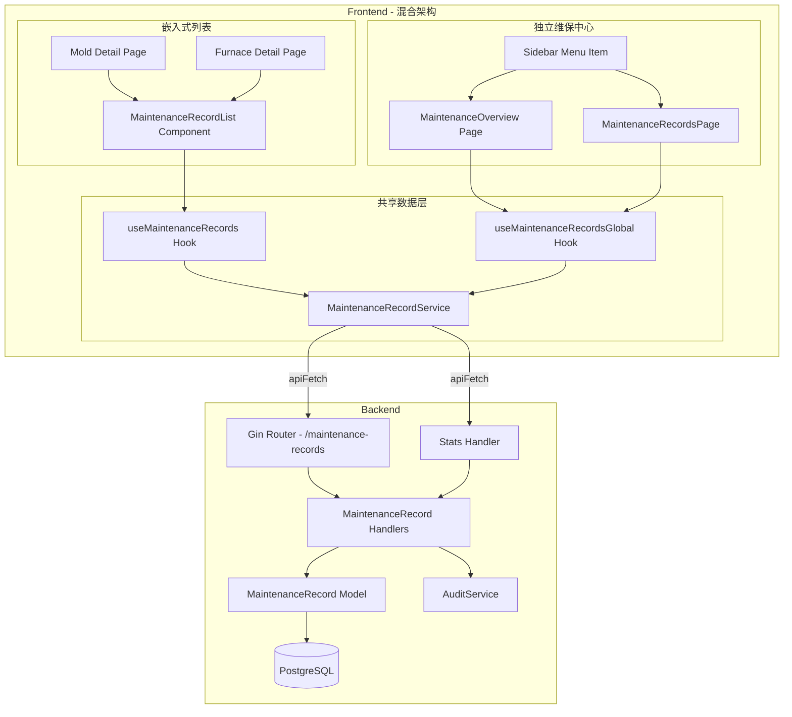
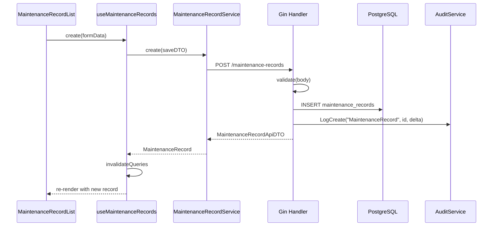
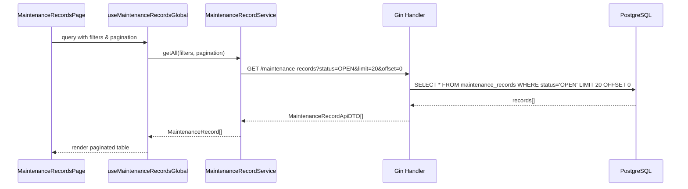
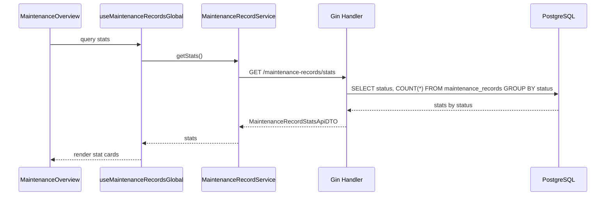
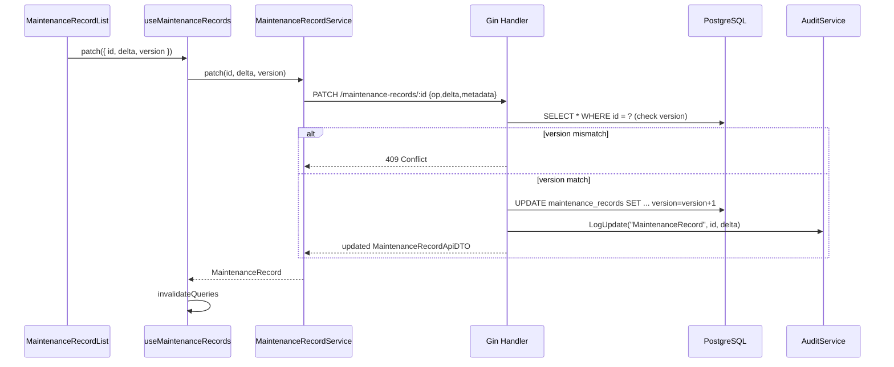

# Design Document: 设备维保记录 (Equipment Maintenance Records)

## Overview

统一维保记录系统，为模具(Mold)和炉台(Furnace)提供共享的维保记录管理能力。通过多态 `asset_type` + `asset_id` 设计，支持未来扩展到更多设备类型。

本功能采用**混合架构**：
- **嵌入式列表**：在模具和炉台详情页中嵌入 `MaintenanceRecordList` 组件，提供设备级维保记录查看和管理
- **独立维保中心**：提供独立的维保中心页面 (`/equipment-maintenance/*`)，支持全局视角的维保记录查询、筛选和管理

后端新增 `maintenance_records` 表及 CRUD API，前端提供共享 `<MaintenanceRecordList>` 组件，分别嵌入模具详情页和炉台详情页。遵循现有 delta-based PATCH、审计日志、zod contract、apiFetch + ensureResponse 等既有模式。

## Architecture



## Components and Interfaces

### Component 1: MaintenanceRecord Model (Backend)

**Purpose**: 统一维保记录数据模型，通过 `assetType` + `assetId` 实现多态关联

```go
// MaintenanceRecord 设备维保记录模型
type MaintenanceRecord struct {
    ID          string         `gorm:"primaryKey;type:uuid;default:gen_random_uuid()" json:"id"`
    AssetType   string         `gorm:"size:50;not null;index:idx_mr_asset" json:"assetType"`   // 'MOLD', 'FURNACE'
    AssetID     string         `gorm:"type:uuid;not null;index:idx_mr_asset" json:"assetId"`
    AssetSN     string         `gorm:"size:100" json:"assetSn"`
    Type        string         `gorm:"size:50;not null" json:"type"`       // 'PREVENTIVE', 'CORRECTIVE', 'INSPECTION'
    Status      string         `gorm:"size:50;default:'OPEN'" json:"status"` // 'OPEN', 'IN_PROGRESS', 'COMPLETED', 'CANCELLED'
    Title       string         `gorm:"size:255;not null" json:"title"`
    Description string         `gorm:"type:text" json:"description"`
    Priority    string         `gorm:"size:20;default:'MEDIUM'" json:"priority"` // 'LOW', 'MEDIUM', 'HIGH', 'CRITICAL'
    StartedAt   *time.Time     `json:"startedAt"`
    CompletedAt *time.Time     `json:"completedAt"`
    Cost        float64        `gorm:"default:0" json:"cost"`
    Remarks     string         `gorm:"type:text" json:"remarks"`
    CreatedBy   string         `gorm:"size:100" json:"createdBy"`
    UpdatedBy   string         `gorm:"size:100" json:"updatedBy"`
    Version     int            `gorm:"default:1" json:"version"`
    CreatedAt   time.Time      `json:"createdAt"`
    UpdatedAt   time.Time      `json:"updatedAt"`
    DeletedAt   gorm.DeletedAt `gorm:"index" json:"-"`
}
```

**Responsibilities**:
- 存储维保记录核心数据
- 通过复合索引 `(asset_type, asset_id)` 高效查询特定设备的维保历史
- 软删除支持

### Component 2: MaintenanceRecord Handlers (Backend)

**Purpose**: RESTful CRUD API，遵循现有 Gin handler 模式

**Interface**:
```go
// Routes (注册在 equipmentGroup 下)
// GET    /maintenance-records?assetType=MOLD&assetId=xxx  → 按设备查询 (assetType/assetId 可选)
// GET    /maintenance-records?limit=20&offset=0           → 全局查询 (支持分页)
// GET    /maintenance-records?status=OPEN&priority=HIGH   → 筛选查询
// GET    /maintenance-records?search=模具维修              → 搜索查询
// GET    /maintenance-records/stats                       → 统计数据
// GET    /maintenance-records/:id                         → 单条详情
// POST   /maintenance-records                             → 新建
// PATCH  /maintenance-records/:id                         → Delta 更新
// DELETE /maintenance-records/:id                         → 软删除
```

**Responsibilities**:
- 参数校验 (assetType 枚举、必填字段)
- Delta-based PATCH (复用现有 `buildXxxUpdates` 模式)
- 审计日志写入 (`services.AuditService`)
- 版本号乐观锁 (version 字段)
- **新增**: 支持可选的 assetType/assetId 参数 (未提供时返回所有记录)
- **新增**: 支持分页 (limit/offset 查询参数)
- **新增**: 支持筛选 (status, priority, type, dateFrom, dateTo, search 查询参数)
- **新增**: 统计端点 (按状态分组计数)

### Component 3: MaintenanceRecordService (Frontend)

**Purpose**: 封装维保记录 API 调用，遵循 `apiFetch` + `ensureObjectResponse`/`ensureArrayResponse` 模式

```typescript
// maintenance-record-service.ts
import { apiFetch } from '@/lib/api-client'
import { ensureArrayResponse, ensureObjectResponse } from '@/lib/api-response'
import { type DeltaPayload, type DeltaSet } from '@/lib/delta/types'
import { type MaintenanceRecord } from '../data/schema'
import {
  type MaintenanceRecordApiDTO,
  type SaveMaintenanceRecordApiDTO,
  type MaintenanceRecordStatsApiDTO,
} from '../contracts/maintenance-record-api-dto'
import {
  toMaintenanceRecordContract,
  toMaintenanceRecordContracts,
  toSaveMaintenanceRecordApiDTO,
} from '../adapters/maintenance-record-api-adapter'

export interface MaintenanceRecordFilters {
  status?: string
  priority?: string
  type?: string
  dateFrom?: string
  dateTo?: string
  search?: string
}

export interface MaintenanceRecordPagination {
  limit?: number
  offset?: number
}

export class MaintenanceRecordService {
  static async getByAsset(assetType: string, assetId: string): Promise<MaintenanceRecord[]> {
    const res = await apiFetch<MaintenanceRecordApiDTO[]>(
      `/maintenance-records?assetType=${assetType}&assetId=${assetId}`
    )
    return toMaintenanceRecordContracts(
      ensureArrayResponse<MaintenanceRecordApiDTO>(res, 'MaintenanceRecordService.getByAsset')
    )
  }

  static async getAll(
    filters?: MaintenanceRecordFilters,
    pagination?: MaintenanceRecordPagination
  ): Promise<MaintenanceRecord[]> {
    const params = new URLSearchParams()
    if (filters?.status) params.append('status', filters.status)
    if (filters?.priority) params.append('priority', filters.priority)
    if (filters?.type) params.append('type', filters.type)
    if (filters?.dateFrom) params.append('dateFrom', filters.dateFrom)
    if (filters?.dateTo) params.append('dateTo', filters.dateTo)
    if (filters?.search) params.append('search', filters.search)
    if (pagination?.limit) params.append('limit', pagination.limit.toString())
    if (pagination?.offset) params.append('offset', pagination.offset.toString())
    
    const queryString = params.toString()
    const url = queryString ? `/maintenance-records?${queryString}` : '/maintenance-records'
    
    const res = await apiFetch<MaintenanceRecordApiDTO[]>(url)
    return toMaintenanceRecordContracts(
      ensureArrayResponse<MaintenanceRecordApiDTO>(res, 'MaintenanceRecordService.getAll')
    )
  }

  static async getStats(): Promise<MaintenanceRecordStatsApiDTO> {
    const res = await apiFetch<MaintenanceRecordStatsApiDTO>('/maintenance-records/stats')
    return ensureObjectResponse<MaintenanceRecordStatsApiDTO & Record<string, unknown>>(
      res, 'MaintenanceRecordService.getStats'
    ) as MaintenanceRecordStatsApiDTO
  }

  static async create(record: SaveMaintenanceRecordApiDTO): Promise<MaintenanceRecord> {
    const res = await apiFetch<MaintenanceRecordApiDTO>('/maintenance-records', {
      method: 'POST',
      body: JSON.stringify(record),
    })
    return toMaintenanceRecordContract(
      ensureObjectResponse<MaintenanceRecordApiDTO & Record<string, unknown>>(
        res, 'MaintenanceRecordService.create'
      ) as MaintenanceRecordApiDTO
    )
  }

  static async patch(id: string, delta: DeltaSet, version: number): Promise<MaintenanceRecord> {
    const payload: DeltaPayload = {
      op: 'PATCH',
      delta,
      metadata: { id, version, intent: 'MAINTENANCE_RECORD_UPDATE' },
    }
    const res = await apiFetch<MaintenanceRecordApiDTO>(`/maintenance-records/${id}`, {
      method: 'PATCH',
      body: JSON.stringify(payload),
    })
    return toMaintenanceRecordContract(
      ensureObjectResponse<MaintenanceRecordApiDTO & Record<string, unknown>>(
        res, 'MaintenanceRecordService.patch'
      ) as MaintenanceRecordApiDTO
    )
  }

  static async delete(id: string): Promise<void> {
    await apiFetch(`/maintenance-records/${id}`, { method: 'DELETE' })
  }
}
```

### Component 4: useMaintenanceRecords Hook (Frontend)

**Purpose**: TanStack Query 封装，提供维保记录的查询与变更能力

```typescript
// use-maintenance-records.ts
import { useMutation, useQuery, useQueryClient } from '@tanstack/react-query'
import { MaintenanceRecordService } from '../services/maintenance-record-service'
import { type MaintenanceRecord } from '../data/schema'
import { type DeltaSet } from '@/lib/delta/types'

export const MAINTENANCE_RECORDS_QUERY_KEY = (assetType: string, assetId: string) =>
  ['maintenanceRecords', assetType, assetId] as const

export function useMaintenanceRecords(assetType: string, assetId: string) {
  const queryClient = useQueryClient()
  const queryKey = MAINTENANCE_RECORDS_QUERY_KEY(assetType, assetId)

  const query = useQuery({
    queryKey,
    queryFn: () => MaintenanceRecordService.getByAsset(assetType, assetId),
    enabled: !!assetId,
  })

  const createMutation = useMutation({
    mutationFn: MaintenanceRecordService.create,
    onSuccess: () => queryClient.invalidateQueries({ queryKey }),
  })

  const patchMutation = useMutation({
    mutationFn: ({ id, delta, version }: { id: string; delta: DeltaSet; version: number }) =>
      MaintenanceRecordService.patch(id, delta, version),
    onSuccess: () => queryClient.invalidateQueries({ queryKey }),
  })

  const deleteMutation = useMutation({
    mutationFn: MaintenanceRecordService.delete,
    onSuccess: () => queryClient.invalidateQueries({ queryKey }),
  })

  return {
    records: query.data ?? [],
    isLoading: query.isLoading,
    create: createMutation.mutateAsync,
    patch: patchMutation.mutateAsync,
    remove: deleteMutation.mutateAsync,
    reload: () => queryClient.invalidateQueries({ queryKey }),
  }
}
```

### Component 5: MaintenanceRecordList (Frontend UI)

**Purpose**: 共享维保记录列表组件，嵌入模具/炉台详情页

```typescript
// MaintenanceRecordList.tsx - Props interface
interface MaintenanceRecordListProps {
  assetType: 'MOLD' | 'FURNACE'
  assetId: string
  assetSn: string
}
```

**Responsibilities**:
- 展示维保记录列表 (紧凑高密度 UI，带颜色状态标签)
- 新建维保记录对话框
- 行内编辑 (状态流转、备注)
- 删除确认
- 按优先级/状态/类型筛选

### Component 6: MaintenanceOverview (Frontend UI)

**Purpose**: 独立维保中心首页，提供全局维保概览和统计

```typescript
// MaintenanceOverview.tsx
interface MaintenanceOverviewProps {}
```

**Responsibilities**:
- 展示维保记录统计卡片 (按状态分组计数: OPEN, IN_PROGRESS, COMPLETED, CANCELLED)
- 展示高优先级待处理记录列表 (status=OPEN, priority=HIGH/CRITICAL)
- 展示最近维保活动 (最近 10 条记录)
- 提供快速导航链接到筛选后的记录列表页

### Component 7: MaintenanceRecordsPage (Frontend UI)

**Purpose**: 独立维保记录列表页，支持全局查询、筛选和管理

```typescript
// MaintenanceRecordsPage.tsx
interface MaintenanceRecordsPageProps {}
```

**Responsibilities**:
- 展示分页表格 (列: assetType, assetSn, title, type, status, priority, createdAt)
- 提供筛选控件 (status, priority, type, date range)
- 提供搜索框 (按 title 或 assetSn 搜索)
- 点击记录行跳转到对应设备详情页的维保记录标签
- 支持从此页面创建新维保记录 (需选择设备)

### Component 8: useMaintenanceRecordsGlobal Hook (Frontend)

**Purpose**: TanStack Query 封装，用于全局维保记录查询 (不限定设备)

```typescript
// use-maintenance-records-global.ts
export const MAINTENANCE_RECORDS_GLOBAL_QUERY_KEY = (
  filters?: MaintenanceRecordFilters,
  pagination?: MaintenanceRecordPagination
) => ['maintenanceRecords', 'global', filters, pagination] as const

export function useMaintenanceRecordsGlobal(
  filters?: MaintenanceRecordFilters,
  pagination?: MaintenanceRecordPagination
) {
  const queryClient = useQueryClient()
  const queryKey = MAINTENANCE_RECORDS_GLOBAL_QUERY_KEY(filters, pagination)

  const query = useQuery({
    queryKey,
    queryFn: () => MaintenanceRecordService.getAll(filters, pagination),
  })

  const statsQuery = useQuery({
    queryKey: ['maintenanceRecords', 'stats'],
    queryFn: () => MaintenanceRecordService.getStats(),
  })

  // Mutations reuse the same logic from useMaintenanceRecords
  // but invalidate the global query key instead

  return {
    records: query.data ?? [],
    stats: statsQuery.data,
    isLoading: query.isLoading,
    // ... mutations
  }
}
```

**Responsibilities**:
- 使用不同的 query key (`['maintenanceRecords', 'global', ...]`) 与设备级缓存隔离
- 支持筛选和分页参数
- 提供统计数据查询

## Data Models

### MaintenanceRecord (Frontend Schema)

```typescript
// data/schema.ts 新增
export const maintenanceRecordTypeSchema = z.enum(['PREVENTIVE', 'CORRECTIVE', 'INSPECTION'])
export const maintenanceRecordStatusSchema = z.enum(['OPEN', 'IN_PROGRESS', 'COMPLETED', 'CANCELLED'])
export const maintenanceRecordPrioritySchema = z.enum(['LOW', 'MEDIUM', 'HIGH', 'CRITICAL'])

export const maintenanceRecordSchema = z.object({
  id: z.string(),
  assetType: z.enum(['MOLD', 'FURNACE']),
  assetId: z.string(),
  assetSn: z.string(),
  type: maintenanceRecordTypeSchema,
  status: maintenanceRecordStatusSchema,
  title: z.string().min(1),
  description: z.string().optional(),
  priority: maintenanceRecordPrioritySchema,
  startedAt: z.string().nullable().optional(),
  completedAt: z.string().nullable().optional(),
  cost: z.number().min(0).default(0),
  remarks: z.string().optional(),
  createdBy: z.string().optional(),
  updatedBy: z.string().optional(),
  version: z.number().default(1),
  createdAt: z.string(),
  updatedAt: z.string().optional(),
})

export type MaintenanceRecord = z.infer<typeof maintenanceRecordSchema>
export type MaintenanceRecordType = z.infer<typeof maintenanceRecordTypeSchema>
export type MaintenanceRecordStatus = z.infer<typeof maintenanceRecordStatusSchema>
export type MaintenanceRecordPriority = z.infer<typeof maintenanceRecordPrioritySchema>
```

**Validation Rules**:
- `title` 必填，最少 1 字符
- `cost` 非负数
- `completedAt` 仅在 status = 'COMPLETED' 时有值
- `startedAt` <= `completedAt` (如果两者都有值)

### MaintenanceRecordApiDTO (Frontend Contract)

```typescript
// contracts/maintenance-record-api-dto.ts
export type MaintenanceRecordTypeApiDTO = 'PREVENTIVE' | 'CORRECTIVE' | 'INSPECTION'
export type MaintenanceRecordStatusApiDTO = 'OPEN' | 'IN_PROGRESS' | 'COMPLETED' | 'CANCELLED'
export type MaintenanceRecordPriorityApiDTO = 'LOW' | 'MEDIUM' | 'HIGH' | 'CRITICAL'

export interface MaintenanceRecordApiDTO {
  id: string
  assetType: string
  assetId: string
  assetSn: string
  type: MaintenanceRecordTypeApiDTO
  status: MaintenanceRecordStatusApiDTO
  title: string
  description?: string
  priority: MaintenanceRecordPriorityApiDTO
  startedAt?: string | null
  completedAt?: string | null
  cost: number
  remarks?: string
  createdBy?: string
  updatedBy?: string
  version: number
  createdAt: string
  updatedAt?: string
}

export interface SaveMaintenanceRecordApiDTO {
  assetType: string
  assetId: string
  assetSn: string
  type: MaintenanceRecordTypeApiDTO
  title: string
  description?: string
  priority?: MaintenanceRecordPriorityApiDTO
  cost?: number
  remarks?: string
}

export interface MaintenanceRecordStatsApiDTO {
  open: number
  inProgress: number
  completed: number
  cancelled: number
  total: number
}
```

### Database Migration

```sql
CREATE TABLE maintenance_records (
    id UUID PRIMARY KEY DEFAULT gen_random_uuid(),
    asset_type VARCHAR(50) NOT NULL,
    asset_id UUID NOT NULL,
    asset_sn VARCHAR(100) DEFAULT '',
    type VARCHAR(50) NOT NULL,
    status VARCHAR(50) NOT NULL DEFAULT 'OPEN',
    title VARCHAR(255) NOT NULL,
    description TEXT DEFAULT '',
    priority VARCHAR(20) NOT NULL DEFAULT 'MEDIUM',
    started_at TIMESTAMPTZ,
    completed_at TIMESTAMPTZ,
    cost NUMERIC(12,2) DEFAULT 0,
    remarks TEXT DEFAULT '',
    created_by VARCHAR(100) DEFAULT '',
    updated_by VARCHAR(100) DEFAULT '',
    version INTEGER NOT NULL DEFAULT 1,
    created_at TIMESTAMPTZ NOT NULL DEFAULT NOW(),
    updated_at TIMESTAMPTZ NOT NULL DEFAULT NOW(),
    deleted_at TIMESTAMPTZ
);

CREATE INDEX idx_mr_asset ON maintenance_records(asset_type, asset_id) WHERE deleted_at IS NULL;
CREATE INDEX idx_mr_status ON maintenance_records(status) WHERE deleted_at IS NULL;
CREATE INDEX idx_mr_created ON maintenance_records(created_at DESC) WHERE deleted_at IS NULL;
```

## Sequence Diagrams

### 创建维保记录 (嵌入式列表)



### 全局查询维保记录 (独立页面)



### 获取统计数据 (维保概览)



### Delta-based PATCH 更新



## Error Handling

### Error Scenario 1: Version Conflict (乐观锁冲突)

**Condition**: PATCH 请求中 metadata.version 与数据库当前 version 不一致
**Response**: 返回 HTTP 409，前端提示"记录已被他人修改，请刷新后重试"
**Recovery**: 前端 invalidateQueries 刷新数据，用户重新编辑

### Error Scenario 2: Asset Not Found

**Condition**: 创建维保记录时 assetId 对应的设备不存在
**Response**: 返回 HTTP 400，提示"关联设备不存在"
**Recovery**: 前端不应出现此情况（assetId 来自已加载的设备详情）

### Error Scenario 3: Invalid Status Transition

**Condition**: 尝试将 COMPLETED/CANCELLED 状态的记录改回 OPEN
**Response**: 返回 HTTP 422，提示"不允许的状态变更"
**Recovery**: 前端 UI 根据当前状态禁用不合法的状态选项

## Testing Strategy

### Unit Testing Approach

**Backend**:
- Handler 测试：验证 CRUD 各端点的请求/响应格式
- 版本冲突测试：并发 PATCH 场景
- 参数校验测试：缺失必填字段、非法枚举值

**Frontend**:
- Service 层 mock apiFetch 验证请求构造
- Hook 层使用 `@tanstack/react-query` 测试工具验证缓存行为
- Component 层使用 testing-library 验证 UI 交互

### Integration Testing Approach

- 端到端：创建维保记录 → 列表查询 → PATCH 更新 → 删除
- 跨设备类型：同一组件分别为 MOLD 和 FURNACE 创建记录，验证隔离性

## Performance Considerations

- 复合索引 `(asset_type, asset_id)` 确保按设备查询 O(log n)
- 前端按 `(assetType, assetId)` 粒度缓存，避免不同设备间缓存污染
- 列表默认按 `created_at DESC` 排序，配合部分索引 `WHERE deleted_at IS NULL`
- 单设备维保记录通常 < 100 条，无需分页（首期）

## Security Considerations

- 路由挂载在 `equipmentAccess` 中间件下，复用现有设备模块权限
- 新增 `ActionEquipmentMaintenanceManage` 权限控制写操作
- 审计日志记录所有 CUD 操作，含操作人、时间、delta
- 软删除确保数据可追溯

## Correctness Properties

*A property is a characteristic or behavior that should hold true across all valid executions of a system—essentially, a formal statement about what the system should do. Properties serve as the bridge between human-readable specifications and machine-verifiable correctness guarantees.*

### Property 1: Create-Read Round Trip

*For any* valid maintenance record input (with valid assetType, type, priority, title, and non-negative cost), creating the record and then reading it back by id SHALL produce a record with all submitted fields preserved, status='OPEN', version=1, and a non-empty generated id and timestamps.

**Validates: Requirements 1.1, 1.2, 1.4, 2.3**

### Property 2: Query Filtering by Asset

*For any* set of maintenance records with mixed assetType/assetId values and soft-delete states, querying by a specific (assetType, assetId) pair SHALL return exactly the non-deleted records matching that pair, and no others.

**Validates: Requirements 2.1, 4.2**

### Property 3: Query Ordering

*For any* list of maintenance records returned by the list endpoint, each record's createdAt SHALL be greater than or equal to the next record's createdAt (descending order).

**Validates: Requirement 2.2**

### Property 4: Delta PATCH Applies Changes and Increments Version

*For any* existing maintenance record with version N and any valid DeltaSet, submitting a PATCH with the correct version SHALL result in the specified fields being updated and the version becoming N+1.

**Validates: Requirement 3.1**

### Property 5: Optimistic Lock Rejects Version Mismatch

*For any* existing maintenance record with version N and any PATCH request with version != N, the Backend SHALL return HTTP 409 and the record SHALL remain unchanged.

**Validates: Requirement 3.2**

### Property 6: Invalid Enum Values Rejected

*For any* string value not in the defined enum set for assetType, type, priority, or status fields, a create or update request containing that value SHALL be rejected with HTTP 400.

**Validates: Requirements 5.2, 5.3, 5.4, 5.5**

### Property 7: Negative Cost Rejected

*For any* negative number provided as the cost field in a create or update request, the Backend SHALL reject the request with HTTP 400.

**Validates: Requirement 5.6**

### Property 8: Temporal Ordering Constraint

*For any* maintenance record where both startedAt and completedAt are provided, if startedAt is later than completedAt, the Backend SHALL reject the request with HTTP 400.

**Validates: Requirement 5.7**

### Property 9: Invalid Status Transitions Rejected

*For any* maintenance record in a terminal status ('COMPLETED' or 'CANCELLED'), attempting to transition to 'OPEN' or 'IN_PROGRESS' SHALL be rejected with HTTP 422.

**Validates: Requirements 6.1, 6.2, 6.3**

### Property 10: Permission Enforcement

*For any* write operation (POST, PATCH, DELETE) by a user without 'ActionEquipmentMaintenanceManage' permission, the Backend SHALL return HTTP 403. *For any* read operation (GET) by a user with 'equipmentAccess' permission, the Backend SHALL allow access.

**Validates: Requirements 7.2, 7.3**

### Property 11: Rendered Record Contains Required Fields

*For any* valid MaintenanceRecord object, the rendered list item SHALL contain the status badge, priority, type, title, and creation date information.

**Validates: Requirement 8.4**

### Property 12: Valid Next-Status Options

*For any* current status value, the set of available next-status options presented in the UI SHALL only include valid transitions (no backward transitions from terminal states).

**Validates: Requirement 10.3**

### Property 13: Cache Isolation by Asset Key

*For any* two different (assetType, assetId) pairs, mutations on one asset's records SHALL NOT invalidate or affect the cached data of the other asset's records.

**Validates: Requirement 11.2**

### Property 14: API DTO to Domain Object Transformation

*For any* valid MaintenanceRecordApiDTO, transforming it through the adapter (toMaintenanceRecordContract) SHALL produce a valid MaintenanceRecord that passes Zod schema validation with all fields correctly mapped.

**Validates: Requirements 12.1, 12.3**

## Dependencies

- **Backend**: Go, Gin, GORM, PostgreSQL (现有依赖，无新增)
- **Frontend**: React, TanStack Query, Zod, shadcn/ui (现有依赖，无新增)
- **共享**: `@/lib/api-client`, `@/lib/api-response`, `@/lib/delta/*` (现有工具库)
