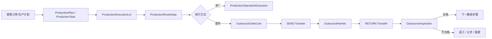

# 生产委外执行链路设计

> 文档状态：生产路线骨架已开始实施，委外执行尚未实施<br>
> 确认日期：2026-07-23<br>
> 适用范围：生产路线、在制品执行、工序转移、委外单位、委外发出/回收/检验<br>
> 前置状态：`产线管理 TAB` 已并入 `产线脑图`，产线拓扑已有唯一维护入口

## 1. 结论先行

委外/外协不能做成一个“公司 + 数量 + 备注”的孤立表单。它本质上是生产执行链路中的一种工序执行方式：

```text
某个批次/单件
  在某条生产路线的某个工序步骤
  被转移到某个具备该能力的委外单位
  发出、在外、回收、检验
  然后根据质量结果进入下一工序、返工、让步或报废
```

因此委外必须绑定：

- 生产路线步骤；
- 批次/单件执行对象；
- 委外单位与能力；
- 发出/回收转移事实；
- 质量检验结果；
- 审计、权限和状态机。

现在不能直接上委外 UI。正确顺序是先落“生产路线 + 执行对象 + 工序转移”骨架，再实现委外单位和委外执行。

## 2. 当前代码现状

### 2.1 已经具备的能力

| 现有对象 | 位置 | 可复用职责 |
| --- | --- | --- |
| `ProductionLine` / `LineSegment` / `JobCategory` / `ProcessStep` | `server/models/production.go`、`src/features/production-shared` | 产线拓扑与工序能力主数据 |
| `ProductionPlan` / `ProductionTask` | `server/models/production_plan.go` | 计划与任务明细，可作为后续执行链路的计划来源 |
| `Supplier` | `server/models/trading.go`、`src/features/purchase/suppliers` | 采购合作方主数据，可作为委外单位的基础引用 |
| `InspectionTask` / `QualityAbnormality` | `server/models/quality.go` | 质量检验与异常事实，可承接委外回收检验 |
| `Inventory` / `InboundRecord` / `ShipmentRecord` | `server/models/inventory.go` | 库存余额和出入库流水，可承接物理数量变化 |
| 产品一维码绑定与裁纱追溯 | `/production/product-barcode-bindings`、裁纱相关模型 | 可提供追溯引用，但不能成为普通生产/委外的硬前置 |

### 2.2 还缺失的关键骨架

| 缺口 | 影响 |
| --- | --- |
| 生产路线实体 | 无法表达“这个产品应该按哪些工序顺序走” |
| 路线步骤版本 | 无法保证历史批次按旧路线追溯，新批次按新路线执行 |
| 批次/单件执行对象 | 无法表达“某个实际产品当前在哪个工序” |
| 工序执行记录 | 无法记录开始、完成、暂停、返工和操作结果 |
| 转移/持有位置 | 无法表达产品在本厂、待发区、委外单位、回收待检区之间移动 |
| 委外单位能力 | 不能确认某个外部单位是否能做某个工序 |
| 委外状态机 | 无法区分草稿、已发出、在外、回收、关闭、取消 |

这些缺口不补，委外页面只能存表单，不能进入长期生产链路。

## 3. 文件职责边界

### 3.1 产线拓扑只能作为能力地图

产线脑图现在是产线主数据、拓扑、工序能力的唯一入口。委外模块只能读取产线拓扑作为能力锚点，不能直接修改：

- 产线资料；
- 一级/二级/三级节点；
- 工序能力绑定；
- 拓扑模板。

原因很简单：委外是“某次执行如何处理”，产线脑图是“系统具备哪些生产能力”。这两个事实不能混写。

### 3.2 供应商不能直接等于委外单位

采购供应商里已有“外协加工”分类，但它只能作为候选来源，不应该把委外能力直接塞进 `Supplier`：

```text
Supplier = 合作方基础资料、采购/结算关系、联系人
OutsourcePartner = 生产委外单位、工序能力、质量准入、交期能力
```

长期模型应是 `OutsourcePartner.supplierId` 可选引用供应商档案。这样能复用统一合作方资料，也能保留生产委外自己的能力、准入和状态。

前端也应遵守现有供应商边界：外部消费者通过 `src/features/purchase/suppliers/index.ts` 暴露的公共 API 使用供应商数据，不深层 import 供应商内部文件。

### 3.3 `ProductionTask` 不应被继续撑大

现在 `ProductionTask` 是计划明细，状态只有：

```text
PENDING / RUNNING / HOLD / DONE
```

它适合表达“计划下有一个任务”，不适合承载：

- 单件/批次当前路线步骤；
- 委外发出批次；
- 委外单位持有中；
- 回收待检；
- 返工/让步/报废后的路线跳转。

如果继续往 `ProductionTask` 加很多外协字段，会让计划、执行、物流、质量全部挤在一个表里，后续一定难维护。应新增独立的执行对象和工序执行记录。

### 3.4 现有 `ProductionUnit` 命名需要避让

当前 `server/models/production_unit.go` 的 `ProductionUnit` 更像“生产组织/执行单元层级”，字段包括 `unitType`、`parentId`、`orgUnitId`、`metadata`，不等于“产品单件”。

后续表示批次/单件时，不建议继续用 `ProductionUnit` 这个名字，避免概念冲突。建议代码命名：

```text
ProductionExecutionLot   // 生产执行批次
ProductionExecutionUnit  // 生产执行单件，可选
```

如果未来要整理旧 `ProductionUnit`，更适合改名为 `ProductionOrgUnit` 或 `ProductionStructureUnit`，但这需要单独迁移，不能和委外首期混在一起做。

## 4. 建议领域模型

### 4.1 路线与步骤

```text
ProductionRoute
  id
  code
  name
  productId / productTemplateId
  version
  status

ProductionRouteStep
  id
  routeId
  sequence
  processStepId
  jobCategoryId
  defaultExecutionMode: IN_HOUSE | OUTSOURCE_ALLOWED | OUTSOURCE_REQUIRED
  qualityGate
```

路线定义“产品怎么走”，产线拓扑定义“能力在哪里”。路线步骤可以引用 `ProcessStep` 和 `JobCategory`，但不反向改拓扑。

### 4.2 执行对象与工序执行

```text
ProductionExecutionLot
  id
  planId
  taskId
  productId
  batchNo
  quantity
  currentRouteStepId
  operationStatus
  custodyStatus
  qualityStatus

ProductionOperationExecution
  id
  executionLotId
  routeStepId
  executionMode: IN_HOUSE | OUTSOURCE
  lineId
  partnerId
  startedAt
  completedAt
  result
```

“到了哪个工序”由 `currentRouteStepId` 与 `ProductionOperationExecution` 表达；“现在在哪里”由持有位置/转移事实表达；“能不能进入下一步”由工序结果和质量状态共同决定。

### 4.3 委外单位与能力

```text
OutsourcePartner
  id
  supplierId
  code
  name
  status
  qualityGrade
  settlementPolicyId

OutsourcePartnerCapability
  id
  partnerId
  processStepId
  jobCategoryId
  leadTimeDays
  minQty
  maxQty
  pricePolicyId
  status
```

委外单位可以引用供应商，但生产能力必须独立维护。

### 4.4 委外任务、转移与检验

```text
OutsourceOrder
  id
  orderNo
  partnerId
  status
  createdFrom

OutsourceOrderLine
  id
  orderId
  executionLotId
  routeStepId
  quantity
  requiredCapabilityId
  status

OutsourceTransfer
  id
  orderLineId
  transferType: SEND | RETURN
  quantity
  fromLocation
  toLocation
  occurredAt
  operator

OutsourceInspection
  id
  orderLineId
  inspectionTaskId
  result
  acceptedQuantity
  rejectedQuantity
  disposition
```

发出和回收必须是事实流水，不要只改订单状态。否则后面无法追责“什么时候发出去、谁收回、数量差异在哪里”。

## 5. 状态不能混在一个字段里

委外至少要拆四个状态维度：

| 状态维度 | 建议值 | 事实所有者 |
| --- | --- | --- |
| 工序状态 | `NOT_STARTED`、`IN_PROGRESS`、`COMPLETED`、`HOLD`、`REWORK` | 生产执行 |
| 委外状态 | `DRAFT`、`RELEASED`、`SENT`、`IN_PROCESS`、`RETURNED`、`CLOSED`、`CANCELED` | 委外执行 |
| 质量状态 | `PENDING`、`PASSED`、`FAILED`、`CONCESSION`、`SCRAP` | 品质管理 |
| 持有位置 | 本厂产线、待发区、委外单位、回收待检区、合格区、不合格区 | 仓储/生产转移 |

一个大 `status` 看起来省事，但会把“任务有没有完成”“东西在哪里”“质量是否放行”混成一团。后期分析、审计、消息规则都会变得很痛苦。

## 6. 数据链路



## 7. 菜单与路由归属

建议仍放在生产管理域，不放采购域：

```text
生产管理
├─ 计划中心
│  ├─ MRP
│  └─ APS
└─ 生产协同
   ├─ 计件管理
   ├─ 生产架构
   └─ 委外管理
      ├─ 委外单位
      ├─ 委外能力
      ├─ 委外任务
      └─ 委外收发检验
```

首期不建议把“委外单位、委外任务、收发检验”拆成多个侧边栏三级域。更好的方式是一个三级域 `委外管理`，内部用 TAB 承载相关页面。三级菜单代表领域，TAB 代表领域内能力，这和当前生产分析域的修正方向一致。

建议首期路由：

```text
/production-outsourcing/partners
/production-outsourcing/capabilities
/production-outsourcing/orders
/production-outsourcing/transfers
```

如果 UI 上希望更收敛，也可以先只放一个入口：

```text
/production-outsourcing
```

然后内部 TAB 为 `委外单位 / 委外能力 / 委外任务 / 收发检验`。这更符合“三级菜单代表域”的原则。

## 8. API 与权限建议

### 8.1 API 分组

```text
GET    /production/routes
POST   /production/routes
PATCH  /production/routes/:id

GET    /production/execution-lots
POST   /production/execution-lots
PATCH  /production/execution-lots/:id/operations

GET    /production/outsourcing/partners
POST   /production/outsourcing/partners
PATCH  /production/outsourcing/partners/:id

GET    /production/outsourcing/orders
POST   /production/outsourcing/orders
PATCH  /production/outsourcing/orders/:id
POST   /production/outsourcing/orders/:id/release
POST   /production/outsourcing/order-lines/:id/send
POST   /production/outsourcing/order-lines/:id/return
POST   /production/outsourcing/order-lines/:id/inspect
```

### 8.2 权限动作

```text
page_production_outsourcing
tab_production_outsourcing_partners
tab_production_outsourcing_capabilities
tab_production_outsourcing_orders
tab_production_outsourcing_transfers

action_production_route_manage
action_production_execution_manage
action_outsource_partner_manage
action_outsource_order_manage
action_outsource_transfer_execute
action_outsource_inspection_submit
```

委外发出、回收、检验都应记录审计事件；发出和回收建议要求二次确认，后续可接入扫码校验。

## 9. 裁纱与卷材边界

这一点要特别写死：

- 产品一维码绑定后即可进入后续生产链路；
- 裁纱计算、卷材绑定、卷材追溯是独立模块；
- 是否绑定卷材不能阻断普通生产下单、工序流转或委外；
- 委外可以引用裁纱追溯信息，但不能反向要求所有产品必须先完成卷材绑定；
- 只有明确配置为“必须追溯卷材”的特殊工艺路线，才允许增加校验，并且必须是路线级配置，不是全局硬编码。

这能避免裁纱模块变成整个生产系统的隐性前置条件。

## 10. 实施顺序

### 阶段 A：生产路线骨架

- [x] 新增 `ProductionRoute` / `ProductionRouteStep` 后端模型；
- [x] 路线步骤引用 `ProcessStep` 与 `JobCategory`；
- [x] 增加路线版本和发布状态；
- [x] 前端新增生产路线只读/维护入口；
- [x] 明确路线与产线脑图的只读引用关系。

### 阶段 B：执行对象与工序流转

- [ ] 新增 `ProductionExecutionLot`；
- [ ] 新增 `ProductionOperationExecution`；
- [ ] 从 `ProductionPlan` / `ProductionTask` 生成执行批次；
- [ ] 实现当前路线步骤推进；
- [ ] 增加持有位置和转移事件基础模型。

### 阶段 C：委外基础资料

- [ ] 新增 `OutsourcePartner`；
- [ ] 支持从 `Supplier` 引用基础资料；
- [ ] 新增 `OutsourcePartnerCapability`；
- [ ] 建立委外单位与工序能力的映射；
- [ ] 增加委外单位权限、审计和搜索。

### 阶段 D：委外执行

- [ ] 新增 `OutsourceOrder` / `OutsourceOrderLine`；
- [ ] 实现发出、回收转移流水；
- [ ] 接入回收检验；
- [ ] 根据检验结果推进、返工、让步或报废；
- [ ] 接入消息中心事件源和审计引擎。

### 阶段 E：页面与菜单

- [ ] 新增 `委外管理` 领域入口；
- [ ] 内部 TAB 承载委外单位、能力、任务、收发检验；
- [ ] 保持移动端可用；
- [ ] 保持权限不足时按钮显示但置灰；
- [ ] 不保留临时旧路由和兼容跳转。

## 11. 不能做的短期捷径

| 捷径 | 为什么不做 |
| --- | --- |
| 在供应商里直接加委外能力字段 | 会让采购主数据拥有生产能力事实 |
| 在 `ProductionTask` 里继续加外协字段 | 会把计划、执行、转移、质量混进一个任务表 |
| 用销售出库/采购入库代替委外发出回收 | 委外是生产在制转移，不是正常销售/采购交易 |
| 委外页面直接修改产线拓扑 | 破坏产线脑图唯一入口 |
| 让卷材绑定成为生产流转前置 | 会让裁纱模块干扰普通生产和委外 |
| 先做一个大表单以后再拆 | 一旦数据进库，后面拆状态机会非常痛苦 |

## 12. 下一步建议

当前已按阶段 A 启动，不从委外页面开始，而是先实施：

```text
生产路线实体 + 路线步骤版本 + 与产线脑图能力的只读引用
```

已落地的第一批骨架包括：

- `ProductionRoute` / `ProductionRouteStep` 后端模型；
- `/production/routes` 读取、保存、删除 API；
- `action_production_route_manage` 权限动作；
- `production-route` 审计实体；
- 生产架构下的 `生产路线` TAB；
- 路线步骤对产线脑图岗位能力与工序的只读引用。

下一步应继续阶段 B：执行批次、工序执行记录和持有位置/转移事件。委外真正开始写代码时，才会有稳定锚点，不会做成漂浮在系统外面的孤岛。
