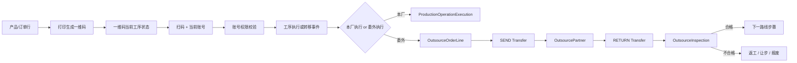

# 生产委外执行链路设计

> 文档状态：生产路线、条码状态、工序执行、统一扫码命令、路线推进、转移事件基础、委外单位档案和委外任务首期已落地；委外可执行工序范围、发出/回收/检验尚未实施<br>
> 确认日期：2026-07-25<br>
> 适用范围：生产路线、在制品执行、工序转移、委外单位、委外发出/回收/检验<br>
> 前置状态：`产线管理 TAB` 已并入 `产线脑图`，产线拓扑已有唯一维护入口

生产拓扑只使用固定层级键 `L1 → L2 → L3`；节点名称由用户自定义，委外链路只保存节点 ID，不通过可变名称或额外中间层定位。

## 1. 结论先行

委外/外协不能做成一个“公司 + 数量 + 备注”的孤立表单。它本质上是生产执行链路中的一种工序执行方式，而执行主线必须以产品一维码为锚点：

```text
产品/订单行
  按产品规则打印生成一维码
  一维码反查产品身份
  一维码绑定当前所在工序状态
  当前账号通过页面/命令/动作权限校验是否允许执行扫码动作
  扫码确认后发生工序执行或转移
  被转移到某个能够执行该工序的委外单位
  发出、在外、回收、检验
  然后根据质量结果进入下一工序、返工、让步或报废
```

因此委外必须绑定：

- 生产路线步骤；
- 产品打印产生的一维码及其当前工序状态；
- 当前账号的页面/命令/动作权限；
- 委外单位与可执行工序范围；
- 发出/回收转移事实；
- 质量检验结果；
- 审计、权限和状态机。

产品主数据、一维码编码、一维码状态和裁纱/卷材追溯必须分开。产品/订单负责生成和打印一维码；生产执行只把状态绑定到一维码上，并通过一维码反查产品。不能为了委外把这些事实拼成一个大对象。

当前已上线委外管理域中的“委外单位”档案和“委外任务”首期能力。委外任务可以从销售订单、生产计划或手工来源创建，因此已经支持“销售订单 500 件，本厂做不过来，直接从开始就委外”的基础登记链路。这里要明确：当前只是委外任务骨架，不是完整委外闭环；可执行工序范围、扫码发出、扫码回收、回收检验和质量判定后的路线跳转还没有实施。

## 2. 当前代码现状

### 2.1 已经具备的能力

| 现有对象 | 位置 | 可复用职责 |
| --- | --- | --- |
| `ProductionLine` / `LineSegment` / `ProcessStep` | `server/models/production.go`、`src/features/production-shared` | 固定 L1/L2/L3 结构：产线、工段、工序 |
| `ProductionPlan` / `ProductionTask` | `server/models/production_plan.go` | 计划与任务明细，可作为后续执行链路的计划来源 |
| `Supplier` | `server/models/trading.go`、`src/features/purchase/suppliers` | 采购合作方主数据，可作为委外单位的基础引用 |
| `OutsourcePartner` | `server/models/production_outsourcing.go`、`src/features/production-outsourcing` | 生产委外单位档案，可选引用供应商并保留委外域自己的状态、等级、交期和结算说明 |
| `OutsourceOrder` / `OutsourceOrderLine` | `server/models/production_outsourcing.go`、`src/features/production-outsourcing/orders` | 生产委外任务首期骨架，承接销售订单、生产计划或手工来源，并保存委外单位、数量、产品快照和从已有 L3 下拉选择的工序锚点 |
| `InspectionTask` / `QualityAbnormality` | `server/models/quality.go` | 质量检验与异常事实，可承接委外回收检验 |
| `Inventory` / `InboundRecord` / `ShipmentRecord` | `server/models/inventory.go` | 库存余额和出入库流水，可承接物理数量变化 |
| 产品一维码绑定与裁纱追溯 | `/production/product-barcode-bindings`、裁纱相关模型 | 一维码由产品/订单打印产生，生产执行只绑定工序状态；裁纱/卷材只作为独立可选追溯 |

### 2.2 当前未完成的关键骨架

| 缺口 | 影响 |
| --- | --- |
| 扫码入口与账号权限落点 | 已新增 `POST /production/scan-commands/execute`，入口复用账号动作权限 `action_production_issuance_execute`；前端 Web/PDA/USB UI 尚未全部改入该统一接口 |
| 路线步骤推进 | 已支持 `COMPLETE` 后按同一路线 `sequence` 推进到下一步骤；返工跳转、质量判定后的跳转策略尚未实施 |
| 转移/持有位置 | 已新增 `product_barcode_transfer_events` 作为路线推进和持有方转移基础事实；委外发出/回收业务状态机尚未实施 |
| 委外单位档案 | 已新增 `OutsourcePartner`、`/production/outsourcing/partners` API、`action_outsource_partner_manage` 权限、`outsource-partner` 审计和 `/production-outsourcing/partners` 页面 |
| 委外单位可执行工序范围 | 不能确认某个外部单位是否能做某个工序 |
| 委外状态机 | 委外任务已有草稿、下发、发出、在外、回收、关闭、取消等状态字段；但扫码发出、扫码回收、检验放行等状态动作尚未实施 |
| 跨域契约 | 仓储、品质、采购、裁纱对委外事实的读写边界还未形成接口级约束 |

这些缺口不补，委外页面只能存表单，不能进入长期生产链路。

## 3. 文件职责边界

### 3.1 产线拓扑只定义工段与工序

产线脑图现在是产线主数据、工段层级和工序定义的唯一入口。最终层级固定为：

```text
ProductionLine 产线
└─ LineSegment 工段
   └─ ProcessStep 工序
```

拓扑固定为 L1 → L2 → L3，不增加独立中间层。工序定义本身负责说明具体操作、适用范围、执行方式、质量关卡和完成后转移要求。委外模块只能读取产线拓扑作为工序锚点，不能直接修改：

- 产线资料；
- 工段层级；
- 工序定义；
- 拓扑模板。

工序可以在同一工段下存在多个，工段也可以存在多个。产品状态只认当前工序，也不把操作人挂到产线节点上。

权限是另一条独立链路：

```text
账号/人员 → 页面权限 / 命令权限 / 动作权限
工序 → 只定义操作内容、顺序锚点和工艺事实
```

扫码时只按当前登录账号校验对应页面、命令或动作权限。工序不引用职位、不引用员工、不引用账号；人员资料里的职位变化不应影响产线拓扑或产品状态历史。

### 3.2 供应商不能直接等于委外单位

采购供应商里已有“外协加工”分类，但它只能作为可引用来源，不应该把委外可执行工序范围直接塞进 `Supplier`：

```text
Supplier = 合作方基础资料、采购/结算关系、联系人
OutsourcePartner = 生产委外单位、可执行工序范围、质量准入、交期约束
```

长期模型应是 `OutsourcePartner.supplierId` 可选引用供应商档案。这样能复用统一合作方资料，也能保留生产委外自己的可执行工序范围、准入和状态。

前端也应遵守现有供应商边界：外部消费者通过 `src/features/purchase/suppliers/index.ts` 暴露的公共 API 使用供应商数据，不深层 import 供应商内部文件。

### 3.3 `ProductionTask` 不应被继续撑大

现在 `ProductionTask` 是计划明细，状态只有：

```text
PENDING / RUNNING / HOLD / DONE
```

它适合表达“计划下有一个任务”，不适合承载：

- 单件/批次当前路线步骤；
- 委外发出批次；
- 委外单位持有中；
- 回收待检；
- 返工/让步/报废后的路线跳转。

如果继续往 `ProductionTask` 加很多外协字段，会让计划、执行、物流、质量全部挤在一个表里，后续一定难维护。应新增独立的执行对象和工序执行记录。

### 3.4 现有 `ProductionUnit` 命名需要避让

当前 `server/models/production_unit.go` 的 `ProductionUnit` 更像“生产组织/执行单元层级”，字段包括 `unitType`、`parentId`、`orgUnitId`、`metadata`，不等于“产品单件”。

后续表示批次/单件时，不建议继续用 `ProductionUnit` 这个名字，避免概念冲突。建议代码命名：

```text
ProductionExecutionLot   // 生产执行批次
ProductionExecutionUnit  // 生产执行单件，可选
```

如果未来要整理旧 `ProductionUnit`，更适合改名为 `ProductionOrgUnit` 或 `ProductionStructureUnit`，但这需要单独迁移，不能和委外首期混在一起做。

## 4. 建议领域模型

### 4.1 路线与步骤

```text
ProductionRoute
  id
  code
  name
  productId / productTemplateId
  version
  status

ProductionRouteStep
  id
  routeId
  sequence
  segmentId
  processStepId
  defaultExecutionMode: IN_HOUSE | OUTSOURCE_ALLOWED | OUTSOURCE_REQUIRED
  qualityGate
```

路线定义“产品按哪些 L2、哪些 L3 顺序走”，产线拓扑提供 L2 与 L3 的只读引用。路线步骤只保存 `segmentId + processStepId`，也不反向改产线拓扑。

工序不能配置按职位授权。职位属于组织人事资料，不参与生产执行授权。是否能扫码、转移、发出、回收或检验，只能由权限系统按账号权限分配到页面、命令或动作上。

### 4.2 一维码状态与工序执行

```text
ProductBarcodeState
  id
  productBarcode
  productId
  currentProcessStepId
  status

ProductBarcodeStateEvent
  id
  productBarcode
  fromProcessStepId
  toProcessStepId
  action: START | COMPLETE | TRANSFER | HOLD | REWORK
  operatorAccount
  occurredAt

ProductionExecutionLot
  id
  productBarcode
  planId
  taskId
  productId
  batchNo
  quantity

ProductionOperationExecution
  id
  productBarcode
  routeStepId
  executionMode: IN_HOUSE | OUTSOURCE
  partnerId
  operatorAccount
  startedAt
  completedAt
  result
```

一维码是执行状态的轻量锚点，但不是新的产品主数据：扫码即可按既有产品编码规则反查产品，再查询当前工序和最近状态事件，不要求先加载整张生产计划或卷材追溯链。批次、计划、质量和委外记录通过 ID 或产品一维码关联，不混入产品主数据。

当前基础状态链已落地：

```text
product_barcode_states
  productBarcode
  productId / productName
  routeId / routeStepId
  currentProcessStepId
  status

product_barcode_state_events
  productBarcode
  fromProcessStepId
  toProcessStepId
  eventType
  operator
  occurredAt
```

对应 API 为 `GET /production/product-barcode-states/:productBarcode` 和 `POST /production/product-barcode-states`。这一步只负责“某个一维码当前在哪个工序”和“状态事件历史”。扫码执行与路线推进已收束到新的统一入口 `POST /production/scan-commands/execute`，不再让 Web、PDA、USB 各自直接猜测当前工序。

当前可选执行批次关联也已落地：

```text
production_execution_lots
  productBarcode
  productId / productName
  planId / taskId
  batchNo
  quantity
  status
```

对应 API 为 `GET /production/execution-lots` 和 `POST /production/execution-lots`。这张表只用于把产品码归入计划、任务或批次，方便后续批量追踪和分析；一维码状态链、扫码执行和委外流转都不能依赖它作为硬前置。

当前工序执行记录已落地：

```text
production_operation_executions
  productBarcode
  processStepId
  routeId / routeStepId
  executionLotId
  action
  status
  operator
```

对应 API 为 `GET /production/operation-executions` 和 `POST /production/operation-executions`。写入时会校验工序存在；是否允许调用该接口、按钮或扫码命令，由账号/人员权限体系在入口侧处理。写入成功后同步追加 `product_barcode_state_events`。

统一扫码命令已落地：

```text
POST /production/scan-commands/execute
  productBarcode
  routeId / routeStepId / processStepId
  action: START | COMPLETE | HOLD | REWORK
  commandSource: WEB | PDA | USB
  optional holder transfer fields
```

该入口负责从请求、条码当前状态和路线步骤推导执行上下文：`START` 可在仅提供路线时取第一步骤初始化；`COMPLETE/HOLD/REWORK` 必须能从当前状态或显式参数定位到当前工序，避免错误完成第一步骤。`COMPLETE` 成功后会按路线步骤顺序推进下一步骤；到最后一步时返回 `routeCompleted=true`，不会生成虚假的下一步。

路线推进和持有方变化会写入：

```text
product_barcode_transfer_events
  productBarcode
  operationId
  transferType: ROUTE_ADVANCE | CUSTODY_TRANSFER
  fromRouteStepId / toRouteStepId
  fromProcessStepId / toProcessStepId
  fromHolderType / fromHolderId
  toHolderType / toHolderId
```

这张表只是转移事实基础，不等于委外发出/回收业务状态机。委外发出、回收、在外、回收待检仍要在 P2 独立实现。

### 4.3 委外单位与可执行工序范围

```text
OutsourcePartner
  id
  supplierId
  code
  name
  status
  qualityGrade
  settlementPolicyId

OutsourcePartnerProcessScope
  id
  partnerId
  processStepId
  leadTimeDays
  minQty
  maxQty
  pricePolicyId
  status
```

委外单位可以引用供应商，但“能做哪些工序”的可执行工序范围必须独立维护。

### 4.4 委外任务、转移与检验

```text
OutsourceOrder
  id
  orderNo
  partnerId
  status
  createdFrom

OutsourceOrderLine
  id
  orderId
  productBarcode
  executionLotId
  routeStepId
  quantity
  requiredProcessStepId
  status

OutsourceTransfer
  id
  orderLineId
  transferType: SEND | RETURN
  quantity
  fromLocation
  toLocation
  productBarcode
  occurredAt
  operatorAccount

OutsourceInspection
  id
  orderLineId
  inspectionTaskId
  result
  acceptedQuantity
  rejectedQuantity
  disposition
```

当前已落地 `OutsourceOrder` / `OutsourceOrderLine` 首期模型和页面：

```text
/production-outsourcing/orders
GET    /production/outsourcing/orders
POST   /production/outsourcing/orders
PATCH  /production/outsourcing/orders/:id
DELETE /production/outsourcing/orders/:id
POST   /production/outsourcing/orders/:id/release
```

它只负责“这批产品/订单行准备交给哪个委外单位做、数量是多少、来源是什么、计划何时发出/返回”。销售订单、生产计划和手工来源只是需求来源，委外任务拥有生产执行责任。当前每条委外明细必须从系统已有 L3 下拉选择 `processStepId`，后端校验该 L3 存在且启用，并回填 `processCode/processName` 快照；不允许在委外页手工创建或手填工序名称。

这里的 L3 不是新建委外工序，而是“产品/任务当前绑定的生产 L3 将要转移给委外单位执行”的稳定锚点。真正发出、回收和回收检验仍要由后续转移事件与状态机完成。

发出和回收必须是事实流水，不要只改订单状态。否则后面无法追责“什么时候发出去、谁收回、数量差异在哪里”。

## 5. 状态不能混在一个字段里

委外至少要拆四个状态维度：

| 状态维度 | 建议值 | 事实所有者 |
| --- | --- | --- |
| 工序状态 | `NOT_STARTED`、`IN_PROGRESS`、`COMPLETED`、`HOLD`、`REWORK` | 生产执行 |
| 委外状态 | `DRAFT`、`RELEASED`、`SENT`、`IN_PROCESS`、`RETURNED`、`CLOSED`、`CANCELED` | 委外执行 |
| 质量状态 | `PENDING`、`PASSED`、`FAILED`、`CONCESSION`、`SCRAP` | 品质管理 |
| 持有位置 | 本厂产线、待发区、委外单位、回收待检区、合格区、不合格区 | 仓储/生产转移 |

一个大 `status` 看起来省事，但会把“任务有没有完成”“东西在哪里”“质量是否放行”混成一团。后期分析、审计、消息规则都会变得很痛苦。

## 6. 数据链路



## 7. 菜单与路由归属

建议仍放在生产管理域，不放采购域：

```text
生产管理
├─ 计划中心
│  ├─ MRP
│  └─ APS
└─ 生产协同
   ├─ 计件管理
   ├─ 生产架构
   └─ 委外管理
      ├─ 委外单位
      ├─ 可执行工序范围
      ├─ 委外任务
      └─ 委外收发检验
```

首期不建议把“委外单位、委外任务、收发检验”拆成多个侧边栏三级域。更好的方式是一个三级域 `委外管理`，内部用 TAB 承载相关页面。三级菜单代表领域，TAB 代表领域内页面，这和当前生产分析域的修正方向一致。

建议首期路由：

```text
/production-outsourcing/partners
/production-outsourcing/process-scope
/production-outsourcing/orders
/production-outsourcing/transfers
```

如果 UI 上希望更收敛，也可以先只放一个入口：

```text
/production-outsourcing
```

然后内部 TAB 为 `委外单位 / 可执行工序范围 / 委外任务 / 收发检验`。这更符合“三级菜单代表域”的原则。

## 8. API 与权限建议

### 8.1 API 分组

```text
GET    /production/routes
POST   /production/routes
PATCH  /production/routes/:id

GET    /production/execution-lots
POST   /production/execution-lots
PATCH  /production/execution-lots/:id/operations

GET    /production/outsourcing/partners
POST   /production/outsourcing/partners
PATCH  /production/outsourcing/partners/:id

GET    /production/outsourcing/orders
POST   /production/outsourcing/orders
PATCH  /production/outsourcing/orders/:id
POST   /production/outsourcing/orders/:id/release
POST   /production/outsourcing/order-lines/:id/send
POST   /production/outsourcing/order-lines/:id/return
POST   /production/outsourcing/order-lines/:id/inspect
```

### 8.2 权限动作

```text
page_production_outsourcing
tab_production_outsourcing_partners
tab_production_outsourcing_process_scope
tab_production_outsourcing_orders
tab_production_outsourcing_transfers

action_production_route_manage
action_production_execution_manage
action_outsource_partner_manage
action_outsource_order_manage
action_outsource_transfer_execute
action_outsource_inspection_submit
```

委外发出、回收、检验都应记录审计事件；发出和回收必须以产品一维码扫码为入口，账号动作权限校验通过后才能写入转移事实。

## 9. 裁纱与卷材边界

这一点要特别写死：

- 产品主数据、一维码身份和一维码工序状态是生产执行主链；
- 裁纱计算、卷材绑定、卷材追溯是独立模块；
- 一维码绑定错误必须能通过产品引用和状态事件直接定位；
- 产品一维码绑定后即可进入后续生产链路；
- 是否绑定卷材不能阻断普通生产下单、工序流转或委外；
- 委外可以引用裁纱追溯信息，但不能反向要求所有产品必须先完成卷材绑定；
- 只有明确配置为“必须追溯卷材”的特殊工艺路线，才允许增加校验，并且必须是路线级配置，不是全局硬编码。

这能避免裁纱模块变成整个生产系统的隐性前置条件。

## 10. 当前已完成与未完成队列

### 10.1 已完成并可作为后续基础

- [x] 新增 `ProductionRoute` / `ProductionRouteStep` 后端模型；
- [x] 将路线步骤收敛为 `segmentId + processStepId`，不再引用旧中间层；
- [x] 增加路线版本和发布状态；
- [x] 前端新增生产路线只读/维护入口；
- [x] 明确路线与产线脑图工段/工序的只读引用关系；
- [x] 新增产品一维码身份与当前工序状态；
- [x] 新增 `ProductionExecutionLot` 作为可选批次关联，不作为扫码前置；
- [x] 新增 `ProductionOperationExecution`；
- [x] 新增统一生产扫码命令入口；
- [x] 新增 `ProductBarcodeTransferEvent` 作为路线推进和持有方转移基础事实；
- [x] 确认工序不承载职位限制，并删除工序与职位映射链路；
- [x] 确认产品一维码绑定后即可进入生产链路，裁纱/卷材追溯不是普通生产硬前置。

### 10.2 P0：先补生产执行主链

- [x] 明确扫码命令入口：Web、PDA、USB 扫码都进入同一条执行命令；
- [x] 扫码入口接入账号/命令/动作权限校验，不从工序读取人员限制；
- [x] 从一维码扫描入口自动触发工序执行；
- [x] 实现当前路线步骤解析与推进；
- [x] 增加扫码确认的持有位置和转移事件基础模型；
- [x] 工序执行与路线推进写入 `production-operation` 审计，并接入 `PRODUCTION_OPERATION` 消息事件源；
- [ ] 返工跳转、质量判定后的路线跳转策略；
- [ ] 委外发出/回收转移事件的独立状态机、审计和消息规则。

### 10.3 P1：再补委外基础资料

- [x] 新增 `OutsourcePartner`；
- [x] 支持从 `Supplier` 引用基础资料；
- [ ] 新增 `OutsourcePartnerProcessScope`；
- [ ] 建立委外单位与可执行工序范围的映射；
- [x] 增加委外单位权限、审计和搜索。

### 10.4 P2：最后补委外执行

- [x] 新增 `OutsourceOrder` / `OutsourceOrderLine`；
- [x] 委外任务支持从销售订单、生产计划或手工来源创建；
- [x] 委外任务支持草稿编辑、删除和下发；
- [ ] 实现发出、回收转移流水；
- [ ] 接入回收检验；
- [ ] 根据检验结果推进、返工、让步或报废；
- [ ] 接入消息中心事件源和审计引擎。

### 10.5 P3：页面与菜单收口

- [x] 新增 `委外管理` 领域入口；
- [x] 已接入 `委外单位` TAB；
- [x] 已接入 `委外任务` TAB；
- [ ] 继续接入可执行工序范围、收发检验 TAB；
- [ ] 保持移动端可用；
- [x] 保持权限不足时按钮显示但置灰；
- [x] 不保留临时旧路由和兼容跳转。

## 11. 不能做的短期捷径

| 捷径 | 为什么不做 |
| --- | --- |
| 在供应商里直接加委外可执行工序范围字段 | 会让采购主数据拥有生产执行范围事实 |
| 在 `ProductionTask` 里继续加外协字段 | 会把计划、执行、转移、质量混进一个任务表 |
| 用销售出库/采购入库代替委外发出回收 | 委外是生产在制转移，不是正常销售/采购交易 |
| 委外页面直接修改产线拓扑 | 破坏产线脑图唯一入口 |
| 让卷材绑定成为生产流转前置 | 会让裁纱模块干扰普通生产和委外 |
| 先做一个大表单以后再拆 | 一旦数据进库，后面拆状态机会非常痛苦 |

## 12. 下一步建议

当前已落地的基础骨架包括：

- `ProductionRoute` / `ProductionRouteStep` 后端模型；
- `/production/routes` 读取、保存、删除 API；
- `action_production_route_manage` 权限动作；
- `production-route` 审计实体；
- 生产架构下的 `生产路线` TAB；
- 路线步骤对产线脑图工段与工序的只读引用；
- 产品、一维码、工序状态、账号权限和裁纱追溯边界已明确。
- `OutsourceOrder` / `OutsourceOrderLine` 委外任务首期模型、API、权限、审计和页面；
- 委外任务可从销售订单、生产计划或手工来源创建，能覆盖“销售订单 500 件直接委外”的基础登记场景。

当前扫码主链已具备后端锚点：

```text
统一扫码命令入口
  → 账号/命令/动作权限校验
  → 读取一维码当前状态
  → 写入工序执行记录
  → 推进路线步骤
  → 写入路线推进/持有方转移基础事实
  → 写入审计与消息事件源
```

下一步应进入 `OutsourcePartnerProcessScope`，把委外单位和可执行工序范围映射起来；之后补发出、回收、检验和质量判定后的路线跳转。后续委外执行必须继续复用这条扫码主链，不能另起一套“公司 + 数量 + 备注”的孤立表单。
