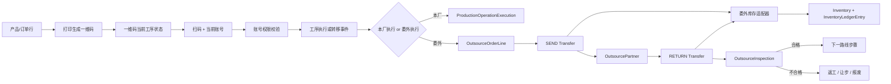

# 生产委外执行链路设计

> 文档状态：生产路线、条码状态、工序执行、统一扫码命令、路线推进、委外单位档案、委外任务、委外收发检验、质量路由、委外消息中心事件源/通知编排、通知失败日志与人工重试恢复、委外运行诊断/对账、跨域读写契约和移动端验收已落地<br>
> 确认日期：2026-07-29<br>
> 适用范围：生产路线、在制品执行、工序转移、委外单位、委外发出/回收/检验<br>
> 前置状态：`产线管理 TAB` 已并入 `产线脑图`，产线拓扑已有唯一维护入口

生产拓扑只使用固定展示层级 `L1 → L2 → L3`；L3 是工段与标准作业动态绑定后的投影，节点名称由用户自定义。委外单不能手填裸 L3 或工序名称；如果需要表达产品当前具体环节，必须读取或初始化一维码当前状态里的 `routeStepId`，再由该路线步骤带出对应作业。这样既能在界面上显示“处于哪个作业”，又不会因同一个标准作业被多条路线复用而定位错误。

本文件中的“工段”指生产拓扑的 `LineSegment`，“工序/作业项目”指 `ProcessStep` 或路线中的 `ProductionRouteStep`。`ProcessStep` 是全局标准作业库，通过映射动态绑定到工段；工段本身不是执行或计件对象。生产拓扑、路线步骤与计件工价的统一边界见 [`生产拓扑路线步骤与计件工价统一设计.md`](生产拓扑路线步骤与计件工价统一设计.md)。

## 1. 结论先行

委外/外协不能做成一个“公司 + 数量 + 备注”的孤立表单。它本质上是生产执行链路中的一种工序执行方式，而执行主线必须以产品一维码为锚点：

```text
产品/订单行
  按产品规则打印生成一维码
  一维码反查产品身份
  一维码绑定当前所在工序状态
  当前账号通过页面/命令/动作权限校验是否允许执行扫码动作
  扫码确认后发生工序执行或转移
  按委外任务选择的合作单位执行
  发出、在外、回收、检验
  然后根据质量结果进入下一工序、返工、让步或报废
```

因此委外必须绑定：

- 生产路线步骤；
- 产品打印产生的一维码及其当前工序状态；
- 当前账号的页面/命令/动作权限；
- 发出/回收转移事实；
- 质量检验结果；
- 审计、权限和状态机。

产品主数据、一维码编码、一维码状态和裁纱/卷材追溯必须分开。产品/订单负责生成和打印一维码；生产执行只把状态绑定到一维码上，并通过一维码反查产品。不能为了委外把这些事实拼成一个大对象。

当前已上线委外管理域中的“委外单位”“委外任务”和“委外收发检验”能力。委外任务必须从销售订单或生产计划创建，因此已经支持“销售订单 500 件，本厂做不过来，直接从开始就委外”的基础登记链路。收发检验页按明细扫描产品一维码，发出和回厂写入独立转移流水，回厂检验复用统一扫码事务推进条码工序状态。路线步骤可配置 `qualityRouting`，为合格、让步接收、返工或报废处置指定同一路线内的目标步骤；未配置目标时，合格/让步接收仍按顺序推进，返工保留在当前步骤并标记 `REWORK`，报废进入 `HOLD`。委外不维护第二套工序能力主数据，产品当前工序只认一维码状态中的 `routeStepId`。

## 2. 当前代码现状

### 2.1 已经具备的能力

| 现有对象 | 位置 | 可复用职责 |
| --- | --- | --- |
| `ProductionLine` / `LineSegment` / `ProcessStep` | `server/models/production_topology.go`、`server/models/production_process.go`、`src/features/production-shared` | 产线、工段、标准作业和动态映射；L3 是映射后的界面投影 |
| `ProductionPlan` / `ProductionTask` | `server/models/production_plan.go` | 计划与任务明细，可作为后续执行链路的计划来源 |
| `Supplier` | `server/models/trading.go`、`src/features/purchase/suppliers` | 采购合作方主数据，可作为委外单位的基础引用 |
| `OutsourcePartner` | `server/models/production_outsourcing.go`、`src/features/production-outsourcing` | 生产委外单位档案，可选引用供应商并保留委外域自己的状态、等级、交期和结算说明 |
| `OutsourceOrder` / `OutsourceOrderLine` | `server/models/production_outsourcing.go`、`src/features/production-outsourcing/orders` | 生产委外任务首期骨架，承接销售订单或生产计划，并保存委外单位、数量和来源产品快照；后续发出/回收必须在扫码时读取一维码当前状态，不由委外单位档案推导 |
| `InspectionTask` / `QualityAbnormality` | `server/models/quality.go` | 质量检验与异常事实，可承接委外回收检验 |
| `Inventory` / `InboundRecord` / `ShipmentRecord` | `server/models/inventory.go` | 库存余额和出入库流水，可承接物理数量变化 |
| 产品一维码绑定与裁纱追溯 | `/production/product-barcode-bindings`、裁纱相关模型 | 一维码由产品/订单打印产生，生产执行只绑定工序状态；裁纱/卷材只作为独立可选追溯 |

> 注：上表中的 `Inventory` / `InboundRecord` / `ShipmentRecord` 仅表示库存物理数量变化的承接点，不等于车型匹配、装车推荐或最终发货确认链路。

### 2.2 关键能力与当前状态

| 能力 | 当前状态 |
| --- | --- |
| 扫码入口与账号权限落点 | 已新增 `POST /production/scan-commands/execute`，入口复用账号动作权限 `action_production_issuance_execute`；PDA、Web、USB 执行入口均已接入统一客户端，Web/USB 独立执行页为 `/production-execution` |
| 路线步骤推进 | 已支持 `COMPLETE` 后按同一路线 `sequence` 推进到下一步骤；委外检验的合格/让步接收复用该链路，质量处置可按路线步骤 `qualityRouting` 跳转目标步骤 |
| 转移/持有位置 | `product_barcode_transfer_events` 提供路线推进和持有方转移基础事实；委外 `SEND` / `RETURN` 已有独立转移流水、数量校验、条码幂等约束和审计 |
| 委外单位档案 | 已新增 `OutsourcePartner`、`/production/outsourcing/partners` API、`action_outsource_partner_manage` 权限、`outsource-partner` 审计和 `/production-outsourcing/partners` 页面 |
| 委外状态机 | 委外任务已有草稿、下发、发出、在外、回收、关闭、取消等状态字段；收发检验、质量处置和路线步骤 `qualityRouting` 首期链路已实施，后续重点是复检扩展、发布路线变更保护和服务器版本回归确认 |
| 跨域契约 | 已形成仓储、品质、采购、裁纱对委外事实的读写边界；委外专用库存适配器已接入，通用库存出入库写入口会拒绝 `PRODUCTION_OUTSOURCE` 专用来源；回收检验会先创建/领取正式 `InspectionTask`，再在同一事务内完成品质任务、委外检验和路线推进 |

首期委外执行链路已经不再只是表单：委外任务、扫码发出/回收、回收检验、质量处置、消息事件、跨域读写边界和委外专用库存适配器均已落地。当前已补齐重复事实的数据库唯一约束兜底、作废单拒绝、跨路线与无权限扫码拒绝、正式品质任务创建/领取/判定桥接、真实多连接 PostgreSQL 并发验收、通知发布失败日志、真实 Redis Pub/Sub 投递、失败通知人工重试入口、失败通知自动重试，以及从事实表反推的委外运行诊断/对账。剩余工作集中在复检扩展、发布路线变更保护和服务器版本回归确认。

## 3. 文件职责边界

### 3.1 产线拓扑维护工段、标准作业与动态绑定

产线脑图现在是产线主数据、工段层级、标准作业库和工段作业绑定的唯一入口。界面层级固定为：

```text
ProductionLine 产线
└─ LineSegment 工段
   └─ ProcessStep 作业投影（来自动态映射）
```

拓扑展示固定为 L1 → L2 → L3，不增加独立中间层。`ProcessStep` 只定义可复用作业主数据；执行方式、质量关卡、顺序、预计耗时和转移要求由 `ProductionRouteStep` 定义。委外模块不能在任务创建时手填裸 L3；后续执行、发出、回收应通过扫码读取一维码当前状态中的 `routeStepId`，再引用路线步骤对应的作业，且不能直接修改：

- 产线资料；
- 工段层级；
- 工序定义；
- 拓扑模板。

一个工段可以动态绑定一个或多个作业；同一个标准作业也可以按业务需要映射到多个工段。产品状态只认当前路线步骤和作业，不把操作人挂到产线节点上。无细分的成型工段也应绑定一个“成型作业”，只是界面可以扁平展示。

权限是另一条独立链路：

```text
账号/人员 → 页面权限 / 命令权限 / 动作权限
工序 → 只定义操作内容、顺序锚点和工艺事实
```

扫码时只按当前登录账号校验对应页面、命令或动作权限。工序不引用职位、不引用员工、不引用账号；人员资料里的职位变化不应影响产线拓扑或产品状态历史。

### 3.2 供应商不能直接等于委外单位

采购供应商里已有“外协加工”分类，但它只能作为可引用来源，不应该把生产执行状态直接塞进 `Supplier`：

```text
Supplier = 合作方基础资料、采购/结算关系、联系人
OutsourcePartner = 生产委外单位、质量准入、交期约束
```

长期模型应是 `OutsourcePartner.supplierId` 可选引用供应商档案。这样能复用统一合作方资料，也能保留生产委外自己的准入、交期和状态。

前端也应遵守现有供应商边界：外部消费者通过 `src/features/purchase/suppliers/index.ts` 暴露的公共 API 使用供应商数据，不深层 import 供应商内部文件。

### 3.3 `ProductionTask` 不应被继续撑大

现在 `ProductionTask` 是计划明细，状态只有：

```text
PENDING / RUNNING / HOLD / DONE
```

它适合表达“计划下有一个任务”，不适合承载：

- 单件/批次当前路线步骤；
- 委外发出批次；
- 委外单位持有中；
- 回收待检；
- 返工/让步/报废后的路线跳转。

如果继续往 `ProductionTask` 加很多外协字段，会让计划、执行、物流、质量全部挤在一个表里，后续一定难维护。应新增独立的执行对象和工序执行记录。

### 3.4 现有 `ProductionUnit` 命名需要避让

当前 `server/models/production_unit.go` 的 `ProductionUnit` 更像“生产组织/执行单元层级”，字段包括 `unitType`、`parentId`、`orgUnitId`、`metadata`，不等于“产品单件”。

后续表示批次/单件时，不建议继续用 `ProductionUnit` 这个名字，避免概念冲突。建议代码命名：

```text
ProductionExecutionLot   // 生产执行批次
ProductionExecutionUnit  // 生产执行单件，可选
```

如果未来要整理旧 `ProductionUnit`，更适合改名为 `ProductionOrgUnit` 或 `ProductionStructureUnit`，但这需要单独迁移，不能和委外首期混在一起做。

## 4. 建议领域模型

### 4.1 路线与步骤

```text
ProductionRoute
  id
  code
  name
  productId / productTemplateId
  version
  status

ProductionRouteStep
  id
  routeId
  sequence
  segmentId
  processStepId
  defaultExecutionMode: IN_HOUSE | OUTSOURCE_ALLOWED | OUTSOURCE_REQUIRED
  qualityGate
  qualityRouting: JSON
```

路线定义“产品按哪些 L2、哪些 L3 顺序走”，产线拓扑提供 L2 与 L3 的只读引用。路线步骤只保存 `segmentId + processStepId`，也不反向改产线拓扑。

`qualityRouting` 是路线步骤的可选质量处置路由，键使用 `ACCEPT`、`CONCESSION`、`REWORK`、`SCRAP`，值指向同一路线内的 `targetRouteStepId`，也可在目标唯一时使用 `targetProcessStepId`。保存路线时会校验目标属于当前路线；执行时委外检验只负责提交处置，统一扫码命令负责写入执行记录、条码状态和转移事实。

工序不能配置按职位授权。职位属于组织人事资料，不参与生产执行授权。是否能扫码、转移、发出、回收或检验，只能由权限系统按账号权限分配到页面、命令或动作上。

### 4.2 一维码状态与工序执行

```text
ProductBarcodeState
  id
  productBarcode
  productId
  routeId
  routeStepId
  currentProcessStepId
  status

ProductBarcodeStateEvent
  id
  productBarcode
  fromProcessStepId
  toProcessStepId
  action: START | COMPLETE | TRANSFER | HOLD | REWORK
  operatorAccount
  occurredAt

ProductionExecutionLot
  id
  productBarcode
  planId
  taskId
  productId
  batchNo
  quantity

ProductionOperationExecution
  id
  productBarcode
  routeStepId
  executionMode: IN_HOUSE | OUTSOURCE
  partnerId
  operatorAccount
  startedAt
  completedAt
  result
```

一维码是执行状态的轻量锚点，但不是新的产品主数据：扫码即可按既有产品编码规则反查产品，再查询当前工序和最近状态事件，不要求先加载整张生产计划或卷材追溯链。批次、计划、质量和委外记录通过 ID 或产品一维码关联，不混入产品主数据。

当前基础状态链已落地：

```text
product_barcode_states
  productBarcode
  productId / productName
  routeId / routeStepId
  currentProcessStepId
  status

product_barcode_state_events
  productBarcode
  fromProcessStepId
  toProcessStepId
  eventType
  operator
  occurredAt
```

对应 API 为 `GET /production/product-barcode-states/:productBarcode` 和 `POST /production/product-barcode-states`。这一步只负责“某个一维码当前在哪个工序”和“状态事件历史”。扫码执行与路线推进已收束到新的统一入口 `POST /production/scan-commands/execute`，不再让 Web、PDA、USB 各自直接猜测当前工序。

当前可选执行批次关联也已落地：

```text
production_execution_lots
  productBarcode
  productId / productName
  planId / taskId
  batchNo
  quantity
  status
```

对应 API 为 `GET /production/execution-lots` 和 `POST /production/execution-lots`。这张表只用于把产品码归入计划、任务或批次，方便后续批量追踪和分析；一维码状态链、扫码执行和委外流转都不能依赖它作为硬前置。

当前工序执行记录已落地：

```text
production_operation_executions
  productBarcode
  processStepId
  routeId / routeStepId
  executionLotId
  action
  status
  operator
```

对应 API 为 `GET /production/operation-executions` 和 `POST /production/operation-executions`。写入时会校验工序存在；是否允许调用该接口、按钮或扫码命令，由账号/人员权限体系在入口侧处理。写入成功后同步追加 `product_barcode_state_events`。

统一扫码命令已落地：

```text
POST /production/scan-commands/execute
  productBarcode
  routeId / routeStepId / processStepId
  action: START | COMPLETE | HOLD | REWORK
  commandSource: WEB | PDA | USB
  optional holder transfer fields
```

该入口负责从请求、条码当前状态和路线步骤推导执行上下文：`START` 可在仅提供路线时取第一步骤初始化；`COMPLETE/HOLD/REWORK` 必须能从当前状态或显式参数定位到当前工序，避免错误完成第一步骤。`COMPLETE` 成功后会按路线步骤顺序推进下一步骤；到最后一步时返回 `routeCompleted=true`，不会生成虚假的下一步。

路线推进和持有方变化会写入：

```text
product_barcode_transfer_events
  productBarcode
  operationId
  transferType: ROUTE_ADVANCE | CUSTODY_TRANSFER
  fromRouteStepId / toRouteStepId
  fromProcessStepId / toProcessStepId
  fromHolderType / fromHolderId
  toHolderType / toHolderId
```

这张表是路线推进和持有方变化的基础事实，不等于委外发出/回收业务状态机。当前委外发出、回收、在外、回收待检和检验处置已由 `OutsourceTransfer`、`OutsourceInspection` 及统一扫码命令共同承接；真实 PostgreSQL + HTTP 主链路、真实 Redis Pub/Sub 投递、跨路线扫码拒绝、无权限扫码拒绝、已作废委外单执行拒绝和多连接并发验收均已通过。

### 4.3 委外单位

```text
OutsourcePartner
  id
  supplierId
  code
  name
  status
  qualityGrade
  settlementPolicyId
  leadTimeDays
  contact / address / notes
```

委外单位只保存合作方、准入和履约资料，不保存产品当前工序，也不维护单位与工序的第二套映射。产品能否被发出、回收或推进，统一由一维码当前状态、生产路线和账号动作权限决定。

### 4.4 委外任务、转移与检验

```text
OutsourceOrder
  id
  orderNo
  partnerId
  status
  createdFrom

OutsourceOrderLine
  id
  orderId
  productBarcode
  executionLotId
  routeStepId
  quantity
  requiredProcessStepId
  status

OutsourceTransfer
  id
  orderLineId
  transferType: SEND | RETURN
  quantity
  fromLocation
  toLocation
  productBarcode
  occurredAt
  operatorAccount

OutsourceInspection
  id
  orderLineId
  inspectionTaskId
  result
  acceptedQuantity
  rejectedQuantity
  disposition
```

当前已落地 `OutsourceOrder` / `OutsourceOrderLine`、`OutsourceTransfer`、`OutsourceInspection` 和委外管理页面：

```text
/production-outsourcing/orders
GET    /production/outsourcing/orders
POST   /production/outsourcing/orders
PATCH  /production/outsourcing/orders/:id
DELETE /production/outsourcing/orders/:id
POST   /production/outsourcing/orders/:id/release
GET    /production/outsourcing/transfers
GET    /production/outsourcing/inventory-category-options
GET    /production/outsourcing/inspections
POST   /production/outsourcing/order-lines/:id/send
POST   /production/outsourcing/order-lines/:id/return
POST   /production/outsourcing/order-lines/:id/inspection-task
POST   /production/outsourcing/order-lines/:id/inspect
```

它只负责“这批产品/订单行准备交给哪个委外单位做、数量是多少、来源是什么、计划何时发出/返回”。销售订单和生产计划只是需求来源，委外任务拥有生产执行责任。当前每条委外明细必须从来源订单行或生产计划读取产品快照；创建任务时不手填裸 `processStepId` 或工序名称。后续扫码发出、转移和回收时，由一维码当前状态里的 `routeStepId` 说明产品正处于路线中的哪个具体作业步骤，再引用该步骤的 `processStepId` 和 `segmentId`；不允许在委外页手工创建或手填产品、工序名称。

这里不能把 L3 当成委外任务创建时随意手填或预选的字段。委外任务创建只读取订单行/生产计划的来源快照和数量；真正发出、回收和回收检验时，必须扫描产品一维码，读取该码当前状态里的 `routeStepId`，再由状态机完成转移和后续推进。

发出和回收必须是事实流水，不要只改订单状态。当前 `OutsourceTransfer` 是发出/回收的事实所有者，委外明细上的累计数量只是查询汇总；这样才能追责“什么时候发出去、谁收回、数量差异在哪里”。

委外执行已接入消息中心独立事件源 `PRODUCTION_OUTSOURCE`。事件源监听 `STATUS_CHANGED` 规则动作，但规则匹配的状态不是只看委外单总状态，而是下达、作废、发出、退回、检验处置和最终关闭这些执行事实：`RELEASED`、`CANCELED`、`SENT`、`RETURNED`、`INSPECTION_ACCEPTED`、`INSPECTION_CONCESSION`、`INSPECTION_REWORK`、`INSPECTION_SCRAP`、`CLOSED`。其中下达、作废和关闭以 `OutsourceOrder.id` 作为事件目标，发出/退回以 `OutsourceTransfer.id` 作为事件目标，检验以 `OutsourceInspection.id` 作为事件目标，保证同一个委外单多行、多条码、多次收发时通知不会被订单聚合状态吞掉。

消息通知失败不会回滚委外业务事实。Redis 发布失败时，业务链路仍完成状态变更并写入 `notify/failed` 规则执行日志；系统管理的执行日志页可对失败通知调用 `POST /message-center/execution-logs/:id/retry-notification` 人工重试，重试结果追加新的 `notify` 日志，不覆盖原失败记录。

2026-07-29 已用真实 PostgreSQL + HTTP API 跑通委外主链路验收：下发委外单、扫码 `START`、扫码 `COMPLETE`、委外发出、委外回厂、回收检验和最终关闭均通过。验收条码 `ACCEPTANCE-BC-001` 最终推进到第二路线步骤，订单和明细均为 `CLOSED`，委外明细累计发出、回厂和接收数量均为 `2`，最终条码状态为 `COMPLETED`。验收还确认了 `OutsourceTransfer`、`OutsourceInspection`、`ProductionOperationExecution`、`ProductBarcodeStateEvent`、`ProductBarcodeTransferEvent`、审计日志与 `PRODUCTION_OUTSOURCE` 消息规则处理日志会在同一业务链路中留下事实。

### 4.5 跨域读写契约

委外执行的长期边界不是“把所有模块都连起来写一遍”，而是明确每个域只能拥有自己的事实：

| 领域 | 可读事实 | 可写事实 | 禁止绕行 |
| --- | --- | --- | --- |
| 仓储/库存 | 可按产品码、批次和持有方读取委外转移事实，用于库存视图和待收发提示 | 只能通过委外发出/回厂专用动作写 `OutsourceTransfer`、`product_barcode_transfer_events`、`Inventory` 和 `InventoryLedgerEntry`；四类事实必须在同一事务中提交，通用库存接口拒绝 `PRODUCTION_OUTSOURCE` 来源 | 不能用通用销售出库、采购入库、库存调整或手工作废来代替委外发出/回厂 |
| 品质 | 可读取 `OutsourceInspection`、产品码状态和可选 `inspectionTaskId` | 委外检验动作写委外检验处置，并通过统一扫码命令推进条码；后续品质任务/异常单必须走品质自己的专用 API | 不能让品质模块直接改委外单总状态或直接推进路线步骤 |
| 采购 | 可读取 `OutsourcePartner.supplierId` 关联的供应商基础资料、结算信息 | 采购只维护供应商、付款、结算和合同类事实；委外单位自己的准入、交期和执行状态由委外域维护 | 不能把供应商状态当成委外执行状态，也不能用采购入库完成委外回厂 |
| 裁纱 | 可按产品码读取卷材、裁纱和追溯信息 | 裁纱只写卷材绑定、裁切计算和追溯事实；委外只保存可选引用 | 不能把卷材绑定变成普通委外发出/回厂的全局前置，除非路线级配置明确要求 |

当前代码中，仓储通用写入口已经通过 `DedicatedInventorySourceProductionOutsource = "PRODUCTION_OUTSOURCE"` 收口：`CreateShipmentDraft`、`RecordInbound`、`CommitShipment`、`VoidShipment` 和草稿修改都会拒绝该来源。委外专用适配器 `applyProductionOutsourceInventoryTransferTx` 负责把产品快照解析为库存物料，在同一事务内锁定源/目标库存、更新 `Inventory`、写入两条 `InventoryLedgerEntry`，并与 `OutsourceTransfer`、`ProductBarcodeTransferEvent` 一起提交；事务成功后才同步库存搜索索引。委外页面不直接调用通用入库/出库接口。

## 5. 状态不能混在一个字段里

委外至少要拆四个状态维度：

| 状态维度 | 建议值 | 事实所有者 |
| --- | --- | --- |
| 工序状态 | `NOT_STARTED`、`IN_PROGRESS`、`COMPLETED`、`HOLD`、`REWORK` | 生产执行 |
| 委外状态 | `DRAFT`、`RELEASED`、`SENT`、`IN_PROCESS`、`RETURNED`、`CLOSED`、`CANCELED` | 委外执行 |
| 质量状态 | `PENDING`、`PASSED`、`FAILED`、`CONCESSION`、`SCRAP` | 品质管理 |
| 持有位置 | 本厂产线、待发区、委外单位、回收待检区、合格区、不合格区 | 仓储/生产转移 |

一个大 `status` 看起来省事，但会把“任务有没有完成”“东西在哪里”“质量是否放行”混成一团。后期分析、审计、消息规则都会变得很痛苦。

## 6. 数据链路



## 7. 菜单与路由归属

建议仍放在生产管理域，不放采购域：

```text
生产管理
├─ 计划中心
│  ├─ MRP
│  └─ APS
└─ 生产协同
   ├─ 计件管理
   ├─ 生产架构
   └─ 委外管理
      ├─ 委外单位
      ├─ 委外任务
      └─ 委外收发检验
```

首期不建议把“委外单位、委外任务、收发检验”拆成多个侧边栏三级域。更好的方式是一个三级域 `委外管理`，内部用 TAB 承载相关页面。三级菜单代表领域，TAB 代表领域内页面，这和当前生产分析域的修正方向一致。

建议首期路由：

```text
/production-outsourcing/partners
/production-outsourcing/orders
/production-outsourcing/transfers
```

如果 UI 上希望更收敛，也可以先只放一个入口：

```text
/production-outsourcing
```

然后内部 TAB 为 `委外单位 / 委外任务 / 收发检验`。这更符合“三级菜单代表域”的原则。

## 8. API 与权限建议

### 8.1 API 分组

```text
GET    /production/routes
POST   /production/routes
PATCH  /production/routes/:id

GET    /production/execution-lots
POST   /production/execution-lots
PATCH  /production/execution-lots/:id/operations

GET    /production/outsourcing/partners
POST   /production/outsourcing/partners
PATCH  /production/outsourcing/partners/:id

GET    /production/outsourcing/orders
POST   /production/outsourcing/orders
PATCH  /production/outsourcing/orders/:id
POST   /production/outsourcing/orders/:id/release
POST   /production/outsourcing/order-lines/:id/send
POST   /production/outsourcing/order-lines/:id/return
POST   /production/outsourcing/order-lines/:id/inspection-task
POST   /production/outsourcing/order-lines/:id/inspect
POST   /quality/tasks/:id/claim
```

### 8.2 权限动作

```text
page_production_outsourcing
tab_production_outsourcing_partners
tab_production_outsourcing_orders
tab_production_outsourcing_transfers

action_production_route_manage
action_production_execution_manage
action_outsource_partner_manage
action_outsource_order_manage
action_outsource_transfer_execute
action_outsource_inspection_submit
```

委外发出、回收、检验都应记录审计事件；发出和回收必须以产品一维码扫码为入口，账号动作权限校验通过后才能写入转移事实。

## 9. 裁纱与卷材边界

这一点要特别写死：

- 产品主数据、一维码身份和一维码工序状态是生产执行主链；
- 裁纱计算、卷材绑定、卷材追溯是独立模块；
- 一维码绑定错误必须能通过产品引用和状态事件直接定位；
- 产品一维码绑定后即可进入后续生产链路；
- 是否绑定卷材不能阻断普通生产下单、工序流转或委外；
- 委外可以引用裁纱追溯信息，但不能反向要求所有产品必须先完成卷材绑定；
- 只有明确配置为“必须追溯卷材”的特殊工艺路线，才允许增加校验，并且必须是路线级配置，不是全局硬编码。

这能避免裁纱模块变成整个生产系统的隐性前置条件。

## 10. 当前已完成与未完成队列

### 10.1 已完成并可作为后续基础

- [x] 新增 `ProductionRoute` / `ProductionRouteStep` 后端模型；
- [x] 将路线步骤收敛为 `segmentId + processStepId`，不再引用旧中间层；
- [x] 增加路线版本和发布状态；
- [x] 前端新增生产路线只读/维护入口；
- [x] 明确路线与产线脑图工段、标准作业及动态映射的只读引用关系；
- [x] 新增产品一维码身份与当前工序状态；
- [x] 新增 `ProductionExecutionLot` 作为可选批次关联，不作为扫码前置；
- [x] 新增 `ProductionOperationExecution`；
- [x] 新增统一生产扫码命令入口；
- [x] 新增 `ProductBarcodeTransferEvent` 作为路线推进和持有方转移基础事实；
- [x] 确认工序不承载职位限制，并删除工序与职位映射链路；
- [x] 确认产品一维码绑定后即可进入生产链路，裁纱/卷材追溯不是普通生产硬前置。

### 10.2 P0：先补生产执行主链

- [x] 明确扫码命令入口：Web、PDA、USB 扫码都进入同一条执行命令；
- [x] 扫码入口接入账号/命令/动作权限校验，不从工序读取人员限制；
- [x] 从一维码扫描入口自动触发工序执行；
- [x] 实现当前路线步骤解析与推进；
- [x] 增加扫码确认的持有位置和转移事件基础模型；
- [x] 工序执行与路线推进写入 `production-operation` 审计，并接入 `PRODUCTION_OPERATION` 消息事件源；
- [x] 返工跳转、质量判定后的路线跳转策略；
- [x] 委外发出/回收转移事件的独立状态机和审计；
- [x] 委外发出/回收/检验消息事件源与通知编排。

### 10.3 P1：再补委外基础资料

- [x] 新增 `OutsourcePartner`；
- [x] 支持从 `Supplier` 引用基础资料；
- [x] 增加委外单位权限、审计和搜索。

### 10.4 P2：最后补委外执行

- [x] 新增 `OutsourceOrder` / `OutsourceOrderLine`；
- [x] 委外任务支持从销售订单或生产计划创建；
- [x] 委外任务支持草稿编辑、删除和下发；
- [x] 实现发出、回收转移流水；
- [x] 接入回收检验；
- [x] 根据检验结果执行合格、让步接收、返工、报废的首期动作；
- [x] 委外与仓储、品质、采购、裁纱的接口契约；
- [x] 配置化返工目标和复杂质量判定后的路线跳转；
- [x] 接入委外审计引擎；
- [x] 接入消息中心事件源和通知编排。

### 10.5 P3：页面与菜单收口

- [x] 新增 `委外管理` 领域入口；
- [x] 已接入 `委外单位` TAB；
- [x] 已接入 `委外任务` TAB；
- [x] 接入收发检验 TAB；
- [x] 保持移动端可用：390px 窄屏下三个委外 TAB 无横向溢出；统计卡片采用紧凑单行布局；委外任务、委外单位和执行弹窗在窄屏接近满宽并保持内部滚动；
- [x] 保持权限不足时按钮显示但置灰；
- [x] 不保留临时旧路由和兼容跳转。

## 11. 不能做的短期捷径

| 捷径 | 为什么不做 |
| --- | --- |
| 在供应商里直接加生产执行字段 | 会让采购主数据拥有生产执行事实 |
| 在 `ProductionTask` 里继续加外协字段 | 会把计划、执行、转移、质量混进一个任务表 |
| 用销售出库/采购入库代替委外发出回收 | 委外是生产在制转移，不是正常销售/采购交易 |
| 委外页面直接修改产线拓扑 | 破坏产线脑图唯一入口 |
| 让卷材绑定成为生产流转前置 | 会让裁纱模块干扰普通生产和委外 |
| 先做一个大表单以后再拆 | 一旦数据进库，后面拆状态机会非常痛苦 |

## 12. 下一步未完成工作

委外首期闭环已经完成，后续不再重复建设委外 CRUD、收发流水、检验处置、质量路由或消息事件源。剩余工作按以下顺序推进：

### 12.1 P0：统一扫码终端接入生产执行

- [x] PDA 生产场景改为调用 `POST /production/scan-commands/execute`，不再进入 `/pda/ingest` 重试队列；
- [x] 前端统一扫码客户端完成来源映射、条码规范化和 400/403/409/网络/超时错误分类；
- [x] Web、USB 扫码执行页面 `/production-execution` 调用统一生产扫码客户端；
- [x] 统一命令层处理 Web/PDA/USB 的当前路线步骤和持有方上下文，Web/USB 页面提供可选路线、工序、委外单位和持有方字段；
- [x] 用真实产品一维码完成“开始/完成/委外发出/回厂/检验”端到端验收；返工链路已有质量路由单元测试覆盖，仍需在真实业务数据中补一次专项验收；
- [x] 补齐同一条码重复委外回厂/检验、数据库唯一约束冲突归一化和已作废委外单执行动作的服务层拒绝测试；
- [x] 验收跨路线步骤扫码、无权限扫码、已作废委外单执行拒绝和真实多连接并发拒绝场景；真实 HTTP 路由权限验收确认无扫码执行权限的账号返回 `403`，并发验收确认下发/作废/发出/回厂不会产生超量、重复事实或状态倒退。

完成标准：所有终端只保留一条扫码执行链，不允许某个终端自行修改条码状态、委外状态或路线步骤。

### 12.2 P0：生产环境数据链路验收

- [x] 使用真实 PostgreSQL、HTTP API 和真实账号权限数据验证路线、条码状态、委外转移、检验、审计和消息规则处理日志；
- [x] 通知发布失败会写入 `notify/failed` 规则执行日志，并支持从执行日志追加重试记录；
- [x] 服务层覆盖重复发出/回厂/检验、唯一约束冲突归一化和作废委外单拒绝；
- [x] 使用真实 Redis Pub/Sub 验证正常异步投递、失败日志、恢复后的人工重试消息到达和 fixture 清理；
- [x] 使用真实多连接 PostgreSQL 验证并发下发/作废/发出/回厂不会产生超量、重复事实或状态倒退（2026-07-29，实际使用 2 个 PostgreSQL backend connection，验收 fixture 自动清理）；
- [x] 验证消息中心实际规则、通知命令、处理状态和审计记录；
- [x] 重新执行 CI 和镜像扫描回归（2026-07-29，`d2943f04` 的 Continuous Integration 与 Publish Production Images 均成功，本地 `pnpm audit --prod --audit-level high --ignore GHSA-mh99-v99m-4gvg` 通过）；
- [ ] 完成服务器部署回归，确认服务器运行的是同一版本；公开健康检查已通过，Hostinger 项目镜像 tag 仍需服务器侧确认。

完成标准：一条真实业务数据可以从来源订单/计划进入委外任务，经扫码发出、回厂检验后，正确推进条码路线并留下完整审计和通知事实。

### 12.3 P1：仓储专用适配器

- [x] 新增 `PRODUCTION_OUTSOURCE` 系统库区，并由委外专用库存适配器负责在制数量；
- [x] 产品通过现有产品到物料解析器解析库存物料，禁止直接把 `ProductID` 当作物料 ID；
- [x] 在同一事务内关联 `OutsourceTransfer`、`ProductBarcodeTransferEvent`、`Inventory` 和两条 `InventoryLedgerEntry`；
- [x] 发出固定目标库区为 `PRODUCTION_OUTSOURCE`，回厂固定来源库区为 `PRODUCTION_OUTSOURCE`；
- [x] 通用销售出库、采购入库、库存调拨、批量同步、负库存对账和库存作废接口拒绝委外专用来源；
- [x] 委外执行页通过生产域只读库区选项接口读取来源/目标库区，不要求额外持有仓储菜单权限；
- [x] 测试夹具覆盖物料映射、库存余额、库存流水、短缺回滚和完整发出/回厂链路。

当前通用库存接口已明确拒绝委外专用来源，委外库存只能沿专用适配器进入，不能用临时放开校验代替。

### 12.4 P1：品质域正式任务桥接

- [x] 将 `InspectionTaskID` 从可选引用扩展为品质任务创建/领取/判定的正式桥接；委外回收检验会创建或领取带 `PRODUCTION_OUTSOURCE` 来源、委外行和产品码绑定的 `InspectionTask`，检验完成后把任务置为 `COMPLETED`；
- [x] 明确品质异常、复检、让步审批和报废审批与委外检验的职责边界：`OutsourceInspection` 只记录委外执行快照，`QualityAbnormality` 记录失败/返工/让步/报废的品质事实和后续处置；复检必须创建新的品质任务/检验轮次，当前首期不提前放开同一条码的多次检验；让步与报废后续审批仍归品质域；
- [x] 品质域只维护质量任务、结果和异常事实，委外域只维护委外订单、收发和检验执行事实，路线推进继续由统一扫码命令负责；品质任务的领取冲突由数据库行锁和来源唯一约束兜底。

### 12.5 P2：运行维护与扩展

- [x] 增加通知发布失败日志和失败通知人工重试入口；
- [x] 增加委外运行诊断、事件幂等告警和转移/检验对账：`GET /production/outsourcing/diagnostics` 只读扫描委外明细、转移事实、库存流水、条码转移事件、检验事实、品质任务桥接和通知执行日志，前端收发检验页显示紧凑诊断面板；诊断层只暴露异常，不反写业务状态；
- [x] 增加通知失败自动重试策略：release 环境默认每 10 分钟通过 Redis 分布式锁扫描 `PRODUCTION_OUTSOURCE` 的 `notify/failed` 原始日志，2 分钟冷却后最多追加 3 次重试日志；已恢复成功、超过次数或本身是重试日志的记录不会再被当成新源头；
- [ ] 补充发布路线后的变更保护和历史版本追溯；
- [ ] 根据实际业务再扩展批次拆分、多次部分回厂和多次检验，不提前复制第二套状态机。

以上事项完成后，委外才算从“首期闭环已实现”进入“真实生产可长期运行”阶段。任何新增页面或模块都必须继续复用：

```text
统一扫码命令入口
  → 账号/命令/动作权限校验
  → 读取一维码当前状态
  → 写入工序执行记录
  → 推进路线步骤
  → 写入路线推进/持有方转移基础事实
  → 写入审计与消息事件源
```
