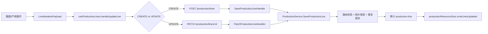
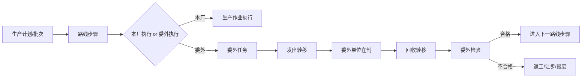

# 生产架构与委外边界设计

> 文档状态：产线管理 TAB 迁移已完成，委外功能尚未实施<br>
> 确认日期：2026-07-24<br>
> 适用范围：生产架构、产线脑图、生产路线、在制品执行、委外/外协<br>
> 当前原则：产线领域已收敛到唯一入口；后续委外先落生产路线与执行链路骨架，项目尚未正式接入生产，不保留旧路由兼容跳转

## 1. 决策摘要

### 1.1 产线管理 TAB 的最终归属

`产线管理` 与 `产线脑图` 当前都围绕同一份 `/production/lines` 数据工作，并且都能修改产线层级。两者长期并存会造成：

- 用户不知道应该在哪个页面维护产线；
- 同一条产线出现两套编辑入口；
- 权限、搜索、最近访问和路由目录需要同时维护；
- 后续委外、工序转移、产能分析无法确定哪个页面是产线结构的权威来源。

最终决策：

```text
产线脑图 = 产线主数据 + 产线拓扑 + 工序能力配置的唯一入口
```

独立的 `产线管理` TAB 应删除，而不是保留空壳、跳转页或兼容入口。

### 1.2 删除前的必要前置条件与当前状态

当前脑图还没有以下产线基础操作：

- 新增产线；
- 编辑产线名称、编码、描述；
- 启用/停用产线；
- 删除产线；
- 产线级操作菜单；
- 拓扑模板的应用/保存入口。

这些前置条件已经在 `产线脑图` 迁移中完成，旧 `line` 路由已删除。实施顺序记录如下：

1. 先将产线基础操作迁入脑图工具栏或“当前产线操作”菜单；
2. 补齐脑图对应的权限状态、确认弹窗和空数据状态；
3. 验证脑图成为完整的产线管理入口；
4. 删除 `line` TAB、旧路由、搜索项、权限目录项和旧菜单引用；
5. 重新生成路由目录与权限索引；
6. 运行前端构建、后端测试和路由/权限一致性检查；
7. 最后再进入委外功能设计与实现。

当前进度：步骤 1 到 6 已完成并提交，委外专项设计已迁入 `docs/architecture/生产委外执行链路设计.md`。

## 2. 当前产线文件职责

### 2.1 页面与路由层

| 文件 | 当前职责 | 长期处理 |
| --- | --- | --- |
| `src/features/production-architecture/index.tsx` | 生产架构页签容器，按路径处理脑图布局 | 保留，删除 `line` 页签后的容器 |
| `src/features/production-architecture/tab-config.ts` | 定义生产架构页签 | 删除 `line` 配置，只保留脑图、层级配置、拓扑模板 |
| `src/routes/_authenticated/production-architecture/line.tsx` | 独立产线管理路由 | 已删除 |
| `src/routes/_authenticated/production-architecture/mindmap.tsx` | 产线脑图路由 | 保留，作为唯一产线入口 |
| `src/routes/_authenticated/production-architecture/index.tsx` | 生产架构根路径入口 | 根路径正式进入 `mindmap` |

根路由切换后不保留 `/production-architecture/line` 的兼容重定向。因为项目尚未正式接入生产，旧地址应直接从代码、权限和路由目录中移除，避免形成长期幽灵入口。

### 2.2 产线管理 UI

| 文件 | 当前职责 | 迁移判断 |
| --- | --- | --- |
| `src/features/production-shared/tabs/line-mgmt/index.tsx` | 产线管理页组合 | 页面入口删除 |
| `src/features/production-shared/tabs/line-mgmt/components/line-list.tsx` | 搜索、列表、新增产线、编辑/删除/启停调度 | 交互逻辑迁入脑图工具栏或产线操作菜单 |
| `src/features/production-shared/tabs/line-mgmt/components/line-card.tsx` | 产线卡片、拓扑树、模板应用、拓扑编辑 | 不整体搬入；拓扑编辑逻辑整理后由脑图复用 |
| `src/features/production-shared/tabs/line-mgmt/components/line-dialog.tsx` | 产线基础资料弹窗 | 改成脑图专用的 `line-profile-dialog` 后复用 |
| `src/features/production-shared/tabs/line-mgmt/components/topology/security-auth-dialog.tsx` | 拓扑/产线敏感操作二次授权 | 提升为生产架构共享组件 |
| `src/features/production-shared/tabs/line-mgmt/hooks/use-line-topology.ts` | 旧树形 UI 的拓扑变更适配 | 脑图已具备同等动作后，删除旧 UI 依赖 |
| `src/features/production-shared/tabs/line-mgmt/utils/line-topology-helpers.ts` | 纯拓扑变更函数 | 保留并迁移到共享 topology 目录 |

`line-mgmt` 不应继续作为长期领域名称。完成迁移后，建议按职责整理为：

```text
src/features/production-shared/
├─ data/
│  ├─ production-line.ts
│  └─ production-process.ts
├─ contracts/
├─ services/
│  └─ production-lines-service.ts
├─ hooks/
│  ├─ use-production-lines.ts
│  └─ use-production-processes.ts
└─ topology/
   ├─ line-topology-helpers.ts
   ├─ line-topology-mutations.ts
   └─ security-auth-dialog.tsx
```

整理的目的不是制造更多目录，而是让“共享数据链路”和“已删除页面的 UI”彻底分离。

### 2.3 产线脑图 UI

| 文件 | 当前职责 | 结论 |
| --- | --- | --- |
| `src/features/production-shared/tabs/line-mindmap/index.tsx` | 脑图页面组合、查询、节点动作、弹窗挂载 | 保留，补齐产线基础操作 |
| `.../components/line-mindmap-toolbar.tsx` | 产线选择、新建一级/二级/三级节点、编辑节点 | 增加新增/编辑/启停/删除产线操作 |
| `.../hooks/use-line-mindmap-view-model.ts` | 当前产线、节点投影、节点选择 | 保留，未来增加当前产线操作状态 |
| `.../hooks/use-line-mindmap-actions.ts` | 层级节点增删改绑 | 保留，改为依赖共享 topology 类型 |
| `.../hooks/use-line-mindmap-topology-auth.ts` | 拓扑变更的二次授权和待提交状态 | 保留，抽离 `LineMutationPayload` 的旧路径依赖 |
| `.../hooks/use-line-mindmap-process-panel.ts` | 工序库查询、工序能力绑定、工序增删改 | 保留，作为脑图的三级能力配置 |
| `.../components/line-mindmap-dialogs.tsx` | 统一挂载脑图弹窗 | 增加产线资料、产线删除确认、产线状态变更弹窗 |
| `.../adapters/line-mindmap-adapter.ts` | 将产线 DTO 投影为脑图节点 | 保留，只负责投影，不负责写入 |

当前脑图已经能完成：

- 产线选择；
- 一级、二级、三级节点新增；
- 节点重命名、删除、重绑；
- 工序能力分配；
- 工序库新增、编辑、删除；
- 层级配置弹窗。

缺失的是产线自身的生命周期操作，而不是拓扑能力。

## 3. 当前数据链路

### 3.1 前端读取链路


脑图和旧产线管理页读取同一个 Query Cache，因此删除页面不会影响数据源；必须保留 `useProductionLinesQuery`、`productionLinesService`、DTO、适配器和缓存失效逻辑。

### 3.2 前端写入链路



当前共享 hook 已整理为 `useProductionLines`，旧 `useLineMgmtLines` 文件和页面入口均已删除。

### 3.3 后端保存边界

| 层 | 文件 | 责任 |
| --- | --- | --- |
| 路由 | `server/routes/routes_production.go` | 注册 `/production/lines`、`/production/processes`、映射接口及权限中间件 |
| Handler | `server/handlers/production_topology_handlers.go` | 解析请求、映射操作者/客户端 IP、返回 HTTP 状态 |
| Service | `server/services/production_service.go` | 事务、版本冲突、拓扑授权、审计、关联删除 |
| Repository | `server/repositories/production_repository.go` | GORM 查询、层级预加载、嵌套保存、映射表维护 |
| Model | `server/models/production.go` | 产线、一级节点、二级节点、工序能力的持久化结构 |
| DTO | `server/services/production_dto.go` | HTTP DTO 与模型之间的转换 |

后端目前没有“旧页面专用 API”。因此应删除旧前端入口，而不是删除 `/production/lines` API。

## 4. 重复职责与长期风险

### 4.1 重复职责

旧 `line-mgmt` 和 `line-mindmap` 都：

- 读取 `/production/lines`；
- 展示产线与层级；
- 修改产线拓扑；
- 触发版本更新；
- 受生产域权限保护。

差异仅在呈现方式和脑图额外的工序能力操作。继续保留两个页面会让同一份拓扑出现“双写入口”。

### 4.2 当前保存模型的风险

`SaveProductionLine` 会按整棵层级树保存，并删除不再提交的关联节点。该模式可以保证一棵树的整体一致性，但要求：

- 所有写入都携带最新 `version`；
- 任何页面都不能只提交局部旧快照；
- 脑图和未来委外页面不能直接修改产线拓扑；
- 发生 409 时必须让用户重新读取，而不是静默覆盖。

因此脑图成为唯一拓扑写入口后，版本冲突更容易定位，长期稳定性更高。

### 4.3 权限风险

当前前端路由、搜索和权限目录仍显式包含：

- `src/features/authz/data/authenticated-route-catalog.ts`
- `src/features/authz/data/route-permission-labels.ts`
- `src/components/layout/data/search-data.ts`
- `src/features/production-architecture/tab-config.ts`
- `src/routes/_authenticated/production-architecture/line.tsx`

删除 TAB 时必须一起清理，否则会出现“页面没有入口但权限/搜索仍可进入”的幽灵路由。

后端的权限边界仍应保留：

- 读取产线：生产配置菜单权限；
- 修改拓扑：`action_production_line_update`；
- 新增/删除产线：管理员权限；
- 拓扑敏感操作：`topology_auth_password` 二次授权。

## 5. 产线唯一入口的目标结构

```text
生产管理
└─ 生产协同
   └─ 生产架构
      ├─ 产线脑图（唯一产线管理入口）
      │  ├─ 产线选择与搜索
      │  ├─ 新增产线
      │  ├─ 编辑产线资料
      │  ├─ 启用 / 停用
      │  ├─ 删除产线
      │  ├─ 一级 / 二级 / 三级节点
      │  ├─ 工序库与工序能力
      │  └─ 拓扑模板应用 / 保存
      ├─ 层级配置
      └─ 拓扑模板
```

脑图工具栏建议分为三组，避免按钮继续堆叠：

1. **产线选择**：搜索、切换当前产线；
2. **产线操作**：新增、编辑、启停、删除、模板；
3. **结构操作**：新建一级/二级/三级节点、编辑当前节点、打开层级配置。

产线资料弹窗与节点编辑弹窗必须区分：

- 产线资料：名称、编码、描述、状态；
- 节点编辑：层级名称、层级绑定、节点说明、工序能力。

## 6. 迁移实施清单

### 阶段 A：脑图补齐基础能力

- [x] 将 `LineDialog` 整理为长期命名的产线资料弹窗；
- [x] 在脑图 Toolbar 增加“新增产线”；
- [x] 在当前产线操作菜单增加“编辑资料、启用/停用、删除”；
- [x] 复用现有版本、拓扑授权、审计和乐观更新链路；
- [x] 空产线时仍能从脑图直接创建第一条产线；
- [x] 无权限时保留按钮但置灰，并说明缺少的权限；
- [x] 删除产线使用管理员权限和明确确认。

### 阶段 B：共享职责整理

- [x] `use-line-mgmt-lines.ts` 重命名为 `use-production-lines.ts`；
- [x] `LineMutationPayload` 移到共享 contracts；
- [x] `line-topology-helpers.ts` 移到 `production-shared/topology`；
- [x] 安全授权弹窗移到生产架构共享组件；
- [x] 脑图不再从 `tabs/line-mgmt` 深层导入共享能力；
- [x] 检查所有跨域深层 import，保持显式共享模块边界。

### 阶段 C：删除旧入口

- [x] 从 `getProductionArchitectureTabs` 删除 `line`；
- [x] 删除 `src/routes/_authenticated/production-architecture/line.tsx`；
- [x] 根路径进入 `mindmap`，不保留旧兼容跳转；
- [x] 从 `search-data.ts` 删除产线管理搜索项；
- [x] 从 `authenticated-route-catalog.ts` 删除旧路由；
- [x] 从 `route-permission-labels.ts` 删除旧页签标签；
- [x] 删除旧 UI 组件和只服务于旧页面的 hook；
- [x] 删除生产架构页签中旧“产线管理”文案；
- [x] 重新生成路由树、权限清单和搜索索引。

### 阶段 D：验收

- [x] 新增、编辑、启停、删除产线均可在脑图完成；
- [x] 拓扑和工序能力编辑不丢失；
- [x] 版本冲突能阻止覆盖；
- [x] 二次授权仍生效；
- [x] 删除产线后相关层级级联清理；
- [x] 搜索、侧边栏、最近访问不再出现旧路由；
- [x] 直接访问旧路径不产生兼容页面；
- [x] 完整前端构建、后端测试和部署前检查通过。

## 7. 委外/外协的长期领域边界

产线入口收敛后，再设计委外。委外不是采购订单的附属页面，也不是供应商资料的另一个别名；它是生产执行在某个工序节点上的外部执行方式。

### 7.1 领域归属

```text
生产管理
├─ 计划中心
├─ 生产协同
│  └─ 生产架构 / 产线脑图
└─ 委外管理
   ├─ 委外基础
   │  ├─ 委外单位
   │  ├─ 委外能力
   │  └─ 委外协议/价格
   └─ 委外执行
      ├─ 委外任务
      ├─ 发出
      ├─ 在外
      ├─ 回收
      └─ 委外检验
```

委外属于生产管理域。采购域可以维护结算、付款和供应商合作信息，但不能拥有“某个产品当前处于哪个生产工序”的事实。

### 7.2 不应直接修改的现有对象

| 对象 | 原因 |
| --- | --- |
| `Product` | 产品是主数据，不代表某个生产批次当前执行到哪一步 |
| `ProductionLine` | 产线是能力拓扑，不代表在制品状态 |
| `Supplier` | 供应商适合采购合作方，不能自动代表具备某道工序的委外能力 |
| `EquipmentPartner` | 设备/工装合作方与生产加工委外不是同一事实 |
| 裁纱卷材绑定 | 裁纱与卷材追溯是独立模块，不能成为后续生产或委外的硬前置 |

### 7.3 建议的核心实体

```text
ProductionRoute
  └─ ProductionRouteStep

ProductionLot / ProductionUnit
  ├─ currentRouteStepId
  ├─ executionStatus
  ├─ holdingLocation
  └─ trace references

ProductionOperationExecution
  ├─ lot/unit
  ├─ routeStep
  ├─ productionLine
  ├─ startedAt / completedAt
  └─ result

OutsourcePartner
  └─ OutsourcePartnerCapability

OutsourceOrder
  └─ OutsourceOrderLine
      ├─ lot/unit
      ├─ routeStep
      ├─ quantity
      └─ requiredCapability

OutsourceTransfer
  ├─ sentAt
  ├─ returnedAt
  ├─ quantity
  └─ custody/location

OutsourceInspection
  ├─ result
  ├─ acceptedQuantity
  ├─ rejectedQuantity
  └─ disposition
```

### 7.4 状态必须拆开

委外设计不能只用一个 `status` 解决所有问题，至少要区分：

| 状态维度 | 示例 |
| --- | --- |
| 工序状态 | `NOT_STARTED`、`IN_PROGRESS`、`COMPLETED`、`HOLD` |
| 委外状态 | `DRAFT`、`RELEASED`、`SENT`、`IN_PROCESS`、`RETURNED`、`CLOSED`、`CANCELED` |
| 质量状态 | `PENDING`、`PASSED`、`FAILED`、`CONCESSION`、`REWORK` |
| 持有位置 | 本厂产线、待发区、委外单位、回收待检区、合格区、不合格区 |

“产品到了哪个工序”应由 `ProductionLot/ProductionUnit + RouteStep + OperationExecution` 表达；“东西现在在哪里”由库存/转移事实表达；“是否允许进入下一道工序”由工序完成和质量判定共同决定。

### 7.5 委外执行链路



委外任务必须绑定具体路线步骤和批次/单件，不允许只有“公司 + 数量”的孤立记录。

### 7.6 裁纱边界

裁纱、计算、卷材追溯是独立能力：

- 产品只要完成必要的一维码/产品绑定，就可以进入后续下单和生产流程；
- 是否绑定卷材、是否完成裁纱计算，不得成为普通生产或委外的强制阻断条件；
- 裁纱结果可作为追溯、自动切割和后续质量分析的补充事实；
- 委外系统只能引用裁纱追溯信息，不能反向要求所有产品必须先绑定卷材。

这是生产执行和裁纱引擎之间的硬边界，必须在后续接口契约和验收用例中明确。

## 8. 委外实施前置条件

在实现委外页面前，必须先完成：

1. 产线管理 TAB 删除，脑图成为产线唯一入口；
2. 生产路线与产线拓扑的关系定义；
3. 生产批次/单件执行对象落地；
4. 工序转移事件和持有位置模型落地；
5. 委外单位与委外能力主数据模型落地；
6. 委外发出、回收、检验的状态机确认；
7. 与仓储、品质、采购、裁纱模块的读写边界确认；
8. 审计事件和权限动作清单确认。

没有这些前置条件时，直接做委外 UI 会得到一套无法追溯、无法判断在制状态的孤立表单。

## 9. 当前未完成项

### 产线架构

- [x] 脑图补齐产线基础资料 CRUD；
- [x] 共享 hook、类型、拓扑 helper 重命名和归位；
- [x] 删除旧 `line` TAB、路由、搜索项和权限目录引用；
- [x] 更新根路径默认入口；
- [x] 完成完整构建、后端回归和部署前检查；
- [ ] 部署到服务器。

### 委外/外协

- [ ] 生产路线实体和版本策略；
- [ ] 批次/单件执行实体；
- [ ] 工序执行与转移事件；
- [ ] 委外单位和能力档案；
- [ ] 委外任务、发出、回收、检验；
- [ ] 委外与仓储、品质、采购、裁纱的接口契约；
- [ ] 委外权限、审计和状态机测试；
- [ ] 委外页面和菜单归属；
- [x] 委外专项架构文档落位：`docs/architecture/生产委外执行链路设计.md`。

## 10. 最终验收原则

### 产线架构

- 一个产线只有一个维护入口：产线脑图；
- 产线资料与产线拓扑在同一领域内，但弹窗职责分离；
- 所有写入共享同一版本、授权、审计和缓存链路；
- 删除旧路由后，搜索、权限、侧边栏和最近访问不再出现旧入口；
- 不保留兼容跳转和旧连接。

### 委外/外协

- 委外任务必须绑定路线步骤和批次/单件；
- 工序状态、委外状态、质量状态、持有位置互不混淆；
- 委外单位不是简单复制采购供应商；
- 委外回收必须经过质量判定才能进入下一工序；
- 裁纱/卷材追溯不会阻断未绑定产品进入正常生产链路；
- 生产、采购、品质、仓储和裁纱分别拥有自己的事实所有权。

> 结论：产线唯一入口迁移已完成。下一步不应直接做委外 UI，应先实施“生产路线实体 + 路线步骤版本 + 与产线脑图能力的只读引用”，再进入执行批次、工序流转和委外状态机。
