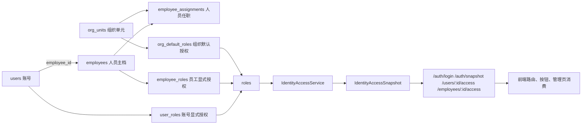

# 组织、人员、账号、权限统一实施方案

## 1. 目标

项目尚未正式接入生产，本方案不为旧权限链路保留长期兼容入口。目标是把系统统一到一条明确的权威链路上：

- 组织权威源：`org_units`
- 人员归属权威源：`employee_assignments`
- 账号身份绑定：`users.employee_id`
- 显式授权权威源：`user_roles`、`employee_roles`
- 默认授权权威源：`org_default_roles`
- 运行时权限裁决权威出口：后端统一 `IdentityAccessSnapshot`

统一后的口径：

- 组织决定人员归属。
- 人员归属决定组织默认授权。
- 账号只负责登录与身份映射，不再直接成为普通员工权限真相源。
- 前端只消费后端裁决结果，不自行推导最终权限。

> 2026-07-25 纠正：职位/岗位只作为组织人事资料和任职属性，不作为当前权限默认来源。页面权限、命令权限、动作权限必须通过账号、角色和显式权限裁决，不能通过职位名称、生产工序或产线节点反推。

---

## 2. 统一原则

本方案严格遵循 [GEMINI.md](../../GEMINI.md)：

- 后端权威
  - 所有 `effectiveRoles`、`permissions` 必须由后端统一计算。
- 服务去副作用化
  - `services/` 只做请求与 DTO 封装，不做权限推导和跨模块状态同步。
- 语义化写操作
  - 调部门、调岗、授权、换绑、停用账号不能长期停留在字段级 patch。
- 分阶段收敛
  - 可以按开发风险分批落地，但最终代码只保留一条正式链路，不保留旧模型兜底。
- Fail loudly
  - 对缺失员工、缺失归属、缺失默认角色、空权限等异常，输出明确诊断。

---

## 3. 目标架构



---

## 4. 当前问题与改造方向

## 4.1 当前问题

当前系统已经有一半实现了统一方向，但还有三个核心断点：

1. 组织和人员主写模型仍然是旧链路
   - 页面维护的是 `organizations` 和 `employees.dept_id`
   - 但权限解析开始读 `org_units`、`employee_assignments`
2. 员工侧改动没有形成权限同步闭环
   - 用户改角色会同步 `user_roles` / `employee_roles`
   - 员工调部门、调岗、批量同步后，没有统一重算和回写
3. `users.role` 仍承担过多职责
   - 列表展示字段、主角色来源、旧权限兜底来源混在一起

## 4.2 总体改造策略

采用“三阶段、读先于写、最后移除旧入口”的方式：

1. 先统一后端读模型
   - 把运行时权限裁决全部收敛到一个服务
2. 再补齐写后同步闭环
   - 所有影响权限的数据变更，都触发统一重算
3. 最后切换主写模型并删除旧入口
   - 组织和人员页面从旧表写入切到新模型写入，完成后移除旧写路径和旧兜底逻辑

---

## 5. 阶段划分

## 5.1 Phase A：统一读模型

目标：

- 登录、鉴权、中后台查询统一依赖同一个权限快照服务。
- 明确“谁是主角色、哪些是附加角色、来源是什么”。

### A.1 新增统一快照 DTO

建议新增：

- `server/dependencies/identity_access.go`
- `server/services/identity_access_service.go`
- `server/services/identity_access_dto.go`

建议 DTO：

```go
type AccessRoleSource string

const (
	AccessRoleSourceUserPrimary      AccessRoleSource = "user_primary"
	AccessRoleSourceUserSecondary    AccessRoleSource = "user_secondary"
	AccessRoleSourceEmployeePrimary  AccessRoleSource = "employee_primary"
	AccessRoleSourceOrgDefault       AccessRoleSource = "org_default"
)

type AccessRoleBinding struct {
	RoleID      string           `json:"roleId"`
	Source      AccessRoleSource `json:"source"`
	IsPrimary   bool             `json:"isPrimary"`
	BindingID   string           `json:"bindingId,omitempty"`
	EmployeeID  string           `json:"employeeId,omitempty"`
	AssignmentID string          `json:"assignmentId,omitempty"`
}

type IdentityAccessSnapshot struct {
	UserID           string              `json:"userId"`
	EmployeeID       string              `json:"employeeId,omitempty"`
	PrimaryRoleID    string              `json:"primaryRoleId"`
	EffectiveRoles   []string            `json:"effectiveRoles"`
	Permissions      []string            `json:"permissions"`
	RoleBindings     []AccessRoleBinding `json:"roleBindings"`
	Diagnostics      []string            `json:"diagnostics,omitempty"`
	Version          int64               `json:"version"`
}
```

### A.2 收敛后端读取入口

把这些入口统一改为通过 `IdentityAccessService` 读取：

- [server/handlers/auth.go](../../server/handlers/auth.go)
- [server/middleware/auth.go](../../server/middleware/auth.go)
- [server/handlers/users.go](../../server/handlers/users.go)

原有 [server/dependencies/effective_access.go](../../server/dependencies/effective_access.go) 只允许作为短期内部适配点：

- 内部改为调用新服务；
- 调用方迁完后删除或改名，不能继续形成第二套权限解析。

### A.3 增加诊断能力

快照服务在返回权限时应同步返回诊断信息，例如：

- 账号绑定了不存在的员工
- 员工没有有效任职
- 任职没有组织单元
- 组织没有默认角色
- 普通员工没有任何有效权限

这些诊断至少用于：

- 后台用户详情页
- 员工详情页
- 系统管理诊断页

---

## 5.2 Phase B：补齐写后同步闭环

目标：

- 所有影响权限的变更，在同一事务内完成数据写入、快照重算、绑定关系对齐、审计记录。

### B.1 实现 `RoleSnapshotSynchronizer`

当前 `server/dependencies/role_snapshot.go` (historical target; file not present in current tree) 是空实现。

应实现为统一同步入口，至少提供：

- `SyncEmployee(tx, employee)`
- `SyncDepartment(tx, orgUnitID)`
- `SyncUser(tx, userID)` 或等价能力

其职责：

1. 找出受影响员工和账号
2. 重新计算快照
3. 对齐绑定关系
   - 必要时更新 `employee_roles`
   - 避免残留失效的 account-managed 绑定
4. 记录审计

### B.2 接入员工侧写路径

把以下路径全部接入同步器：

- [server/services/organization_service.go](../../server/services/organization_service.go)
  - `SaveEmployee`
  - `PatchEmployee`
  - `BulkSyncEmployees`
  - `DeleteEmployees`

最低要求：

- 员工保存后：同步该员工绑定账号的权限快照
- 员工部门变更后：重新计算默认组织角色
- 员工离职/停用后：账号状态或可用权限同步调整

### B.3 接入组织侧写路径

把以下路径接入同步器：

- 组织单元默认角色变化
- 组织树调整
- 任职变更

注意：

- 组织名称变更本身未必影响权限
- 组织默认角色、挂靠组织变化会影响权限
- 职位/岗位变化只影响人事资料展示；除非未来另立权限专项，否则不触发权限默认来源变化

### B.4 收口 `users.role`

`users.role` 是当前 schema 中仍存在的旧字段，但不再作为长期权限设计方向。规则改为：

- 它不再是普通员工权限主来源
- 它只是 `IdentityAccessSnapshot.primaryRoleId` 的镜像
- 列表展示必须同时标明这是主角色快照，不得展示成最终权限
- 完成前端和接口切换后，删除基于它的权限兜底逻辑

---

## 5.3 Phase C：统一主写模型

目标：

- 组织和人员管理页面改为直接写新模型。
- 旧模型写入口完全下线。

### C.1 组织管理统一到 `org_units`

现有组织管理页与接口应迁移：

- 旧：`organizations`
- 新：`org_units`

建议新增或替换以下后端能力：

- `GET /org-units/tree`
- `POST /org-units`
- `PATCH /org-units/:id`
- `DELETE /org-units/:id`

旧 `organizations` 不再作为新功能写入方向。迁移完成后，组织管理页、接口、权限解析都应只认 `org_units`；不增加双写方案，不为旧入口保留长期跳转。

### C.2 人员归属统一到 `employee_assignments`

员工主档与归属拆开：

- `employees`
  - 姓名、联系方式、基础状态
- `employee_assignments`
  - 当前主组织、生产归属、有效期、主任职标记；职位/岗位可作为人事属性保存，但不作为权限默认来源

这样可以把现在混在 `employees` 表上的：

- `dept_id`
- `line_id`
- `process_id`

逐步迁移到任职模型。

### C.3 权限默认来源统一

普通员工权限来源收敛为：

1. `employee_assignments -> org_default_roles`
2. `employee_roles`
3. `user_roles`

其中：

- `employee_roles` / `user_roles` 是显式授权
- `org_default_roles` 是组织归属带来的结构性默认授权
- 职位/岗位不参与普通权限默认推导，不参与生产扫码或工序执行授权

---

## 6. 接口收敛方案

## 6.1 保留现有认证接口，补强快照能力

保留：

- `POST /auth/login`
- `GET /auth/snapshot`

增强返回：

- `primaryRoleId`
- `effectiveRoles`
- `permissions`
- `roleBindings`
- `diagnostics`

### 建议

- `login` 返回轻量身份与主角色
- `/auth/snapshot` 返回完整快照

---

## 6.2 新增访问画像查询接口

建议新增：

- `GET /users/:id/access`
- `GET /employees/:id/access`

用途：

- 账号管理页查看该账号权限来源
- 人员页查看该员工为什么有这些权限
- 运维定位授权异常

---

## 6.3 写操作语义化

长期不建议继续只靠裸字段 patch 表达业务动作。

建议逐步引入以下命令型接口：

- `POST /employees/:id/assignments`
  - 新增或变更任职
- `POST /employees/:id/change-org-unit`
  - 调部门
- `POST /users/:id/bind-employee`
  - 账号绑定员工
- `POST /users/:id/unbind-employee`
  - 账号解绑员工
- `POST /users/:id/roles`
  - 增加附加角色
- `PATCH /users/:id/primary-role`
  - 切换主角色

这些接口都应由后端在事务里统一处理：

- 数据变更
- 快照重算
- 绑定关系对齐
- 审计写入

---

## 7. 前端切换方案

## 7.1 登录态

当前登录态已比较接近目标态，继续保持：

- [src/features/auth/sign-in/components/user-auth-form.tsx](../../src/features/auth/sign-in/components/user-auth-form.tsx)
- [src/features/authz/services/effective-permission-service.ts](../../src/features/authz/services/effective-permission-service.ts)
- [src/stores/auth-store.ts](../../src/stores/auth-store.ts)

要求：

- `AuthStore` 继续只持有后端同步后的身份快照
- 禁止前端根据 `employeeId -> deptId -> role` 自行推导最终权限

## 7.2 用户管理页

用户管理页当前仍较强依赖：

- `users.role`
- 前端本地“部门角色推荐”

建议切换为：

- 优先展示 `primaryRoleId`
- 辅助展示 `effectiveRoles`
- 增加“来源标签”
  - 用户绑定
  - 员工绑定
  - 组织默认

影响文件：

- [src/features/users/components/users-action-dialog.tsx](../../src/features/users/components/users-action-dialog.tsx)
- [src/features/users/hooks/use-users-action-dialog-sync.ts](../../src/features/users/hooks/use-users-action-dialog-sync.ts)
- `src/features/users/utils/department-role.ts` (historical target; file not present in current tree)
- `src/features/users/utils/role-resolver.ts` (historical target; file not present in current tree)

前端保留“推荐”可以，但只能用于 UI 辅助，不能作为最终裁决。

## 7.3 组织与人员页

后续组织/人员页要逐步切到新模型：

- 组织页消费 `org_units`
- 人员页展示当前主任职和历史任职
- 不再把 `deptId` 当成唯一归属语义

---

## 8. 数据迁移方案

## 8.1 迁移前提

在正式切写新模型前，先补一轮修复与体检脚本：

- 找出无员工绑定的普通账号
- 找出员工存在但账号挂错员工的记录
- 找出员工没有任职但仍有权限的记录
- 找出组织无默认角色但员工已依赖该组织授权的记录

## 8.2 一次性回填脚本

建议新增数据修复脚本，职责：

1. 把 `organizations` 映射到 `org_units`
2. 把 `employees.dept_id` 回填成 `employee_assignments`
3. 为每个员工生成主任职
4. 根据当前 `users.role` 和 `user_roles` 对齐主角色绑定
5. 输出无法自动修复的问题清单

建议输出三类结果：

- 自动修复成功
- 需要人工确认
- 修复失败并阻断切换

## 8.3 切换期边界

切换期只允许服务开发顺序分阶段，不允许产品层继续暴露两套入口：

- 新模型是权限读取主源。
- 旧写入口完成数据回填后删除。
- 旧字段只作为数据修复输入，不作为运行时兜底。

禁止出现：

- 旧模型被页面直接改
- 新模型被权限引擎读取
- 旧字段又被权限引擎兜底读取

---

## 9. 测试与验收

## 9.1 后端测试

至少补齐以下测试：

1. 用户绑定员工后，权限来自员工任职默认角色
2. 员工调部门后，权限快照自动变化
3. 用户附加角色与默认角色可合并
4. 切换主角色后，账号主角色快照与显式绑定一致
5. 账号解绑员工后，普通员工默认权限消失
6. 缺失任职或缺失默认角色时，快照返回诊断
7. 批量同步员工后，绑定账号权限全部重算

重点文件：

- `server/dependencies/effective_access_test.go` (historical target; file not present in current tree)
- `server/dependencies/effective_access_org_role_family_test.go` (historical target; file not present in current tree)
- 新增 `identity_access_service_test.go`
- 新增 `role_snapshot_synchronizer_test.go`

## 9.2 前端测试

至少覆盖：

1. 登录后从 `/auth/snapshot` 同步身份成功
2. 权限变更后路由可见性即时更新
3. 用户详情可展示角色来源
4. 员工调部门后重新进入页面权限正确
5. 主角色快照展示不再误导最终权限

重点文件：

- `src/features/authz/services/effective-permission-service.test.ts` (historical target; file not present in current tree)
- `src/features/authz/core/access-snapshot.test.ts` (historical target; file not present in current tree)
- 新增用户管理页面测试

## 9.3 验收标准

满足以下条件才算完成统一：

1. 普通员工权限不再依赖 `users.role`
2. 员工调部门、调岗、离职都会自动触发权限重算
3. 登录、接口鉴权、用户详情看到的是同一份后端快照
4. 前端不再需要通过 `deptId -> org_xxx` 自己推导权限
5. 任意账号权限都能追溯来源

---

## 10. 推荐开发顺序

按风险最小的顺序建议如下：

1. 抽出 `IdentityAccessService` 与统一快照 DTO
2. 让认证与鉴权入口都改为调用统一快照服务
3. 实现 `RoleSnapshotSynchronizer`
4. 把员工保存、调部门、批量同步接入同步器
5. 新增 `/users/:id/access` 与 `/employees/:id/access`
6. 前端用户管理页改成展示快照与来源
7. 组织/人员页开始改写新模型
8. 删除旧写入口和运行时兜底

---

## 11. 第一批可直接开工的任务

建议第一批任务不要超过一周开发量，优先做最值钱的闭环：

1. 新建 `IdentityAccessService`，统一 `auth.go` 与 `middleware/auth.go`
2. 实现 `RoleSnapshotSynchronizer`
3. 把 `SaveEmployee` / `PatchEmployee` / `BulkSyncEmployees` 接上同步器
4. 新增 `GET /users/:id/access`
5. 用户管理页增加“主角色 / 生效角色 / 来源”展示

完成这五项后，继续删除旧写入口和运行时兜底，才算进入可长期维护状态。
