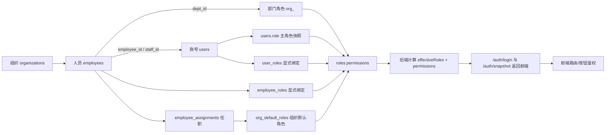

# 组织、人员、账号、权限链路梳理

## 1. 梳理目标

基于 [GEMINI.md](../../GEMINI.md) 的“后端权威”原则，这条链路要回答四个问题：

1. 组织架构在哪里维护。
2. 人员如何挂到组织上。
3. 账号如何绑定到人员。
4. 权限最终如何在后端被裁决，并返回前端消费。

一句话结论：

- 当前系统的运行时权限真相源已经在后端。
- 但“组织/人员维护模型”与“权限绑定模型”存在新旧两套并行结构，尚未完全收敛。

---

## 2. 当前对象分层

### 2.1 现网主链路里的核心对象

当前真正参与“组织 -> 人员 -> 账号 -> 权限”主链路的对象主要是：

- `organizations`
  - 组织树，当前组织管理接口实际使用的是这个模型。
- `employees`
  - 人员主档，当前员工管理接口实际使用的是这个模型。
  - 关键字段是 `dept_id`，它是普通员工权限归属的当前主入口。
- `users`
  - 登录账号。
  - 关键字段是 `employee_id` 和 `role`。
- `roles`
  - 角色定义及权限集合。
  - `permissions` 是角色权限清单。

### 2.2 已经建模但尚未完全接管主链路的新结构

数据库和权限解析器里已经出现了更规范的新模型：

- `org_units`
  - 新版组织单元模型。
- `employee_assignments`
  - 员工任职/归属记录，可描述组织归属；岗位/职位只作为人事资料属性，不作为当前权限推导来源。
- `org_default_roles`
  - 组织单元默认角色绑定。
- `user_roles`
  - 用户账号显式角色绑定。
- `employee_roles`
  - 员工显式角色绑定。

这说明系统正在从“`users.role` + `employees.dept_id` 驱动”收敛到“显式绑定表 + 组织默认授权驱动”的权限模型，但收敛还没有完成。

> 2026-07-25 纠正：早期文档里出现过“按职位派生授权”的候选设计。当前不采用该方向。职位/岗位不参与生产扫码、工序执行、页面按钮或普通账号权限推导；这些能力必须通过账号、角色和显式权限来裁决。

---

## 3. 现有链路总览

---

## 4. 按链路拆开看

## 4.1 组织架构 -> 人员

当前组织与人员管理接口走的是旧主档模型：

- 组织接口
  - `GET /org/tree`
  - `POST /org`
  - `PATCH /org/:id`
  - `DELETE /org/:id`
- 人员接口
  - `GET /employees`
  - `POST /employees`
  - `PATCH /employees/:id`
  - `POST /employees/sync`
  - `DELETE /employees/:id`

这部分的当前事实：

- 组织树由 `organizations` 表维护。
- 员工由 `employees` 表维护。
- 员工通过 `employees.dept_id` 挂到组织。
- 员工详情里仍然保留了 `line_id`、`process_id` 这类生产侧字段，说明当前“人员主档”和“生产归属”还没有完全拆开。

所以，当前“组织 -> 人员”的主链路本质上是：

- `organizations.id`
- `employees.dept_id`

而不是新版的：

- `org_units.id`
- `employee_assignments.org_unit_id`

---

## 4.2 人员 -> 账号

账号与人员的连接点是 `users.employee_id`。

当前规则如下：

- 创建账号时可传 `employeeId`。
- 更新账号时也可改 `employeeId`。
- 登录和 `/auth/snapshot` 都会把 `employeeId` 回传前端。

这意味着：

- 人员是业务身份主体。
- 账号是登录入口。
- 两者通过 `users.employee_id` 绑定。

但这里有一个现实问题：

- `users.employee_id` 目前更像“账号挂靠员工”的弱绑定字段。
- 账号创建/修改时会同步角色绑定。
- 反过来，员工保存/调岗时，并没有统一反推账号角色快照。

也就是说，“账号修改影响权限”已经打通了，“人员变动自动影响账号快照”还没有彻底打通。

---

## 4.3 账号 -> 角色

当前账号到角色有三层含义，不能只看 `users.role`。

### 第一层：`users.role`

这是当前 schema 里仍存在的主角色快照字段，但不能继续作为普通员工最终权限来源。

它的当前遗留作用：

- 作为创建账号时的必填角色字段。
- 作为某些查询列表里的直接展示字段。
- 部分旧逻辑仍把它当兜底权限输入，这是后续必须删除的点。

### 第二层：`user_roles`

这是账号级显式角色绑定表。

当前已经在以下动作中同步：

- 创建用户
- 更新用户
- 替换用户
- 切换主角色
- 批量同步用户

同步方式是：

- 把 `users.role` 写回 `user_roles` 的 primary binding。
- 原 primary binding 会被置为 inactive。

### 第三层：`employee_roles`

当账号绑定了员工时，用户变更角色还会同步一份到 `employee_roles`。

这个同步目前是“从账号反写员工角色”：

- `source = from_user_account`
- 用来让员工维度也有一份显式角色绑定

所以当前“账号 -> 角色”的真实结构是：

- 表面主字段仍能看到 `users.role`
- 运行时优先看 `user_roles`
- 同时向 `employee_roles` 写入镜像绑定

---

## 4.4 组织/人员 -> 权限

这是最关键的一段，也是当前最符合 `GEMINI.md` “后端权威”原则的一段。

后端运行时权限解析不是直接信任前端，也不是只信任 `users.role`，而是按优先级聚合。

### 当前后端有效权限解析优先级

`ResolveEffectiveAccessProfileForUser` 的思路可以整理成下面的顺序：

1. 先取账号主角色
   - 优先取 `user_roles` 里当前有效且 `is_primary=true` 的角色。
2. 再取账号/员工的显式绑定角色
   - `user_roles`
   - `employee_roles`
3. 再取任职带来的组织默认角色
   - `employee_assignments -> org_default_roles`
4. 当前仍存在旧部门字段和主角色快照兜底读取

第 4 点是遗留事实，不是长期方向。正式收敛后，普通员工权限只能来自显式绑定和组织默认授权；旧部门字段和主角色快照不能继续作为运行时兜底。

### 角色如何变成权限

角色变成权限的过程也在后端：

- 从 `roles.permissions` 读取权限清单。
- 如果角色是 `org_<deptId>` 族，则会把整个角色族的权限聚合。
  - 例如：
    - `org_sales`
    - `org_sales|Oversea`
- 聚合后再扩展菜单级权限。
  - 例如某个动作权限会补出对应的 `menu_xxx` 权限。
- `admin` / `superadmin` 走全量兜底权限集。

最终产物是：

- `PrimaryRoleID`
- `EffectiveRoles`
- `Permissions`

这三项都由后端统一裁决。

---

## 5. 登录与前端消费链路

## 5.1 登录阶段

登录接口只做两件事：

1. 校验用户名密码。
2. 立即在后端计算有效访问画像。

登录返回内容里：

- `user.role`
  - 实际返回的是主角色数组。
- `user.effectiveRoles`
  - 返回所有生效角色。
- `user.permissions`
  - 登录阶段先不预装业务权限，前端再走一次快照同步。

这符合 `GEMINI.md` 的方向：

- 前端不自己推导权限。
- 登录后再从后端拿最新身份快照。

## 5.2 鉴权中间件

每次带 Token 请求时，后端会：

1. 从 JWT 取 `sub`。
2. 回库重新查 `users`。
3. 再次调用有效权限解析器。
4. 把以下结果放入上下文：
   - `role`
   - `effectiveRoles`
   - `permissions`

这说明：

- JWT 不是权限真相源。
- 数据库和后端解析器才是权限真相源。

## 5.3 前端消费

前端当前的消费方式也基本符合“后端权威”：

- 登录成功后先把 `effectiveRoles` 放进 `AuthStore`。
- 随后调用 `/auth/snapshot` 同步完整权限。
- 路由与按钮校验都以当前会话里的 `permissions` 为准。

因此前端只是权限消费者，不是权限计算者。

---

## 6. 这条链路里“已经打通”的部分

可以认为已经成立的链路是：

1. 组织和员工基础主档可维护。
2. 账号可绑定员工。
3. 账号修改会同步 `user_roles` / `employee_roles`。
4. 登录与请求鉴权都会由后端重新计算 `effectiveRoles` 和 `permissions`。
5. 前端主要消费后端快照，不再以本地硬编码角色推导权限。

如果只看运行时权限裁决，这条链路已经具备明显的“后端权威”特征。

---

## 7. 这条链路里“还没有完全收敛”的部分

这里是最需要在后续设计会上明确的地方。

### 7.1 组织模型存在新旧双轨

当前并存两套组织语义：

- 旧主链：`organizations + employees.dept_id`
- 新模型：`org_units + employee_assignments`

问题在于：

- 组织管理页面改的是旧表。
- 有效权限解析已经开始读新表。
- 两套模型之间没有形成明确的一主一辅关系。

结果就是：

- “权限引擎认的组织归属”和“业务页面维护的组织归属”并不完全是同一套结构。

### 7.2 员工变动未完全反推账号权限快照

迁移计划里写得很明确：

- 员工保存
- 批量员工同步

都应该把派生出来的部门角色快照回写到账号侧。

但从当前实现看：

- 用户侧变更会同步角色绑定。
- 员工侧保存/补丁/批量同步并没有统一调用角色快照同步器。
- `RoleSnapshotSynchronizer` 目前还是空实现。

这意味着：

- 员工调部门后，运行时权限也许能因旧部门兜底逻辑而变化。
- 但 `users.role`、`user_roles`、`employee_roles` 是否保持一致，不是同一条闭环保证出来的。

### 7.3 `users.role` 仍然承担过多历史职责

当前 `users.role` 同时是：

- 创建账号时的必填字段
- 用户列表展示字段
- `user_roles` primary 的镜像来源
- 没有绑定表时的兜底权限输入

这让它还没有退化为单纯的主角色快照。

理想状态应该是：

- 普通员工权限主要来自绑定关系与组织任职。
- `users.role` 不再参与普通员工权限裁决；管理员账号、服务账号也应通过明确角色绑定表达。

---

## 8. 按 GEMINI 原则给出的收敛建议

如果严格按 `GEMINI.md` 的“后端权威 + DTO/SDRTS + 工作流收敛”去整理，这条链路建议这样落：

### 8.1 统一真相源

先明确唯一主链：

- 组织：`org_units`
- 人员归属：`employee_assignments`
- 账号绑定：`users.employee_id`
- 显式授权：`user_roles` / `employee_roles`
- 默认授权：`org_default_roles`

职位/岗位只作为组织人事资料和展示属性，不作为当前权限默认来源。若未来要把岗位纳入权限，也必须重新立专项方案、数据迁移和验收，不能沿用早期候选表作为默认链路。

如果短期不切到这套，也至少要明确：

- 现阶段 `organizations + employees.dept_id` 是唯一主链
- 新表只做预埋，不参与生产判定

不能长期双轨并行且都声称自己是权威。

### 8.2 把“员工变动 -> 权限同步”补成闭环

建议把以下动作统一纳入后端事务：

- 保存员工
- Patch 员工
- 批量同步员工
- 调岗
- 调部门
- 离职/停用

这些动作完成后，统一触发：

- 员工归属重算
- 账号主角色快照重算
- `user_roles` / `employee_roles` 对齐
- 审计日志记录

这一步如果不补齐，链路就还是半闭环。

### 8.3 让前端只消费后端裁决结果

前端目前方向基本对，但还可以再收口：

- 用户列表不要把 `users.role` 当成最终展示含义。
- 账号页应优先展示：
  - `primaryRoleId`
  - `effectiveRoles`
  - 绑定来源
- “部门角色推荐”应逐步从前端推断，收敛到后端直接返回。

### 8.4 把组织/人员/权限变更纳入语义化工作流

按 `GEMINI.md` 的要求，下面这些都不该只是普通字段 patch：

- 调岗
- 调部门
- 授予附加角色
- 取消附加角色
- 设为主角色
- 离职停用账号

更合适的做法是把它们封装成明确意图的命令或 TDO，而不是仅靠字段级 Patch 拼接语义。

---

## 9. 最终建议的业务口径

如果要把这条链路讲给产品、实施或后端同事，建议统一成下面这句话：

- 组织决定人员归属。
- 人员决定账号挂靠身份。
- 账号只负责登录，不直接成为权限真相源。
- 权限由后端根据“账号绑定 + 人员归属 + 组织默认角色 + 显式授权”统一计算。
- 前端只展示和消费后端裁决结果。

这就是最符合 `GEMINI.md` 的表达方式。

---

## 10. 当前可以直接落地的收敛顺序

建议按下面顺序推进：

1. 先确定组织主模型到底是 `organizations` 还是 `org_units`。
2. 再补齐“员工变更 -> 账号权限快照同步”。
3. 再把用户列表和账号管理从 `users.role` 视角切到 `effectiveRoles` 视角。
4. 最后把调岗、调部门、授权这些动作收敛成语义化命令。

这样改动风险最小，也最符合现有代码的演进方向。
