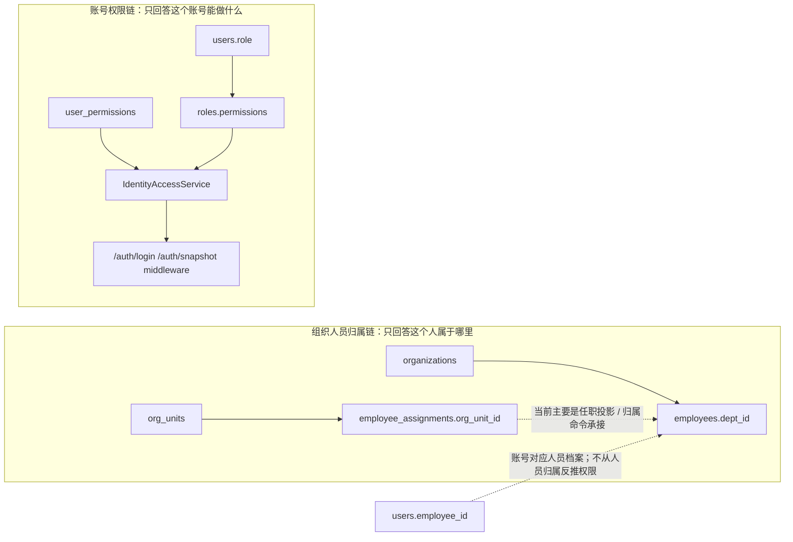

# 组织人员归属 / 账号权限边界与文件职责计划

> 状态：当前权威分析。
> 日期：2026-07-25
> 范围：整理真实代码链路、文件职责、已完成拆分和后续承接位置。

## 1. 当前结论

组织人员归属和账号权限必须分成两条边界清楚的链。账号代表人员在系统中的执行身份，人员管理可以从人员档案发起账号申请和绑定；但人员、组织、职位都不能反推权限。

1. 组织人员归属链：`organizations` + `employees.dept_id` 仍是当前页面和接口的主链；`org_units` + `employee_assignments` 已建模，但主要作为投影/命令承接，还没有接管组织页面主写入口。
2. 账号权限链：`users.role` + `roles.permissions` + `user_permissions` 是当前运行时鉴权真相源。
3. 账号人员绑定：`users.employee_id` 说明这个账号对应哪个人员档案，用于登录身份、操作归属、审计和业务上下文；权限仍分配到账号身份上，不从人员归属自动生成。

因此后续不要继续往 `OrganizationService` 或某个页面里补条件分支。应先把“人员属于哪里”和“账号能做什么”彻底分开，再决定组织人员归属主链是否从 `organizations` 切到 `org_units`。

这里的 `org_units` 是 `organization units`，意思是组织节点 / 组织单元，不是计量单位。计量单位的表是 `units`，路由是 `/basic/units`，两者不能混用。

## 2. 当前真实数据流

### 2.1 登录与鉴权

| 环节 | 当前文件 | 当前职责 | 长期判断 |
| --- | --- | --- | --- |
| 登录 | `server/handlers/auth.go` | 校验账号密码、调用 `IdentityAccessService`、返回 token 和账号权限 | 职责基本正确，但返回 DTO 应继续由统一 snapshot 定义驱动 |
| 请求鉴权 | `server/middleware/auth.go` | 解析 JWT、回库查账号、调用 `IdentityAccessService`、写入 gin context | 正确方向：JWT 不是权限真相源；人员和组织也不是权限真相源 |
| 权限快照 | `server/services/access/identity_access_service.go` | 包装用户身份和权限，返回 `/auth/snapshot` 数据 | 已迁到访问控制 service 包；继续由 Handler/Middleware 单入口调用 |
| 有效权限计算 | `server/services/access/effective_access_service.go` | 合并角色权限与账号直接权限 | 已迁到访问控制 service 包；权限算法本身未改变 |
| 权限目录 | `server/authz/permissions.go` | 后端权限 ID 白名单和 admin 权限集 | 后端权威，继续保留 |

当前权限计算规则很短：

1. 读取 `users.role`。
2. 通过 `roles.permissions` 得到角色继承权限。
3. 读取 `user_permissions` 得到账号显式权限。
4. 合并并去重，返回给前端和中间件。

职位、岗位、工序、产线、组织名称、人员归属都不参与当前权限裁决。`employeeId` 是账号对应的人员档案 ID，用来知道是谁在操作、属于哪个人员档案，不是权限推导依据。

### 2.2 账号管理

| 环节 | 当前文件 | 当前职责 | 长期判断 |
| --- | --- | --- | --- |
| 账号命令 | `server/services/user_command_service.go` | 创建、更新、替换、删除账号并写审计 | 职责基本可保留 |
| 账号角色校验 | `server/services/user_role_assignment_service.go` | 校验 `users.role` 是否存在于 `roles` | 名称容易误解，可改成 `account_primary_role_service.go` |
| 账号人员绑定 | `server/services/user_employee_binding_service.go` | 绑定/解绑 `users.employee_id`，保证人员唯一绑定 | 职责清晰，应保留为独立命令 service |
| 账号显式权限 | `server/services/user_permission_service.go` | 读写 `user_permissions` 并写审计 | 权限分配核心，职责清晰 |
| 账号查询 | `server/services/user_query_service.go`、`server/services/user_query_dto.go` | 用户列表和选项查询 | 可保留，但不要混入权限计算 |
| 账号 Handler | `server/handlers/user_*.go` | 按操作拆分较细 | 方向正确 |

账号的长期口径：

- 人员档案是自然人资料，账号是该人员在系统里的独立执行身份。
- 人员管理可以读取人员档案并发起账号申请 / 绑定账号。
- 账号负责登录、状态、绑定人员。
- 角色是账号主角色/权限预设。
- 账号显式权限走 `user_permissions`。
- 不要从人员职位、组织名称、工序或页面文案反推账号权限。

### 2.3 组织与人员

| 环节 | 当前文件 | 当前职责 | 长期判断 |
| --- | --- | --- | --- |
| 组织/人员模型 | `server/models/production.go` | 同时定义生产模型、`Organization`、`Employee` | 不长期，应拆成独立模型文件 |
| 组织树模型 | `server/models/org_unit.go` | 新组织单元模型 | 可作为最终组织主模型候选 |
| 任职模型 | `server/models/employee_assignment.go` | 人员归属、职位、生产归属投影 | 应承接“人员属于哪里”，但不要承接权限 |
| 职位模型 | `server/models/position.go` | 人事资料属性，可挂组织/生产单元 | 职位只做人事属性，不授权 |
| 组织人员服务 | `server/services/organization_service.go` | 组织树、人员列表、职位列表、人员保存、批量同步 | 过胖，不长期 |
| 任职命令 | `server/services/employee_assignment_commands.go` | 调组织、调职位、同步主任职投影 | 不应挂在 `OrganizationService` 方法上 |
| Repository | `server/repositories/organization_repository.go` | 组织、人员、职位查询和写入混在一起 | 应拆分 |
| Handler | `server/handlers/org_handlers.go`、`server/handlers/employee_handlers.go`、`server/handlers/employee_assignment_handlers.go` | Handler 拆分基本可接受 | Service/Repository 比 Handler 更需要整理 |

当前最大问题是组织人员归属主模型不一致：

- `/org/tree`、员工列表、优秀员工榜仍读 `organizations`。
- `ChangeEmployeeOrgUnit` 参数叫 `orgUnitId`，会校验 `org_units`，但又写回 `employees.dept_id`。
- 员工列表仍通过 `employees.dept_id -> organizations.id` 显示部门。
- `positions.org_unit_id` 也在 Repository 里 join 到 `organizations.id`。

这会造成一个隐患：如果 `org_units` 和 `organizations` 的 ID 不完全一致，调组织、人员列表和职位归属会各读各的。这个隐患只属于人员归属和组织显示，不属于账号权限。

## 3. 前端真实链路

| 模块 | 当前文件 | 当前职责 | 长期判断 |
| --- | --- | --- | --- |
| 登录 | `src/features/auth/sign-in/components/user-auth-form.tsx` | 登录后写入用户和 permissions | 方向正确，前端只接收权限 |
| 权限同步 | `src/features/authz/services/effective-permission-service.ts` | 调 `/auth/snapshot`，同步内存权限 | 方向正确，但注释里的 `/profile` 应改成 `/auth/snapshot` |
| 路由鉴权 | `src/features/authz/guards/**` | 根据后端权限快照控制路由 | 方向正确 |
| 用户管理 | `src/features/users/**` | 账号 CRUD、人员绑定、权限分配弹窗 | 分层基本清楚 |
| 组织人员 | `src/features/org-personnel/**` | 组织树、人员档案、请假、榜单 | 字段仍围绕 `deptId/lineId/processId/positionId`，需要和后端主模型一起收敛 |
| 角色管理 | `src/features/system-mgmt/services/role-service.ts` | 维护 `roles.permissions` | 是权限预设，不是人员职位 |

前端长期边界：

- `authz` 只消费后端权限，不做组织/职位推导。
- `users` 负责账号、主角色、显式权限、人员绑定。
- `org-personnel` 负责组织树、人员主档、任职资料，只提供人员归属上下文，不提供权限来源。
- 生产归属不要继续作为人员主档字段散落在表单里，应收敛到任职/生产归属命令。

## 4. 不符合长期架构的点

### 4.1 模型文件职责混杂

`server/models/production.go` 同时包含生产线、工段、工序、组织、人员、班组等模型。组织和人员是系统基础域，不应藏在生产模型文件里。

建议拆分：

- `server/models/organization.go`
- `server/models/employee.go`
- `server/models/team.go`
- 生产拓扑继续留在生产相关模型文件

第一步只移动定义，不改表名、不改 JSON、不改逻辑。

### 4.2 `OrganizationService` 承载过多

`server/services/organization_service.go` 当前承担：

- 组织树；
- 组织层级校验；
- 员工列表；
- 员工保存；
- 职位列表；
- 员工状态批量更新；
- 组织/员工批量同步；
- 审计写入。

这已经不是一个清晰 service。

建议拆成：

- `organization_command_service.go`：组织新增、修改、删除、层级校验；
- `employee_command_service.go`：人员保存、补丁、删除、状态变更；
- `employee_query_service.go`：人员列表、详情、榜单输入；
- `position_query_service.go`：职位查询；
- `employee_assignment_service.go`：调组织、调职位、任职投影同步。

### 4.3 Repository 过宽

`server/repositories/organization_repository.go` 同时操作组织、人员、职位、账号状态。

建议拆成：

- `organization_repository.go`
- `employee_repository.go`
- `position_repository.go`
- `employee_user_binding_repository.go`

账号禁用可以通过人员删除命令调用账号绑定 service，而不是由组织 Repository 直接写 `users`。

### 4.4 组织人员归属主模型必须二选一

后续组织人员归属只能选一条主线：

推荐长期主线：

- 组织主表：`org_units`
- 人员归属：`employee_assignments.org_unit_id`
- 旧 `employees.dept_id` 不再作为主写字段
- 旧 `organizations` 不再作为组织页面主写表

如果短期不切，也必须反过来明确：

- `organizations` 是唯一主链；
- `org_units` 只做未启用预埋；
- `ChangeEmployeeOrgUnit` 不得校验另一套表。

不能继续“参数叫 orgUnit，显示读 organization，归属写 deptId”。这件事只影响人员归属一致性，不允许延伸成权限逻辑。

### 4.5 访问控制 service 已从 `dependencies` 迁出

`IdentityAccessService` 和 `EffectiveAccessService` 是业务访问控制核心，不是普通依赖注入工具。

当前已迁到：

- `server/services/access/identity_access_service.go`
- `server/services/access/effective_access_service.go`

迁移保持了 Handler/Middleware 的单一入口，不让前端或 Handler 自己拼权限。后续如果 `IdentityAccessSnapshot` 字段继续增多，再单独拆 `access_snapshot_dto.go`，不要提前造空文件。

### 4.6 职位不能进入授权链

当前职位可以存在，但职责必须写死：

- 职位是人员资料；
- 可以用于展示、统计、组织管理；
- 不参与扫码；
- 不参与工序执行；
- 不参与页面按钮权限；
- 不参与普通账号默认授权。

是否能操作某页面、某命令、某动作，只看账号权限快照。

## 5. 建议落地顺序

### Phase 1：无行为变化拆文件

目标：把文件职责摆正，不改变业务行为。

1. 从 `server/models/production.go` 拆出 `Organization`、`Employee`、`Team`。
2. 拆 `server/repositories/organization_repository.go`。
3. 拆 `server/services/organization_service.go`。
4. 移动访问控制 service 到更明确的包或文件。

验收：

- API 返回不变；
- 表名不变；
- `go test ./...` 通过；
- 前端类型不需要同步大改。

### Phase 2：确定组织主模型

目标：不再让 `organizations` 与 `org_units` 双轨争夺人员归属语义。

推荐做法：

1. 明确 `org_units` 为最终组织节点。
2. `/org/tree` 改为读写 `org_units`。
3. 人员归属改为 `employee_assignments.org_unit_id`。
4. 员工列表和详情从 assignment join 组织名称。
5. 移除 `employees.dept_id` 在新写路径中的主语义。
6. 删除旧组织写入口和旧字段依赖。

### Phase 3：收口账号权限

目标：权限链只围绕账号，保持短、清楚、可审计。

1. `IdentityAccessSnapshot` 增加 `primaryRoleId`、`rolePermissionIds`、`directPermissionIds`、`diagnostics`。
2. 用户权限弹窗明确区分“角色继承权限”和“账号显式权限”。
3. `users.role` 在 UI 中改名为“主角色/权限预设”，不要叫职位。
4. 人员变动只影响身份资料，不自动改权限；如需改权限，走账号权限分配命令。

### Phase 4：前端字段和页面收敛

目标：页面字段跟后端主模型一致。

1. `org-personnel` 的 `deptId` 改为组织归属视图字段。
2. `positionId` 明确为任职资料字段。
3. `lineId/processId` 从人员主档表单中拆到生产归属/任职命令。
4. `users` 页面继续只维护账号、主角色、权限、人员绑定。

## 6. 禁止新增的做法

- 不要新增职位到权限的映射表。
- 不要让工序、产线、职位参与账号权限推导。
- 不要在前端按部门、职位、角色名称拼权限。
- 不要继续把组织、人员、职位、账号禁用都塞回一个 Repository。
- 不要在 `OrganizationService` 里继续新增账号权限逻辑。
- 不要在 `users.role` 之外再造一套含义不清的“角色绑定”暗线。

## 7. 下一步建议

### 2026-07-25 Phase 1 进度

已完成的无行为变化拆分：

- `server/models/production.go` 中的 `Organization`、`Employee`、`Team` 已拆到独立模型文件；
- `server/repositories/organization_repository.go` 已拆出人员、职位、账号绑定相关实现文件；
- `server/services/organization_service.go` 已拆出组织命令、人员命令、职位查询实现文件；
- `IdentityAccessService` / `EffectiveAccessService` 已从 `server/dependencies` 迁到 `server/services/access`，调用入口和权限算法保持不变。

仍未做：

- 组织主模型仍未二选一，`organizations` 与 `org_units` 的语义错位仍然存在；
- 前端字段仍未从 `deptId/lineId/processId/positionId` 收敛到最终任职模型。

Phase 1 的主要文件职责拆分已经完成。后续不要先改权限算法，应进入 Phase 2 前先确认组织人员归属主模型：

1. `organizations` 和 `org_units` 只能保留一条主写链；
2. 人员归属字段要从旧 `deptId` 语义收敛到确定后的任职模型；
3. 前端字段名再跟随主模型同步，避免页面先改名、后端仍双轨。

确认组织人员归属主模型以后，再改组织和人员写入链路。账号权限链继续保持独立，不从组织、人员、职位推导权限。
