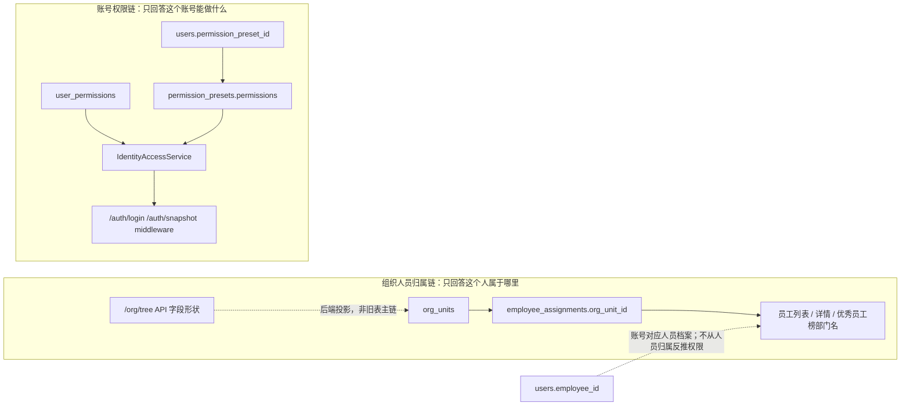

# 组织人员归属 / 账号权限边界与文件职责计划

> 状态：当前权威分析。
> 日期：2026-07-26
> 范围：整理真实代码链路、文件职责、已完成拆分和后续承接位置。

## 1. 当前结论

组织人员归属和账号权限必须分成两条边界清楚的链。业务概念只有两层：人员档案、账号 / 用户。账号代表人员在系统中的执行身份，人员管理可以从人员档案发起账号申请和绑定；但人员、组织、职位都不能反推权限。

1. 组织人员归属链：主模型已切到 `org_units` + `employee_assignments.org_unit_id`。`/org/tree` 仍保留原 API 字段形状，但后端仓库读写 `org_units`；人员组织归属通过主任职记录承接。
2. 账号权限链：账号权限预设 + 账号显式权限是当前运行时鉴权真相源；物理表列已迁移为 `users.permission_preset_id` + `permission_presets.permissions` + `user_permissions`，不再把 `roles / users.role` 作为当前链路。
3. 账号人员绑定：`users.employee_id` 说明这个账号对应哪个人员档案，用于登录身份、操作归属、审计和业务上下文；权限仍分配到账号身份上，不从人员归属自动生成。

因此后续不要继续往 `OrganizationService` 或某个页面里补条件分支。“人员属于哪里”和“账号能做什么”已经是两条链：组织人员归属走 `org_units / employee_assignments`，账号权限走 `users / permission_presets / user_permissions`。

这里的 `org_units` 是 `organization units`，意思是组织节点 / 组织单元，不是计量单位。计量单位的表是 `units`，路由是 `/basic/units`，两者不能混用。

## 2. 当前真实数据流

### 2.1 登录与鉴权

| 环节 | 当前文件 | 当前职责 | 长期判断 |
| --- | --- | --- | --- |
| 登录 | `server/handlers/auth.go` | 校验账号密码、调用 `IdentityAccessService`、返回 token 和账号权限 | 职责基本正确，但返回 DTO 应继续由统一 snapshot 定义驱动 |
| 请求鉴权 | `server/middleware/auth.go` | 解析 JWT、回库查账号、调用 `IdentityAccessService`、写入 gin context | 正确方向：JWT 不是权限真相源；人员和组织也不是权限真相源 |
| 权限快照 | `server/services/access/identity_access_service.go` | 包装用户身份和权限，返回 `/auth/snapshot` 数据 | 已迁到访问控制 service 包；继续由 Handler/Middleware 单入口调用 |
| 有效权限计算 | `server/services/access/effective_access_service.go` | 合并账号权限预设与账号直接权限 | 已迁到访问控制 service 包；权限算法本身未改变 |
| 权限目录 | `server/authz/permissions.go` | 后端权限 ID 白名单和 admin 权限集 | 后端权威，继续保留 |

当前权限计算规则很短：

1. 读取 `users.permission_preset_id`。这是账号绑定的权限预设 ID，不是人员身份层。
2. 通过 `permission_presets.permissions` 得到账号权限预设内置权限。
3. 读取 `user_permissions` 得到账号显式权限。
4. 合并并去重，返回给前端和中间件。

职位、工序、产线、组织名称、人员归属都不参与当前权限裁决。`employeeId` 是账号对应的人员档案 ID，用来知道是谁在操作、属于哪个人员档案，不是权限推导依据。

### 2.2 账号管理

| 环节 | 当前文件 | 当前职责 | 长期判断 |
| --- | --- | --- | --- |
| 账号命令 | `server/services/user_command_service.go` | 创建、更新、替换、删除账号并写审计 | 职责基本可保留 |
| 账号权限预设校验 | `server/services/account_permission_preset_service.go` | 校验 `users.permission_preset_id` 是否存在于 `permission_presets` 权限预设表 | 服务层文件名已收敛为权限预设；业务语义不表示人员职位或人员角色 |
| 账号人员绑定 | `server/services/user_employee_binding_service.go` | 绑定/解绑 `users.employee_id`，保证人员唯一绑定 | 职责清晰，应保留为独立命令 service |
| 账号显式权限 | `server/services/user_permission_service.go` | 读写 `user_permissions` 并写审计 | 权限分配核心，职责清晰 |
| 账号查询 | `server/services/user_query_service.go`、`server/services/user_query_dto.go` | 用户列表和选项查询 | 可保留，但不要混入权限计算 |
| 账号 Handler | `server/handlers/user_*.go` | 按操作拆分较细 | 方向正确 |

账号的长期口径：

- 人员档案是自然人资料，账号是该人员在系统里的独立执行身份。
- 人员管理可以读取人员档案并发起账号申请 / 绑定账号。
- 账号负责登录、状态、绑定人员。
- 权限预设只是账号权限模板，不是人员身份层；账号也可以通过显式权限单独分配。
- 账号显式权限走 `user_permissions`。
- 不要从人员职位、组织名称、工序或页面文案反推账号权限。

### 2.3 组织与人员

| 环节 | 当前文件 | 当前职责 | 长期判断 |
| --- | --- | --- | --- |
| 组织树 API 投影 | `server/models/organization.go` | 保留 `/org/tree` 原字段形状，后端由 `org_units` 投影 | 不是数据库真相源 |
| 组织树主模型 | `server/models/org_unit.go` | 组织节点 / 组织单元主表 | 当前组织树主写模型 |
| 任职模型 | `server/models/employee_assignment.go` | 人员组织归属、职位、未来独立生产归属锚点 | 应承接“人员属于哪里/如何任职”，但不要承接权限 |
| 职位模型 | `server/models/position.go` | 人事资料属性，可挂组织/生产单元 | 职位只做人事属性，不授权 |
| 组织树 / 组织命令 | `server/services/organization_service.go`、`server/services/organization_command_service.go`、`server/services/organization_patch_service.go` | 组织树、组织新增/修改/删除、层级校验、组织批量同步 | 已收敛为组织链，不承接人员主档 |
| 人员查询 | `server/services/employee_query_service.go` | 人员列表、人员详情 | 已从 `OrganizationService` 拆出 |
| 人员命令 | `server/services/employee_command_service.go`、`server/services/employee_patch_service.go` | 人员保存、补丁、删除、状态变更、批量同步 | 已从 `OrganizationService` 拆出；组织归属只写主任职 |
| 人员导入 | `server/services/employee_import_service.go` | Excel 预览、提交、组织归属和职位字段匹配 | 已从 `OrganizationService` 拆出 |
| 职位查询 | `server/services/position_query_service.go` | 职位列表 | 已从 `OrganizationService` 拆出；职位不参与权限 |
| 任职命令 | `server/services/employee_assignment_commands.go` | 调组织、调职位、维护主任职事实 | 已由 `EmployeeAssignmentCommandService` 承接，不再挂在 `OrganizationService` 方法上 |
| 组织仓库 | `server/repositories/org_unit_tree_repository.go` | `org_units` 与 `/org/tree` 字段投影转换 | 当前组织主写入口 |
| 人员仓库 | `server/repositories/employee_repository.go` | 人员列表、榜单输入，部门名从主任职 join `org_units` | 已脱离旧 `organizations` |
| 职位仓库 | `server/repositories/position_repository.go` | 职位列表，归属名从 `org_units` join | 已脱离旧 `organizations` |
| Handler | `server/handlers/org_handlers.go`、`server/handlers/employee_handlers.go`、`server/handlers/employee_assignment_handlers.go` | Handler 拆分基本可接受 | Service/Repository 比 Handler 更需要整理 |

当前已完成的主链修正：

- `/org/tree` 后端仓库改为读写 `org_units`，旧 `organizations` 不再作为新写入口；
- `PatchOrganization` 不再直接 `First(&models.Organization)` 打回旧表；
- `ChangeEmployeeOrgUnit` 不再写 `employees.dept_id`，改为写主任职 `employee_assignments.org_unit_id`；
- 新增/修改/导入/批量同步人员时，接口入参 `deptId` 只作为组织归属视图字段进入主任职，不再作为 `employees.dept_id` 主事实写入；
- 员工列表、员工详情、优秀员工榜从 `employee_assignments -> org_units` 读取部门归属名称；
- `positions.org_unit_id` 改为 join `org_units.id`；
- 数据库启动迁移会先把旧 `organizations` 与 `employees.dept_id` 搬到 `org_units / employee_assignments`，再删除旧 `organizations` 表。

仍需继续处理的点：后端人员 API 字段形状仍保留 `deptId/deptName`，这是当前 HTTP DTO 边界；前端领域模型已改为 `orgUnitId/orgUnitName`，不要再让页面理解成旧 `employees.dept_id`。

## 3. 前端真实链路

| 模块 | 当前文件 | 当前职责 | 长期判断 |
| --- | --- | --- | --- |
| 登录 | `src/features/auth/sign-in/components/user-auth-form.tsx` | 登录后写入用户和 permissions | 方向正确，前端只接收权限 |
| 权限同步 | `src/features/authz/services/effective-permission-service.ts` | 调 `/auth/snapshot`，同步内存权限 | 方向正确，过期的 `/profile` 注释已修正为 `/auth/snapshot` |
| 路由鉴权 | `src/features/authz/guards/**` | 根据后端权限快照控制路由 | 方向正确 |
| 用户管理 | `src/features/users/**` | 账号 CRUD、人员绑定、权限分配弹窗 | 分层基本清楚 |
| 组织人员 | `src/features/org-personnel/**` | 组织树、人员档案、请假、榜单 | 后端主链已切到 `org_units / employee_assignments`；人员领域字段已收敛为 `orgUnitId/orgUnitName`，不再暴露生产线/工序字段 |
| 权限预设管理 | `src/features/system-mgmt/services/permission-preset-service.ts` | 维护 `permission_presets.permissions` | 是账号权限预设，不是人员职位 |

前端长期边界：

- `authz` 只消费后端权限，不做组织/职位推导。
- `users` 负责账号、权限预设、显式权限、人员绑定。
- `org-personnel` 负责组织树、人员主档、任职资料，只提供人员归属上下文，不提供权限来源。
- 生产归属不要继续作为人员主档字段散落在表单里；如后续要维护人员可参与的生产单元，必须走独立任职/生产归属命令，不参与权限推导。

## 4. 不符合长期架构的点

### 4.1 模型文件职责混杂

该问题已经完成两轮修正：`Organization`、`Employee` 和 `Team` 已从生产旧聚合模型拆到独立模型文件；生产域中的 `ProcessStep`、`ProductionLine`、`LineSegment`、`ProductionRoute` 和 `ProductionRouteStep` 也已按“标准作业、生产拓扑、产品路线”拆分。这些属于生产域内部职责边界，不再是组织人员边界问题。

当前状态：

- `server/models/organization.go`：组织兼容模型；
- `server/models/employee.go`：人员模型；
- `server/models/team.go`：班组模型；
- `server/models/production_process.go`：标准作业项目模型；
- `server/models/production_topology.go`：产线和工段模型；
- `server/models/production_route.go`：产品路线和路线步骤模型。

### 4.2 `OrganizationService` 已收敛为组织链入口

`server/services/organization_service.go` 不再承担人员列表、人员保存、人员导入和职位查询。当前服务层按职责拆开：

- `organization_service.go`：组织服务默认实例和对外包级入口；
- `organization_command_service.go`：组织树、组织新增、删除、批量同步、层级校验；
- `organization_patch_service.go`：组织乐观锁 PATCH；
- `employee_query_service.go`：人员列表、人员详情；
- `employee_command_service.go`：人员保存、删除、状态变更、批量同步；
- `employee_patch_service.go`：人员乐观锁 PATCH；
- `employee_import_service.go`：人员 Excel 预览和提交；
- `position_query_service.go`：职位查询；
- `employee_assignment_commands.go`：调组织、调职位、清职位和主任职投影同步。

后续新增人员、职位、导入或权限相关能力时，不要再回填到 `OrganizationService`。组织服务只回答组织树自身的问题。

### 4.3 Repository 接口已按用途收窄

旧的 `NewOrganizationRepository()` 和聚合 `OrganizationRepository` 接口已删除，避免一个“组织仓库”名义上同时暴露组织、人员、职位、账号禁用能力。当前仓库层按用途提供窄接口构造器：

- `NewOrganizationTreeRepository()`：只返回组织树读写接口；
- `NewEmployeeRepository()`：只返回人员读写 / 榜单输入接口；
- `NewPositionRepository()`：只返回职位查询接口；
- `NewEmployeeAccountBindingRepository()`：只返回人员删除时禁用关联账号的接口；
- `NewOrgPersonnelRepository()`：只作为同一组 org/personnel 表的 GORM concrete 实现，在命令/导入这类确实需要多接口组合的 service 内部注入。

文件也按职责拆开：组织树投影在 `org_unit_tree_repository.go`，人员在 `employee_repository.go`，职位在 `position_repository.go`，账号绑定影响在 `employee_account_binding_repository.go`。后续不要恢复 `NewOrganizationRepository()` 这种总入口。

### 4.4 组织人员归属主模型已切到 `org_units`

组织人员归属已经选定一条主线：

- 组织主表：`org_units`；
- 人员归属：`employee_assignments.org_unit_id`；
- 旧 `employees.dept_id` 不再作为主写字段
- 旧 `organizations` 不再作为组织页面主写表

`deptId` 目前只是历史 API 字段名，后端返回值来自主任职 `org_unit_id`。下一步要做的是前端模型命名收敛，不是再改回 `employees.dept_id`。

### 4.5 访问控制 service 已从 `dependencies` 迁出

`IdentityAccessService` 和 `EffectiveAccessService` 是业务访问控制核心，不是普通依赖注入工具。

当前已迁到：

- `server/services/access/identity_access_service.go`
- `server/services/access/effective_access_service.go`

迁移保持了 Handler/Middleware 的单一入口，不让前端或 Handler 自己拼权限。当前 `IdentityAccessSnapshot` 已暴露 `permissionPresetId`、`presetPermissionIds`、`directPermissionIds`、`permissions` 与 `diagnostics`，足够支撑来源诊断。后续如果字段继续增多，再单独拆 `access_snapshot_dto.go`，不要提前造空文件。

### 4.6 职位不能进入授权链

当前职位可以存在，但职责必须写死：

- 职位是人员资料；
- 可以用于展示、统计、组织管理；
- 不参与扫码；
- 不参与工序执行；
- 不参与页面按钮权限；
- 不参与普通账号默认授权。

是否能操作某页面、某命令、某动作，只看账号权限快照。

## 5. 建议落地顺序

### Phase 1：无行为变化拆文件

目标：把文件职责摆正，不改变业务行为。

1. 已完成：从生产旧聚合模型拆出 `Organization`、`Employee`、`Team`，并完成生产作业、拓扑和路线模型的职责拆分。
2. 拆 `server/repositories/organization_repository.go`。
3. 拆 `server/services/organization_service.go`。
4. 移动访问控制 service 到更明确的包或文件。

验收：

- API 返回不变；
- 表名不变；
- `go test ./...` 通过；
- 前端类型不需要同步大改。

### Phase 2：确定组织主模型

目标：不再让 `organizations` 与 `org_units` 双轨争夺人员归属语义。

已完成：

1. 明确 `org_units` 为最终组织节点；
2. `/org/tree` 改为读写 `org_units`；
3. 人员归属改为 `employee_assignments.org_unit_id`；
4. 员工列表、详情、优秀员工榜从 assignment join `org_units`；
5. 新写路径不再把 `employees.dept_id` 作为主事实；
6. 启动迁移搬迁旧数据后删除旧 `organizations` 表；
7. 人员主档不再接收、返回或保存生产线/工序字段，启动迁移会删除 `employees.line_id/process_id` 旧列；
8. 人员查询、人员命令、人员导入、职位查询已从 `OrganizationService` 拆出到独立 service。

仍未完成：

1. 如果后续需要维护“人员可参与哪些生产单元”，应新增独立任职/生产归属命令，不再回填到人员主档。

### Phase 3：收口账号权限

目标：权限链只围绕账号，保持短、清楚、可审计。

1. `IdentityAccessSnapshot` 增加 `permissionPresetId`、`presetPermissionIds`、`directPermissionIds`、`diagnostics`。业务语义是“账号权限预设来源权限 + 账号显式权限”。
2. 用户权限弹窗明确区分“权限预设来源权限”和“账号显式权限”。
3. `users.permission_preset_id` 在 UI 中只允许表达为“权限预设”，不要叫人员身份或职位。
4. 人员变动只影响身份资料，不自动改权限；如需改权限，走账号权限分配命令。

### Phase 4：前端字段和页面收敛

目标：页面字段跟后端主模型一致。

1. `org-personnel` 的领域模型已从 `deptId/deptName` 改为 `orgUnitId/orgUnitName`，API 适配层继续把后端 `deptId/deptName` 映射进出。
2. `positionId` 明确为任职资料字段。
3. `lineId/processId` 已从人员主档表单、人员领域 DTO 和员工模型中移除；生产归属后续只允许通过独立任职/生产归属命令承接。
4. `users` 页面继续只维护账号、权限预设、显式权限、人员绑定。

## 6. 禁止新增的做法

- 不要新增职位到权限的映射表。
- 不要让工序、产线、职位参与账号权限推导。
- 不要在前端按部门、职位、权限预设名称拼权限。
- 不要继续把组织、人员、职位、账号禁用都塞回一个 Repository。
- 不要在 `OrganizationService` 里继续新增账号权限逻辑。
- 不要在 `users.permission_preset_id` 之外再造一套含义不清的账号权限模板暗线。

## 7. 下一步建议

### 2026-07-25 Phase 1 进度

已完成的无行为变化拆分：

- `Organization`、`Employee`、`Team` 已拆到独立模型文件；
- `ProcessStep`、`ProductionLine`、`LineSegment`、`ProductionRoute`、`ProductionRouteStep` 已拆到 `production_process.go`、`production_topology.go`、`production_route.go`；
- `server/repositories/organization_repository.go` 已拆出人员、职位、账号绑定相关实现文件，并删除旧 `NewOrganizationRepository()` 聚合入口；
- `server/services/organization_service.go` 已拆出组织命令、组织 PATCH、人员查询、人员命令、人员 PATCH、人员导入和职位查询实现文件；
- `IdentityAccessService` / `EffectiveAccessService` 已从 `server/dependencies` 迁到 `server/services/access`，调用入口和权限算法保持不变。

### 2026-07-26 Phase 3 权限本体进度

已完成的账号权限收敛：

- `IdentityAccessSnapshot` 已增加 `permissionPresetId`、`presetPermissionIds`、`directPermissionIds`、`diagnostics`，并继续保留 `permissions` 作为最终有效权限；
- `EffectiveAccessService` 已在后端内部区分权限预设来源权限和账号显式权限，最终权限仍按“权限预设来源 + 账号显式权限”合并去重；
- `/auth/snapshot` 与 `/users/:id/access` 已返回权限来源字段，前端 DTO 已同步；
- 用户管理中的 `users.permission_preset_id` 展示文案已只表达为“权限预设”，不再使用旧绑定说法；
- `server/services/user_role_assignment_service.go` 已收敛为 `server/services/account_permission_preset_service.go`，避免文件名误导为人员职位授权；
- 已完成物理数据库命名迁移：启动迁移会把旧 `roles` 表重命名为 `permission_presets`，把旧 `roles.role_id` 重命名为 `permission_presets.permission_preset_id`，把旧 `users.role` 重命名为 `users.permission_preset_id`；当前代码不再保留 `/roles` 旧接口或旧字段双轨；
- `src/features/authz/services/effective-permission-service.ts` 中过期的 `/profile` 注释已改为 `/auth/snapshot`；
- 已新增 `src/features/authz/services/account-access-refresh-service.ts`，当前登录账号被更新、绑定人员变化、显式权限变化，或权限预设变更后，会主动把当前会话标记为未同步并重拉 `/auth/snapshot`；
- 已补充 `server/services/access/identity_access_service_test.go`，验证权限来源拆分和缺失权限预设诊断；
- 已补充 `src/features/authz/services/account-access-refresh-service.spec.ts` 与用户 mutation 测试，验证只刷新当前账号会话，不因修改他人账号污染当前权限快照。

仍未做：

- 跨浏览器 / 跨设备 / 其它已登录会话的实时权限推送已通过现有 Redis/WebSocket 通道接入：账号身份资料、账号显式权限或账号权限预设变化后，目标账号会收到 `AccessControl / IDENTITY_SNAPSHOT_INVALIDATED`，并静默重拉 `/auth/snapshot`。

### 2026-07-26 Phase 2 组织主模型进度

已完成的组织归属主链切换：

- `server/repositories/org_unit_tree_repository.go` 成为组织树仓库主入口，负责 `org_units` 与 `/org/tree` API 字段投影；
- `server/repositories/employee_repository.go` 从 `employee_assignments -> org_units` 读取人员部门名和优秀员工榜部门名；
- `server/repositories/position_repository.go` 从 `positions.org_unit_id -> org_units.id` 读取职位归属名；
- Repository 对外构造器已收窄为 `NewOrganizationTreeRepository()`、`NewEmployeeRepository()`、`NewPositionRepository()`、`NewEmployeeAccountBindingRepository()`，不再提供旧 `NewOrganizationRepository()` 聚合入口；
- `server/services/employee_assignment_commands.go` 已引入 `EmployeeAssignmentCommandService`，调组织/调职位/清职位命令不再挂在 `OrganizationService` 方法上；
- `server/services/employee_query_service.go`、`server/services/employee_command_service.go`、`server/services/employee_patch_service.go`、`server/services/employee_import_service.go`、`server/services/position_query_service.go` 已承接人员和职位链路，`OrganizationService` 不再承载这些职责；
- 调组织命令写主任职 `org_unit_id`，不再写 `employees.dept_id`；
- `SaveEmployee`、`PatchEmployee`、`BulkSyncEmployees`、员工导入提交都把入参 `deptId` 写入主任职，不再作为 `employees.dept_id` 主事实；
- 人员主档 API、前端领域模型和数据库模型不再暴露 `lineId/processId`，旧 `employees.line_id/process_id` 列会在启动迁移中删除；
- `server/db/db.go` 启动迁移会把旧 `organizations`、旧 `employees.dept_id` 搬到 `org_units / employee_assignments`，随后删除旧 `organizations` 表并停止 AutoMigrate 旧模型；
- 已补充后端测试，验证新增人员时 `employees.dept_id` 不再落主事实，主任职 `org_unit_id` 才是组织归属来源。

下一步应继续：

1. 后续如要做人员生产归属，只新增独立命令和页面入口，不再把生产线/工序字段塞回人员主档。

### 2026-07-26 Phase 4 前端字段进度

已完成：

- `src/features/org-personnel/data/schema.ts` 的人员领域字段改为 `orgUnitId/orgUnitName`；
- `src/features/org-personnel/adapters/employee-api-adapter.ts` 负责 `EmployeeApiDTO.deptId/deptName` 与领域字段互转；
- 人员表格、人员弹窗、请假员工选择、账号绑定员工标签、导入导出工具都改为读取 `orgUnitId/orgUnitName`；
- 批量同步人员时通过 `toEmployeeApiDTO` 显式转回后端 DTO，不再裸发前端领域对象；
- PATCH delta 在提交前把 `orgUnitId` 映射回后端当前支持的 `deptId` key；
- 组织归属选择源从 `departmentOptions` 改为 `orgUnitOptions`，显示组织节点完整路径，不再在前端硬编码“只能部门”；
- 人员列表和账号绑定弹窗不再为了人员标签拉取生产线/工序资源；
- Excel 模板表头新增“组织归属 / Organization Assignment”，后端人员导入表头候选已同步接受。

补充完成：

- 优秀员工榜统计接口自身 DTO 已从 `deptName` 改为 `orgUnitName`，统计页表头同步显示“组织归属 / Org Unit”。

账号权限链继续保持独立，不从组织、人员、职位推导权限。
